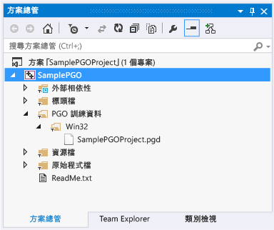

# 效能及診斷中樞中的特性指引最佳化
[!INCLUDE[vs2017banner](../../assembler/inline/includes/vs2017banner.md)]

\[效能及診斷中樞\] 中 Visual C\+\+ 外掛程式的特性指引最佳化，可讓開發人員的特性指引最佳化經驗更加順暢。  您可以從 Visual Studio 網站[下載外掛程式](http://go.microsoft.com/fwlink/p/?LinkId=327915)。  
  
 特性指引最佳化 \(PGO\) 可幫助您建立 x86 和 x64 原生應用程式的組建，並針對使用者互動的方式最佳化。  PGO 是多步驟的程序：首先建立要檢測的應用程式組建以進行程式碼剖析，然後執行「訓練」，也就是在一般使用者互動情況下執行檢測過的應用程式。  接著儲存擷取的程式碼剖析資料，然後使用結果引導整個程式進行最佳化，藉此重新建置您的應用程式。  雖然您可以在 Visual Studio 或命令列中個別執行這些步驟，但是 PGO 外掛程式可集中並簡化這個流程。  PGO 外掛程式會設定所有必要的選項，引導您進行每一個步驟，向您顯示分析內容，然後使用結果設定組建以最佳化每個函式的大小或速度。  PGO 外掛程式還能在您變更程式碼的同時，讓您輕鬆地重新執行應用程式訓練及更新組建最佳化資料。  
  
## 必要條件  
 您必須先[下載 PGO 外掛程式](http://go.microsoft.com/fwlink/p/?LinkId=327915)，並且將它安裝到 Visual Studio 中，才能在 \[效能及診斷中樞\] 使用它。  
  
## 逐步解說：使用 PGO 外掛程式最佳化應用程式  
 首先，您將在 Visual Studio 中建立基本的 Win32 桌面應用程式。  如果您已經有想要最佳化的原生應用程式，可以使用它並略過這個步驟。  
  
#### 若要建立應用程式  
  
1.  在功能表列上，選擇 \[**檔案**\]、\[**新增**\]、\[**專案**\]。  
  
2.  在 \[**新增專案**\] 對話方塊的左窗格中，依序展開 \[**已安裝的**\]、\[**範本**\]、\[**Visual C\+\+**\]，然後選取 \[**MFC**\]。  
  
3.  在中間窗格中選取 \[**MFC 應用程式**\]。  
  
4.  在 \[**名稱**\] 方塊中指定專案的名稱，例如 SamplePGOProject。  選擇 \[**確定**\] 按鈕。  
  
5.  在 \[**MFC 應用程式精靈**\] 對話方塊的 \[**概觀**\] 頁面上選擇 \[**完成**\] 按鈕。  
  
 接下來，將應用程式的組建組態設定為 \[發行\]，讓它準備好進行 PGO 建置及訓練步驟。  
  
#### 若要設定組建組態  
  
1.  在功能表列上，選擇 \[**建置**\]、\[**組態管理員**\]。  
  
2.  在 \[**組態管理員**\] 對話方塊中，選擇 \[**使用中的方案組態**\] 下拉式按鈕，並選取 \[**發行**\]。  選擇 \[關閉\] 按鈕。  
  
 開啟 \[效能及診斷中樞\]：在功能表列上選擇 \[**分析**\]、\[**效能及診斷**\]。  這樣會開啟診斷工作階段頁面，其中會有分析工具可供您的專案類型使用。  
  
   
  
 在 \[**可用的工具**\] 中，選取 \[**特性指引最佳化**\] 核取方塊。  選擇 \[**啟動**\] 按鈕，啟動 PGO 外掛程式。  
  
   
  
 \[**特性指引最佳化**\] 頁面中會描述外掛程式用來改善應用程式效能的步驟。  選擇 \[**開始**\] 按鈕。  
  
   
  
 在 \[**檢測**\] 區段中選擇 \[**一開始即啟用訓練**\] 選項，選擇是否要在訓練中包含應用程式的啟動階段。  如果未選取這個選項，除非您明確啟用訓練，否則執行中的已檢測應用程式中就不會記錄訓練資料。  
  
 選擇 \[**檢測**\] 按鈕，以一組特殊的編譯器選項建置應用程式。  編譯器會在產生的程式碼中插入探查指令。  這些指令會在訓練階段記錄程式碼剖析資料。  
  
   
  
 當已檢測的應用程式組建完成時，應用程式會自動啟動。  
  
 如果建置期間發生任何錯誤或警告，請將它們修復並選擇 \[**重新啟動組建**\] 重新啟動檢測的組建。  
  
 當應用程式啟動時，您可以使用 \[**訓練**\] 區段中的 \[**開始訓練**\] 和 \[**暫停訓練**\] 連結控制何時要記錄程式碼剖析資訊。  您可以使用 \[**停止應用程式**\] 和 \[**啟動應用程式**\] 連結停止並重新啟動應用程式。  
  
   
  
 在訓練期間，檢視您的使用者案例以擷取 PGO 外掛程式最佳化程式碼所需的程式碼剖析資訊。  當您完成訓練時，請關閉應用程式或選擇 \[**停止應用程式**\] 連結。  選擇 \[**分析**\] 按鈕可開始執行分析步驟。  
  
 當分析完成時，\[ **分析**\] 區段會顯示使用者案例訓練階段所擷取之程式碼剖析資訊的報告。  您可以使用這份報告檢查應用程式呼叫最多次的函式，以及花最多時間處理的函式。  PGO 外掛程式會使用這些資訊來判斷要將哪些應用程式函式的速度及大小最佳化。  PGO 外掛程式會設定組建最佳化，針對訓練期間所記錄的使用者案例建立最小、速度最快的應用程式。  
  
   
  
 如果訓練擷取到所需的程式碼剖析資訊，您可以選擇 \[**儲存變更**\] 將分析的分析資料儲存在專案中，以便最佳化未來的組建。  若要捨棄分析資料並從頭開始訓練，請選擇 \[**重做訓練**\]。  
  
 分析資料檔會儲存在專案的 \[**PGO 訓練資料**\] 資料夾中。  這些資料可用來控制應用程式中的編譯器組建最佳化設定。  
  
   
  
 在分析後，PGO 外掛程式會設定專案中的組建選項，以便在編譯期間使用分析資料選擇性地最佳化應用程式。  您可以繼續使用相同的分析資料修改和建置應用程式。  應用程式建置完成後，組建輸出會報告使用分析資料最佳化的函式和指令數目。  
  
   
  
 如果您在開發期間進行重大的程式碼變更，則可能需要重新訓練您的應用程式以獲得最理想的最佳化結果。  在組建輸出報告使用分析資料最佳化的函式或指令未達 80% 時，建議您重新訓練應用程式。