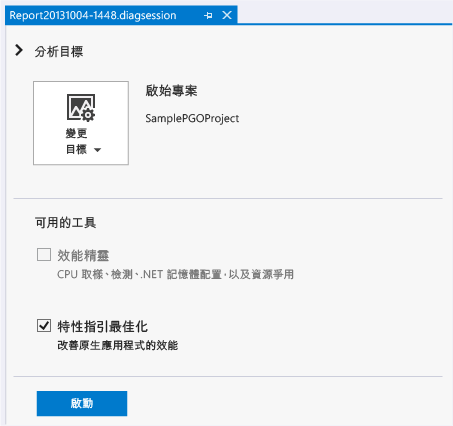
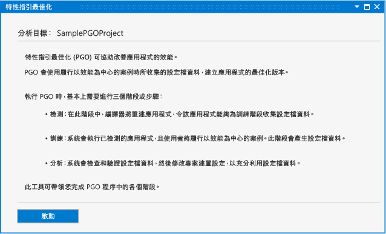
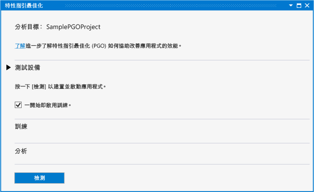
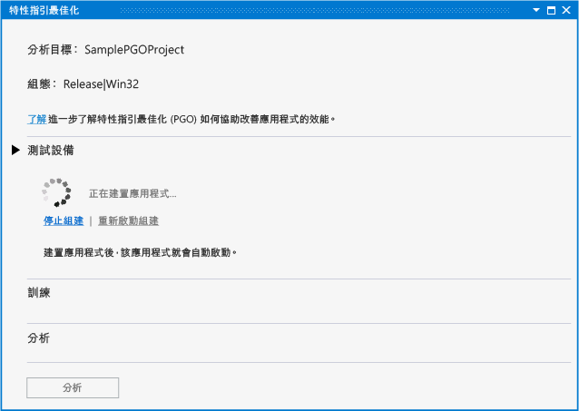
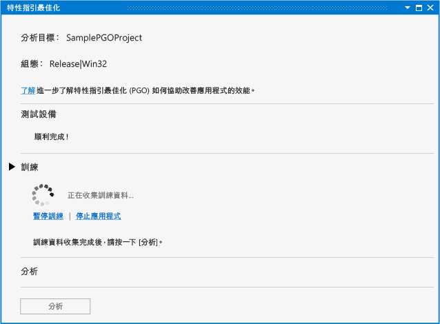
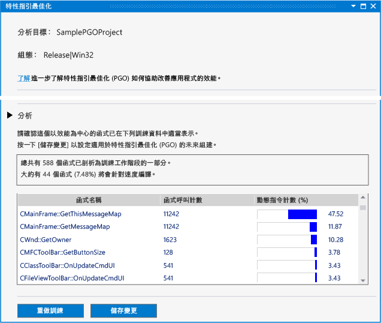
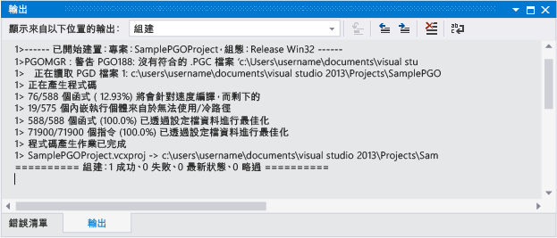

# 特性指引最佳化 Visual Studio 2013 效能及診斷中樞

如果您使用 Visual Studio 2013，Visual c + + 外掛程式在 效能及診斷中樞中的特性指引最佳化可以簡化開發人員的特性指引最佳化體驗。 您可以[下載外掛程式](https://marketplace.visualstudio.com/items?itemName=ProfileGuidedOptimizationTeam.ProfileGuidedOptimizationforVisualC)從 Visual Studio 網站。 外掛程式不支援更新版本的 Visual Studio 中。

特性指引最佳化 (PGO) 可幫助您建立 x86 和 x64 原生應用程式的組建，並針對使用者互動的方式最佳化。 PGO 是多步驟程序： 建立應用程式組建檢測的程式碼剖析，並接著執行 「 訓練 」。 也就是您會透過一般的使用者互動情況下執行已檢測的應用程式。 接著儲存擷取的程式碼剖析資料，然後使用結果引導整個程式進行最佳化，藉此重新建置您的應用程式。 雖然您可以在 Visual Studio 或命令列中個別執行這些步驟，但是 PGO 外掛程式可集中並簡化這個流程。 PGO 外掛程式會設定所有必要的選項，引導您進行每一個步驟，向您顯示分析內容，然後使用結果設定組建以最佳化每個函式的大小或速度。 PGO 外掛程式還能在您變更程式碼的同時，讓您輕鬆地重新執行應用程式訓練及更新組建最佳化資料。

## 必要條件

您必須[下載 PGO 外掛程式](https://marketplace.visualstudio.com/items?itemName=ProfileGuidedOptimizationTeam.ProfileGuidedOptimizationforVisualC)並將它安裝在 Visual Studio 中，才能使用 效能及診斷中樞中。

## 逐步解說：使用 PGO 外掛程式最佳化應用程式

首先，您將在 Visual Studio 中建立基本的 Win32 桌面應用程式。 如果您已經有想要最佳化的原生應用程式，可以使用它並略過這個步驟。

### 若要建立應用程式

1. 在功能表列上，選擇 [檔案] 、[新增] 、[專案] 。

1. 在左窗格中**新的專案**對話方塊方塊中，展開**已安裝**，**範本**， **Visual c + +**，然後選取  **MFC**。

1. 在中央窗格中，選取**MFC 應用程式**。

1. 指定專案的名稱 — 例如， **SamplePGOProject**— 在**名稱** 方塊中。 選擇 [確定]  按鈕。

1. 在上**概觀**頁面**MFC 應用程式精靈**對話方塊方塊中，選擇 [**完成**] 按鈕。

接下來，將應用程式的組建組態設定為 [發行]，讓它準備好進行 PGO 建置及訓練步驟。

### 若要設定組建組態

1. 在功能表列上，選擇 [ **建置**]、[ **組態管理員**]。

1. 在  **Configuration Manager**對話方塊方塊中，選擇**作用中的方案組態**下拉式按鈕，然後選取**版本**。 選擇**關閉** 按鈕。

開啟 效能及診斷中樞，在功能表列上選擇 **分析**，**效能及診斷**。 這樣會開啟診斷工作階段頁面，其中會有分析工具可供您的專案類型使用。

在 **可用的工具**，選取**特性指引最佳化**核取方塊。 選擇**啟動** 按鈕，啟動 PGO 外掛程式。

**特性指引最佳化**頁面描述外掛程式用來改善您的應用程式效能的步驟。 選擇**啟動** 按鈕。

在**檢測**區段中，您使用**一開始即啟用訓練**選項可選擇是否要在訓練中納入您的應用程式的啟動階段。 如果未選取這個選項，除非您明確啟用訓練，否則執行中的已檢測應用程式中就不會記錄訓練資料。

選擇**檢測**按鈕，即可建立您的應用程式使用一組特殊的編譯器選項。 編譯器會在產生的程式碼中插入探查指令。 這些指令會在訓練階段記錄程式碼剖析資料。

當已檢測的應用程式組建完成時，應用程式會自動啟動。

如果發生任何錯誤或警告，在建置期間，修正它們，然後選擇**重新啟動組建**重新啟動已檢測的組建。

您的應用程式啟動時，您可以使用**訓練課程**並**暫停訓練**中的連結**訓練**一節，以控制當記錄程式碼剖析資訊。 您可以使用**停止應用程式**並**啟動應用程式**停止並重新啟動應用程式的連結。

在訓練期間，檢閱您的使用者案例以擷取 PGO 外掛程式最佳化程式碼所需的程式碼剖析資訊。 當您完成訓練時，請關閉您的應用程式，或選擇**停止應用程式**連結。 選擇**分析** 按鈕，開始執行分析步驟。

分析完成時，**分析**區段會顯示報表的使用者案例訓練階段中所擷取的程式碼剖析資訊。 您可以使用這份報告檢查應用程式呼叫最多次的函式，以及花最多時間處理的函式。 PGO 外掛程式會使用這些資訊來判斷要將哪些應用程式函式的速度及大小最佳化。 PGO 外掛程式會設定組建最佳化，針對訓練期間所記錄的使用者案例建立最小、速度最快的應用程式。

如果訓練擷取到預期的程式碼剖析資訊，您可以選擇**儲存變更**儲存分析的分析資料最佳化未來的組建的專案中。 若要捨棄分析資料並從頭開始訓練，選擇**重做訓練**。

設定資料檔會儲存在您的專案中**PGO 訓練資料**資料夾。 這些資料可用來控制應用程式中的編譯器組建最佳化設定。

![在 [方案總管] 中的 PGO 資料檔案](../../build/reference/media/pgofig6data.png "方案總管 中的 PGO 資料檔案")

在分析後，PGO 外掛程式會設定專案中的組建選項，以便在編譯期間使用分析資料選擇性地最佳化應用程式。 您可以繼續使用相同的分析資料修改和建置應用程式。 應用程式建置完成後，組建輸出會報告使用分析資料最佳化的函式和指令數目。

如果您在開發期間進行重大的程式碼變更，則可能需要重新訓練您的應用程式以獲得最理想的最佳化結果。 在組建輸出報告使用分析資料最佳化的函式或指令未達 80% 時，建議您重新訓練應用程式。