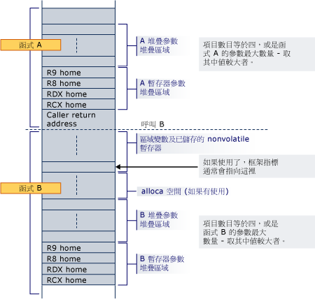

# 堆疊配置
函式的初構會負責配置堆疊空間給區域變數，儲存的暫存器，堆疊參數和暫存器參數。  
  
 [參數] 區域會在堆疊底部 （即使使用 alloca），如此一來，它一律是相鄰的傳回位址在所有函式呼叫期間。 它包含至少四個項目，但一定足夠空間可存放所有參數所需的任何可能被呼叫的函式。 請注意，即使參數本身的堆疊; 永遠不會位於一律空間配置給暫存器參數中，被呼叫端會保證其所有參數的已配置空間。 因此如果呼叫的函式需要引數清單 (va_list) 或個別的引數的地址，就使用的連續區域，住家地址所需的暫存器引數。 這個區域也會提供方便的位置來儲存暫存器引數，thunk 執行期間，或做為偵錯的選項 （例如，它會引數可以輕易地尋找在偵錯，它們會儲存在其初構程式碼中的住家地址）。 即使呼叫的函式擁有少於 4 個參數，所呼叫的函式，有效地擁有這些 4 的堆疊位置，並可能被呼叫的函式用來儲存參數暫存器值以外的其他用途。  因此呼叫端可能不將資訊儲存在堆疊的這個區域中跨函式呼叫。  
  
 如果空間函式中，以動態方式配置 (alloca)，靜態暫存器必須用作框架指標，標示的固定部分堆疊的基底，然後該暫存器必須儲存及初始化初構中。 請注意，使用 alloca 時，來自相同的呼叫端呼叫同一個被呼叫端可能會有不同的住家地址做為暫存器參數。  
  
 堆疊一律會維持 16 個位元組對齊時，除非在初構 （例如，在傳回位址推入之後），而在中指定位置[函式型別](../build/function-types.md)特定框架函式的類別。  
  
 以下是 where 函式 A 呼叫非分葉函式 b 函式的初構堆疊配置的範例已配置空間給所有和堆疊的底部 B 所需的暫存器和堆疊參數。 呼叫推播通知的地址和 B 的初構其本機變數、 靜態暫存器，和呼叫函式所需的空間配置空間。 如果 B 使用 alloca，會儲存區域的本機變數/靜態暫存器和參數堆疊區域之間配置的空間。  
  
   
  
 當函式 B 呼叫另一個函式時，傳回位址推入住家地址的正下方的 RCX。  
  
## 請參閱  
 [堆疊使用方式](../build/stack-usage.md)