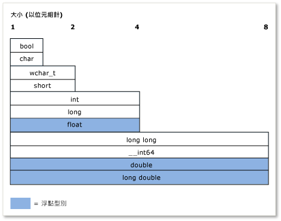

# <a name="c-type-system"></a>C++ 類型系統

*類型*的概念在 c + + 中非常重要。 每個變數、函式引數和函式傳回值都必須有類型才能編譯。 此外，在評估之前，編譯器會以隱含的方式指定每一個運算式 (包括常值) 的類型。 某些類型的範例包括 **`int`** 儲存整數值、儲存 **`double`** 浮點值（也稱為純量資料類型） *scalar*或標準程式庫類別[std：： basic_string](../standard-library/basic-string-class.md)以儲存文字。 您可以藉由定義或來建立自己的類型 **`class`** **`struct`** 。 此類型會指定配置給變數 (或運算式結果) 的記憶體數量、可在該變數中存放的值種類、這些值 (位元模式) 的解譯方式，以及可對其執行的作業。 本文包含 C++ 類型系統主要功能的簡略概觀。

## <a name="terminology"></a>詞彙

**變數**：資料數量的符號名稱，讓名稱可在其定義所在的程式碼範圍內，用來存取它所參考的資料。 在 c + + 中，*變數*通常用來參考純量資料類型的實例，而其他類型的實例通常稱為*物件*。

**物件**：為了簡化和一致性，本文使用「*物件*」一詞來參考類別或結構的任何實例，而在一般意義中使用時，則包含所有類型，甚至是純量變數。

**POD 類型**（一般舊資料）： c + + 中的這個非正式資料類型類別是指純量類型（請參閱基本類型一節）或*POD 類別*。 POD 類別的靜態資料成員同時也是 POD，沒有使用者定義的建構函式、使用者定義解構函式或使用者定義的指派運算子。 此外，POD 類別沒有虛擬函式、沒有基底類別，也沒有私用或受保護的非靜態資料成員。 POD 類型通常用於外部資料交換，例如以 C 語言撰寫的模組 (其中只有 POD 類型)。

## <a name="specifying-variable-and-function-types"></a>指定變數和函式類型

C + + 是*強型別*語言，而且也是*靜態類型*;每個物件都有類型，而且該類型永遠不會變更（不會與靜態資料物件混淆）。 當您在程式碼中宣告變數時，您必須明確指定其類型，或使用 **`auto`** 關鍵字指示編譯器從初始化運算式推算類型。 當您在程式碼中宣告函式時，您必須指定每個引數的類型和其傳回值，或者，如果函式 **`void`** 未傳回任何值，則為。 例外情況是在您使用函式樣板，可允許任意類型的引數。

在您初次宣告變數之後，就不能再變更其類型。 不過，您可以將變數值或函式的傳回值複製到另一個不同類型的變數。 這類作業稱為「*類型轉換*」，有時是必要的，但也是資料遺失或 incorrectness 的潛在來源。

當您宣告 POD 類型的變數時，強烈建議您將其初始化，也就是指定其初始值。 在您初始化變數以前，變數都會包含由先前遺留在該記憶體位置之任何位元所構成的「垃圾」值。 這是一個要記住的 C++ 重要層面，如果您是從另一個用來處理初始化的語言轉換而來時則更是如此。 宣告非 POD 類別類型的變數時，建構函式會處理初始化。

下列範例示範一些簡單的變數宣告，這些宣告各有一些描述。 這個範例也會示範編譯器如何使用類型資訊允許或不允許對變數進行某些後續作業。

```cpp
int result = 0;              // Declare and initialize an integer.
double coefficient = 10.8;   // Declare and initialize a floating
                             // point value.
auto name = "Lady G.";       // Declare a variable and let compiler
                             // deduce the type.
auto address;                // error. Compiler cannot deduce a type
                             // without an intializing value.
age = 12;                    // error. Variable declaration must
                             // specify a type or use auto!
result = "Kenny G.";         // error. Can’t assign text to an int.
string result = "zero";      // error. Can’t redefine a variable with
                             // new type.
int maxValue;                // Not recommended! maxValue contains
                             // garbage bits until it is initialized.
```

## <a name="fundamental-built-in-types"></a>基本 (內建) 類型

有別於某些程式語言，C++ 並沒有可衍生出所有其他類型的通用基底類型。 此語言包含許多*基本類型*，也稱為*內建類型*。 這包括數數值型別，例如 **`int`** 、 **`double`** 、 **`long`** 、 **`bool`** ，以及 **`char`** **`wchar_t`** 分別為 ASCII 和 UNICODE 字元的和類型。 大部分基本類型（除了 **`bool`** 、 **`double`** 、 **wc `har_t** and related types) all have unsigned versions, which modify the range of values that the variable can store. For example, an **` int 不 `**, which stores a 32-bit signed integer, can represent a value from -2,147,483,648 to 2,147,483,647. An **` 帶正負號 int '**，也會儲存為32位）可以儲存0到4294967295的值。 每個案例中的可能值總數都相同；只有範圍不同。

基本類型是由編譯器辨識，其內建規則會控制可對這些類型執行哪些作業，以及如何轉換成其他基本類型。 如需內建類型及其大小和數值限制的完整清單，請參閱[內建類型](../cpp/fundamental-types-cpp.md)。

下圖顯示內建類型的相對大小：



下表列出最常用的基本類型：

|類型|大小|註解|
|----------|----------|-------------|
|int|4 個位元組|整數值的預設選項。|
|double|8 個位元組|浮點值的預設選項。|
|bool|1 個位元組|表示可以是 true 或 false 的值。|
|char|1 個位元組|使用較舊 C-Style 字串或 std::string 物件中永遠不需要轉換成 UNICODE 之的 ASCII 字元。|
|wchar_t|2 個位元組|表示可能以 UNICODE 格式 (在 Windows 上為 UTF-16，而其他作業系統可能不同) 編碼的「寬」字元值。 這是用於 `std::wstring` 類型字串的字元類型。|
|不帶正負號的 &nbsp; 字元|1 個位元組|C + + 沒有內建的 byte 類型。  用 **`unsigned char`** 來代表位元組值。|
|不帶正負號的整數|4 個位元組|位元旗標的預設選項。|
|long long|8 個位元組|表示極大的整數值。|

## <a name="the-void-type"></a>void 類型

**`void`** 類型是一種特殊類型; 您無法宣告類型的變數 **`void`** ，但是可以宣告類型為__void \* __的變數（的指標 **`void`** ），這在配置原始（不具類型）的記憶體時有時是必要的。 不過，的指標 **`void`** 並不是型別安全的，而且通常不建議在現代 c + + 中使用。 在函式宣告中，傳回 **`void`** 值表示函數不會傳回值，這是常見且可接受的用法 **`void`** 。 雖然 C 語言所需的函式在參數清單中會宣告零個參數（例如），但 **`void`** `fou(void)` 在現代 c + + 中並不建議使用這個做法，而且應該進行宣告 `fou()` 。 如需詳細資訊，請參閱[類型轉換和型別安全](../cpp/type-conversions-and-type-safety-modern-cpp.md)。

## <a name="const-type-qualifier"></a>常數類型限定詞

任何內建或使用者定義的類型都可以由 const 關鍵字限定。 此外，成員函式可以是限定的，甚至是多載 **`const`** **`const`** 。 類型的值在 **`const`** 初始化之後就無法修改。

```cpp

const double PI = 3.1415;
PI = .75 //Error. Cannot modify const variable.
```

**`const`** 限定詞在函式和變數宣告中廣泛使用，而「const 正確性」是 c + + 中的重要概念; 基本上，這表示要使用 **`const`** 來保證在編譯時期，這些值不會不慎修改。 如需詳細資訊，請參閱 [`const`](../cpp/const-cpp.md)。

**`const`** 類型與其非 const 版本不同，例如， **`const int`** 是來自的不同類型 **`int`** 。 **`const_cast`** 當您必須從變數中移除*常數性質*時，您可以在很罕見的情況下使用 c + + 運算子。 如需詳細資訊，請參閱[類型轉換和型別安全](../cpp/type-conversions-and-type-safety-modern-cpp.md)。

## <a name="string-types"></a>字串類型

嚴格來說，c + + 語言沒有內建的字串類型。**`char`** 並 **`wchar_t`** 儲存單一字元-您必須宣告這些類型的陣列，以近似字串，並將結束的 null 值（例如 ASCII）新增 `'\0'` 至最後一個有效字元之後的陣列元素（也稱為*C 樣式字串*）。 C-Style 字串需要撰寫更多程式碼或使用外部字串公用程式庫函式。 但是在現代 c + + 中，我們有標準程式庫類型 `std::string` （適用于8位 **`char`** 類型的字元字串）或 `std::wstring` （適用于16位 **`wchar_t`** 類型的字元字串）。 這些 c + + 標準程式庫容器可以視為原生字串類型，因為它們是包含在任何相容 c + + 組建環境中的標準程式庫的一部分。 只要使用 `#include <string>` 指示詞，即可在您的程式中使用這些類型。 （如果您使用 MFC 或 ATL， `CString` 類別也可以使用，但不是 c + + 標準的一部分）。強烈建議您不要使用以 null 終止的字元陣列（先前提到的 C 樣式字串）。

## <a name="user-defined-types"></a>使用者定義型別

當您定義 **`class`** 、 **`struct`** 、或時 **`union`** **`enum`** ，該結構會用於程式碼的其餘部分，如同它是基本類型。 它在記憶體中的大小已知，而且套用了有關其在編譯時間檢查、執行階段和程式存留期之使用方式的特定規則。 基本內建類型和使用者定義類型之間的主要差異如下：

- 編譯器沒有使用者定義類型的內建知識。 它會在編譯過程中第一次遇到定義時學習類型。

- 您會藉由定義 (透過多載) 適當的運算子做為類別成員或非成員函式，指定對類型執行哪些作業，以及如何轉換為其他類型。 如需詳細資訊，請參閱[函數](function-overloading.md)多載

## <a name="pointer-types"></a>指標類型

可追溯回到 C 語言的最早版本，c + + 會繼續讓您使用特殊的宣告子（星號）來宣告指標類型的變數 **`*`** 。 指標類型會將在儲存實際資料值之位置的位址儲存在記憶體中。 在現代 c + + 中，這些稱為*原始指標*，可透過特殊運算子 **`*`** （星號）或 **`->`** （使用大於的虛線）在您的程式碼中存取。 這稱為「取值 *」，而*您使用哪一個，取決於您要對純量的指標或物件中成員的指標取值。 處理指標類型一直以來都是 C 及 C++ 程式開發最具挑戰性和令人困惑的一面。 本章節會概述一些事實和作法，以協助使用原始指標（如果您想要的話），但在現代 c + + 中，由於[智慧型指標](../cpp/smart-pointers-modern-cpp.md)的演進（這會在本節結尾討論），因此不再需要（或建議）使用原始指標來取得物件擁有權。 使用原始指標觀察物件仍然有用且安全，但若要將其用於物件擁有權，就必須小心使用，並非常仔細地考量如何建立和終結所擁有的物件。

您首先應該知道的事就是，宣告原始指標變數時只會配置，在儲存該指標在被取值時所參考之記憶體位置位址時所需的記憶體。 尚未配置資料值本身的記憶體配置（也稱為*備份存放區*）。 換句話說，宣告原始指標變數，即是在建立記憶體位址變數，而不是實際資料變數。 在確定變數包含可用於備份存放區的有效位址之前就先取值指標變數，會導致程式中產生未定義的行為 (通常是嚴重錯誤)。 下列範例示範這種錯誤：

```cpp
int* pNumber;       // Declare a pointer-to-int variable.
*pNumber = 10;      // error. Although this may compile, it is
                    // a serious error. We are dereferencing an
                    // uninitialized pointer variable with no
                    // allocated memory to point to.
```

這個範例會對指標類型取值，但不配置任何記憶體的來儲存指派給它的實際整數資料或有效記憶體位址。 下列程式碼示範這些錯誤：

```cpp
    int number = 10;          // Declare and initialize a local integer
                              // variable for data backing store.
    int* pNumber = &number;   // Declare and initialize a local integer
                              // pointer variable to a valid memory
                              // address to that backing store.
...
    *pNumber = 41;            // Dereference and store a new value in
                              // the memory pointed to by
                              // pNumber, the integer variable called
                              // "number". Note "number" was changed, not
                              // "pNumber".
```

更正的程式碼範例會使用本機堆疊記憶體，建立 `pNumber` 所指向的備份存放區。 我們為了簡單起見使用基本類型。 實際上，指標的備份存放區最常是使用者定義的型別，這些型別是使用*heap*關鍵字運算式（在 C 樣式程式設計中，使用較舊的 c 執行時間程式庫函式），以動態方式配置在稱為堆積（或「 *free store*」）的記憶體區域中 **`new`** `malloc()` 。 一旦配置之後，這些變數通常稱為「物件」，特別是當它們是以類別定義為基礎時。 使用配置的記憶體 **`new`** 必須由對應的 **`delete`** 語句刪除（或者，如果您使用函式 `malloc()` 來配置它，則為 C 執行時間函式 `free()` ）。

不過，很容易忘記刪除動態配置的物件，特別是在複雜的程式碼中，這會造成資源錯誤，稱為*記憶體*流失。 因此，強烈建議您不要在現代 C++ 使用原始指標。 將原始指標包裝在[智慧型指標](../cpp/smart-pointers-modern-cpp.md)中幾乎是最好的作法，這會在叫用其析構函式時自動釋放記憶體（當程式碼超出智慧型指標的範圍時）;藉由使用智慧型指標，您幾乎可以消除 c + + 程式中的整個 bug 類別。 下列範例中，假設 `MyClass` 是具有公用方法 `DoSomeWork();` 的使用者定義類型

```cpp
void someFunction() {
    unique_ptr<MyClass> pMc(new MyClass);
    pMc->DoSomeWork();
}
  // No memory leak. Out-of-scope automatically calls the destructor
  // for the unique_ptr, freeing the resource.
```

如需智慧型指標的詳細資訊，請參閱[智慧型指標](../cpp/smart-pointers-modern-cpp.md)。

如需指標轉換的詳細資訊，請參閱[類型轉換和型別安全](../cpp/type-conversions-and-type-safety-modern-cpp.md)。

如需一般指標的詳細資訊，請參閱[指標](../cpp/pointers-cpp.md)。

## <a name="windows-data-types"></a>Windows 資料類型

在 C 和 c + + 的傳統 Win32 程式設計中，大部分函式會使用 Windows 特定的 typedef 和 `#define` 宏（定義于 `windef.h` ）來指定參數類型和傳回值。 這些 Windows 資料類型大部分都只是指定給 C/c + + 內建類型的特殊名稱（別名）。 如需這些 typedef 和預處理器定義的完整清單，請參閱[Windows 資料類型](/windows/win32/WinProg/windows-data-types)。 其中一些 typedef （例如 `HRESULT` 和 `LCID` ）是有用且描述性的。 其他專案（例如 `INT` ）沒有特殊意義，而且只是基本 c + + 類型的別名。 其他 Windows 資料類型有從 C 程式設計和 16 位元處理器時代保留下來的名稱，在現代硬體或作業系統上並無用處或意義。 Windows 執行階段程式庫也有相關聯的特殊資料類型，列為[Windows 執行階段基底資料類型](/windows/win32/WinRT/base-data-types)。 在現代 C++ 中，一般的方針就是，除非 Windows 類型傳達有關如何解譯值的額外涵義，否則優先使用 C++ 基本類型。

## <a name="more-information"></a>更多資訊

如需 C++ 類型系統的詳細資訊，請參閱下列主題：

[實數值型別](../cpp/value-types-modern-cpp.md)\
描述實*數值型別*，以及與使用方式相關的問題。

[類型轉換和型別安全](../cpp/type-conversions-and-type-safety-modern-cpp.md)\
描述一般類型轉換問題並顯示如何避免這些問題。

## <a name="see-also"></a>另請參閱

[歡迎回到 c + +](../cpp/welcome-back-to-cpp-modern-cpp.md)<br/>
[C + + 語言參考](../cpp/cpp-language-reference.md)<br/>
[C + + 標準程式庫](../standard-library/cpp-standard-library-reference.md)
