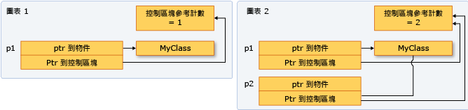

# 如何：建立和使用 shared_ptr 執行個體
`shared_ptr` 類型是 C++ 標準程式庫中的一種智慧型指標，是為有一個以上的擁有者可能必須管理物件在記憶體中的存留期之情節而設計。 在您初始化 `shared_ptr` 之後，您可以函式引數中的值予以複製、傳送以及指派至其他 `shared_ptr` 執行個體。 所有執行個體都會指向相同的物件，並共用對一個每當新的 `shared_ptr` 加入、超出範圍或重設時會遞增和遞減參考計數的「控制區塊」的存取。 當參考計數達到零時，控制區塊會刪除記憶體資源和自己本身。  
  
 下圖顯示幾個指向一個記憶體位置的 `shared_ptr` 執行個體。  
  
   
  
## 範例  
 您應該盡可能使用[make_shared](../standard-library/memory-functions.md#make_shared)函式來建立`shared_ptr`時建立第一次的記憶體資源。 `make_shared` 是無例外狀況之虞。 它會使用相同的呼叫來為控制區塊和資源配置記憶體，從而降低建構的額外負荷。 如果您不使用 `make_shared`，則在將其傳遞至 `shared_ptr` 建構函式前，必須先使用明確的新運算式建立物件。 下列範例顯示各種宣告和初始化 `shared_ptr` 及新物件的方式。  
  
 [!code-cpp[stl_smart_pointers#1](../cpp/codesnippet/CPP/how-to-create-and-use-shared-ptr-instances_1.cpp)]  
  
## 範例  
 下列範例顯示如何宣告和初始化 `shared_ptr` 執行個體，其具有已被另一個 `shared_ptr` 配置之物件的共用擁有權。 假設 `sp2` 是已初始化的 `shared_ptr`。  
  
 [!code-cpp[stl_smart_pointers#2](../cpp/codesnippet/CPP/how-to-create-and-use-shared-ptr-instances_2.cpp)]  
  
## 範例  
 `shared_ptr`也是 c + + 標準程式庫容器很有幫助您使用複製項目的演算法時。 您可以包裝 `shared_ptr` 中的項目，然後將它複製到能夠辨識只有需要時才有效 (不再需要時則無效) 之基礎記憶體的其他容器中。 下列範例顯示如何在向量中的 `replace_copy_if` 執行個體上運用 `shared_ptr` 演算法。  
  
 [!code-cpp[stl_smart_pointers#4](../cpp/codesnippet/CPP/how-to-create-and-use-shared-ptr-instances_3.cpp)]  
  
## 範例  
 您可以使用 `dynamic_pointer_cast`、`static_pointer_cast` 和 `const_pointer_cast` 轉換 `shared_ptr`。 這些函式類似 `dynamic_cast`、`static_cast` 和 `const_cast` 運算子。 下列範例顯示如何測試在基底類別的 `shared_ptr` 向量中每個項目的衍生類型，然後複製項目並顯示其相關資訊。  
  
 [!code-cpp[stl_smart_pointers#5](../cpp/codesnippet/CPP/how-to-create-and-use-shared-ptr-instances_4.cpp)]  
  
## 範例  
 您可以透過下列方式將 `shared_ptr` 傳遞至另一個函式：  
  
-   以傳值方式傳遞 `shared_ptr`。 這會叫用複製建構函式、遞增參考計數以及讓被呼叫端成為擁有者。 此作業中有少量的額外負荷，也可能視您傳遞的 `shared_ptr` 物件多寡而變多。 當呼叫端和被呼叫端之間的程式碼協定 (隱含或明確) 需要被呼叫端為擁有者時，請使用這個選項。  
  
-   以傳址或 const 的傳址方式傳遞 `shared_ptr`。 在這種情況下，參考計數不會遞增，而只要呼叫端不超出範圍，被呼叫端就可以存取指標。 或者，被呼叫端可以決定根據參考建立 `shared_ptr`，從而成為共用擁有者。 當呼叫端不了解被呼叫端或者您必須傳遞 `shared_ptr` 且要基於效能考量避免複製作業時，請使用這個選項。  
  
-   將基底指標或參考傳遞至基礎物件。 這可讓被呼叫端使用物件，但是不會讓它共用擁有權或延長存留期。 如果被呼叫端會從原始指標建立 `shared_ptr`，則新的 `shared_ptr` 與原始指標無關，並且不會控制基礎資源。 當呼叫端和被呼叫端之間的協定明確指定呼叫端保留 `shared_ptr` 存留期的擁有權時，請使用這個選項。  
  
-   當您決定如何傳遞 `shared_ptr` 時，請判斷被呼叫端是否必須共用基礎資源的擁有權。 「擁有者」是一個只要需要時就讓基礎資源存活的物件或函式。 如果呼叫端必須確保被呼叫端可以延長指標的壽命為超過其 (函式的) 存留期，請使用第一個選項。 如果您不在乎被呼叫端是否延長存留期，則以傳址方式傳遞，並讓被呼叫端決定是否複製。  
  
-   如果您必須讓 helper 函式能夠存取基底指標，並且您知道 helper 函式只會在呼叫函式傳回之前使用指標並傳回，則該函式不需要共用基底指標的擁有權。 它只需要存取呼叫端之 `shared_ptr` 的存留期內的指標。 在這種情況下，以傳址方式傳遞 `shared_ptr`，或者傳遞原始指標、或基礎物件的參考是安全的。 以這種方式傳遞有一小小的效能優點，並且也可以協助您表達程式設計的意圖。  
  
-   在某些情況下，例如在 `std:vector<shared_ptr<T>>` 中，您可能必須將每個 `shared_ptr` 傳遞到 Lambda 運算式主體或具名函式物件。 如果 Lambda 或函式不儲存指標，則以傳址方式傳遞 `shared_ptr`，以避免叫用每個項目的複製建構函式。    
  
## 範例  
 以下範例顯示 `shared_ptr` 如何多載各種比較運算子，以啟用 `shared_ptr` 執行個體所擁有之記憶體的指標比較。  
  
 [!code-cpp[stl_smart_pointers#3](../cpp/codesnippet/CPP/how-to-create-and-use-shared-ptr-instances_6.cpp)]  
  
## 請參閱  
 [智慧型指標](../cpp/smart-pointers-modern-cpp.md)