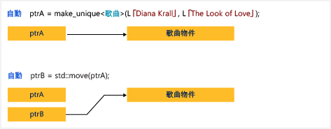

# How to: Create and use unique_ptr instances

A [unique_ptr](../standard-library/unique-ptr-class.md) does not share its pointer. It cannot be copied to another `unique_ptr`, passed by value to a function, or used in any C++ Standard Library algorithm that requires copies to be made. 只能移動 `unique_ptr`。 這表示記憶體資源的擁有權轉移到另一個 `unique_ptr`，原始 `unique_ptr` 不再擁有它。 因為多重擁有權會增加程序邏輯的複雜度，建議您將物件限制為一個擁有者。 Therefore, when you need a smart pointer for a plain C++ object, use `unique_ptr`, and when you construct a `unique_ptr`, use the [make_unique](../standard-library/memory-functions.md#make_unique) helper function.

下圖說明兩個 `unique_ptr` 執行個體之間的擁有權轉移。

`unique_ptr` is defined in the `<memory>` header in the C++ Standard Library. It is exactly as efficient as a raw pointer and can be used in C++ Standard Library containers. The addition of `unique_ptr` instances to C++ Standard Library containers is efficient because the move constructor of the `unique_ptr` eliminates the need for a copy operation.

## 範例 1

下列範例示範如何建立 `unique_ptr` 執行個體，並在函式之間傳遞這些執行個體。

[!code-cpp[stl_smart_pointers#210](codesnippet/CPP/how-to-create-and-use-unique-ptr-instances_1.cpp)]

這些範例示範 `unique_ptr` 的這種基本特性：可加以移動，但無法複製。 「移動」會將擁有權轉移到新的 `unique_ptr` 並重設舊的 `unique_ptr`。

## 範例 2

下列範例示範如何建立 `unique_ptr` 執行個體並在向量中使用這些執行個體。

[!code-cpp[stl_smart_pointers#211](codesnippet/CPP/how-to-create-and-use-unique-ptr-instances_2.cpp)]

在範圍 for 迴圈中，請注意 `unique_ptr` 是以傳址方式傳遞。 如果您嘗試在這裡以傳值方式傳遞，編譯器就會擲回錯誤，因為 `unique_ptr` 複製建構函式已刪除。

## 範例 3

下列範例示範如何初始化本身為類別成員的 `unique_ptr`。

[!code-cpp[stl_smart_pointers#212](codesnippet/CPP/how-to-create-and-use-unique-ptr-instances_3.cpp)]

## 範例 4

You can use [make_unique](../standard-library/memory-functions.md#make_unique) to create a `unique_ptr` to an array, but you cannot use `make_unique` to initialize the array elements.

[!code-cpp[stl_smart_pointers#213](codesnippet/CPP/how-to-create-and-use-unique-ptr-instances_4.cpp)]

For more examples, see [make_unique](../standard-library/memory-functions.md#make_unique).

## 請參閱

[智慧型指標 (現代 C++)](smart-pointers-modern-cpp.md) 
[make_unique](../standard-library/memory-functions.md#make_unique)
