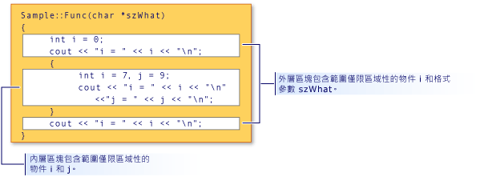

# <a name="scope-visual-c"></a>範圍 (Visual C++)
C++ 名稱只可以在程式的某些區域使用。 這個區域稱為名稱的「範圍」。 範圍會決定不是代表靜態延伸物件之名稱的「存留期」。 範圍也會決定名稱的可視性，即當呼叫類別建構函式和解構函式時，以及當變數的區域範圍初始化時。 (如需詳細資訊，請參閱[建構函式](../cpp/constructors-cpp.md)和[解構函式](../cpp/destructors-cpp.md)。)範圍有五種：  
  
-   **本機領域**區塊內宣告的名稱是只能在該區塊以及它，並只在宣告點之後，括住的區塊中存取。 函式的最外層區塊範圍中函式的型式引數名稱具有區域範圍，就像是在封閉函式主體的區塊內進行宣告。 請考慮下列程式碼片段：  
  
    ```  
    {  
        int i;  
    }  
    ```  
  
     由於 `i` 是在大括號括住的區塊內宣告，因此 `i` 具有區域範圍，而且永遠不會存取，因為沒有任何程式碼會在右邊大括號之前存取它。  
  
-   **函式範圍**標籤是唯一具有函式範圍的名稱。 可以在函式內的任意位置使用，不過，無法從該函式的外部進行存取。 在函式的型式引數 (在函式定義中指定的引數) 視為在函式主體最外層區塊的範圍內。  
  
-   **檔案範圍**之外所有區塊或類別宣告任何名稱具有檔案範圍。 可以在宣告後，於轉譯單位中的任意位置進行存取。 未宣告靜態物件的名稱具有檔案範圍，通常稱為全域名稱。  
  
     在 C++ 中，檔案範圍也稱為命名空間範圍。  
  
-   **類別範圍**類別成員的名稱具有類別範圍。 類別成員函式可以存取使用成員選取運算子 (**。** 或 **->** ) 或成員指標運算子 (**。\***或 **-> \*** ) 上的物件或該類別; 的物件指標非靜態類別成員資料會被視為本機該類別的物件。 請考慮下列類別宣告：  
  
    ```  
    class Point  
    {  
        int x;  
        int y;  
    };  
    ```  
  
     類別成員 `x` 和 `y` 視為是位於類別 `Point` 的範圍內。  
  
-   **原型範圍**函式原型中宣告的名稱才可見之原型的結尾。 下列原型宣告三個名稱 (`strDestination`、`numberOfElements` 和 `strSource`)，這些名稱超出原型結尾的範圍：  
  
    ```  
    errno_t strcpy_s( char *strDestination, size_t numberOfElements, const char *strSource );  
    ```  
  
## <a name="hiding-names"></a>隱藏名稱  
 您可以在封閉的區塊中宣告名稱，以隱藏該名稱。 下圖是在內層區塊中重新宣告 `i`，從而隱藏外層區塊範圍中與 `i` 相關的變數。  
  
   
隱藏區塊範圍和名稱  
  
 本圖所示的程式輸出為：  
  
```  
i = 0  
i = 7  
j = 9  
i = 0  
```  
  
> [!NOTE]
>  `szWhat` 引數被視為在函式的範圍中。 因此，其會被視為已在函式的最外層區塊中宣告。  
  
## <a name="hiding-class-names"></a>隱藏類別名稱  
 您可以藉由宣告函式、物件、變數或相同範圍中的列舉程式，隱藏類別名稱。 不過，類別名稱仍可存取時加上關鍵字**類別**。  
  
```  
// hiding_class_names.cpp  
// compile with: /EHsc  
#include <iostream>  
using namespace std;  
  
// Declare class Account at file scope.  
class Account  
{  
public:  
    Account( double InitialBalance )  
        { balance = InitialBalance; }  
    double GetBalance()  
        { return balance; }  
private:  
    double balance;  
};  
  
double Account = 15.37;            // Hides class name Account  
  
int main()  
{  
    class Account Checking( Account ); // Qualifies Account as   
                                       //  class name  
  
    cout << "Opening account with balance of: "  
         << Checking.GetBalance() << "\n";  
}  
//Output: Opening account with balance of: 15.37  
```  
  
> [!NOTE]
>  任何呼叫類別名稱 (`Account`) 的位置，都必須使用關鍵字類別將它與檔案範圍變數 Account 做區分。 當類別名稱出現在範圍解析運算子 (::) 的左邊時，不適用這項規則。 範圍解析運算子左邊的名稱一律視為類別名稱。  
  
 下列範例示範如何宣告類型的物件的指標`Account`使用**類別**關鍵字：  
  
```  
class Account *Checking = new class Account( Account );  
```  
  
 `Account`初始設定式中 （括號中） 之前的陳述式中具有檔案範圍; 它是型別**double**。  
  
> [!NOTE]
>  重複使用識別項名稱 (如這個範例中所示) 會視為不良的程式設計風格。  
  
 如需指標的詳細資訊，請參閱[衍生型別](http://msdn.microsoft.com/en-us/aa14183c-02fe-4d81-95fe-beddb0c01c7c)。 如需宣告和初始化類別物件的資訊，請參閱[類別、 結構和等位](../cpp/classes-and-structs-cpp.md)。 如需使用**新**和**刪除**可用存放區運算子，請參閱[新和 delete 運算子](new-and-delete-operators.md)。  
  
## <a name="hiding-names-with-file-scope"></a>隱藏檔案範圍的名稱  
 您可以藉由在區塊範圍中明確宣告相同的名稱，隱藏具有檔案範圍的名稱。 不過，檔案範圍名稱可以使用範圍解析運算子 (`::`) 存取。  
  
```  
// file_scopes.cpp  
// compile with: /EHsc  
#include <iostream>  
  
int i = 7;   // i has file scope, outside all blocks  
using namespace std;  
  
int main( int argc, char *argv[] ) {  
   int i = 5;   // i has block scope, hides i at file scope  
   cout << "Block-scoped i has the value: " << i << "\n";  
   cout << "File-scoped i has the value: " << ::i << "\n";  
}  
```  
  
```Output  
Block-scoped i has the value: 5  
File-scoped i has the value: 7  
```  
  
## <a name="see-also"></a>請參閱  
 [基本概念](../cpp/basic-concepts-cpp.md)