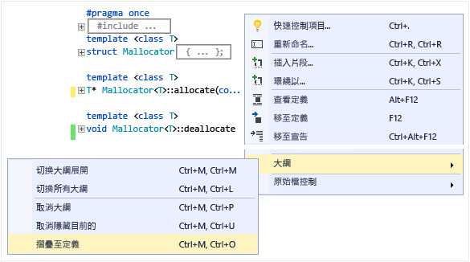
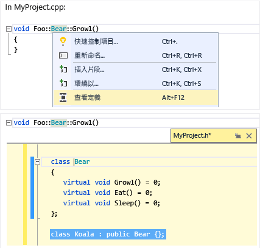
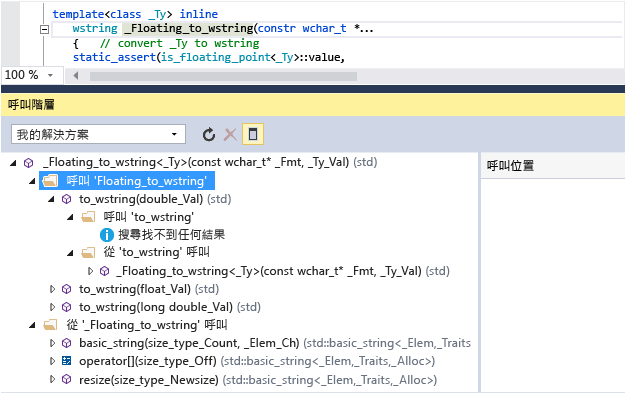

# 在 Visual Studio 中閱讀及了解 C++ 程式碼

C++ 程式碼編輯器和 Visual Studio IDE 提供許多程式碼撰寫的輔助工具。 有些是 C++ 獨有，有些則基本上對所有 Visual Studio 語言都相同。 如需編輯器的詳細資訊，請參閱[在程式碼和文字編輯器中撰寫程式碼](/visualstudio/ide/writing-code-in-the-code-and-text-editor)。  

## 顏色標示

Visual Studio 會以顏色標示語法元素來區別符號類型，例如語言關鍵字、類型名稱、變數名稱、函式參數、字串常值等等。

未使用程式碼 (例如 #if 0 底下的程式碼) 的顏色較淡。

您可以在 [快速啟動]**** 中鍵入「字型」，然後選擇 [字型和色彩]**** 來自訂色彩。 請在 [字型和色彩]**** 對話方塊中向下捲動至 C/C++ 選項，然後選擇自訂字型及/或色彩。

## 大綱

在原始程式碼檔案中的任何位置按一下滑鼠右鍵，然後選擇 [大綱]**** 可摺疊或展開程式碼區塊及/或自訂區域，讓您更方便僅瀏覽感興趣的部分。 如需詳細資訊，請參閱[大綱](/visualstudio/ide/outlining)。

當您將資料指標放在大括弧 '{' 或 '}' 前面時，編輯器會醒目提示其相符的對應項目。

其他大綱選項位於主選單中的 **「編輯** > **大綱**」下。

## 行號

您可以通過**存取工具** > **選項** > **文字編輯器** > **所有語言** > **一般**或透過**快速啟動(Ctrl+ Q)** 搜尋「列數」來向專案添加行號。 您可以針對所有語言或只針對特定語言 (包括 C++) 設定行號。

## 捲動和縮放

您可以按下 **Ctrl** 鍵並使用滑鼠滾輪捲動，在編輯器中放大或縮小。 您也可以使用左下角的縮放設定來進行縮放。

捲軸 [對應模式]**** 可讓您快速地捲動及瀏覽程式碼檔案，而不需要離開目前位置。 您可以按一下 Code Map 上的任何位置，直接移至該處。

要打開**地圖模式**,請在主工具列中的 **「快速啟動**」搜尋框中鍵入「地圖」,然後選擇 **「使用滾動地圖模式**」。 如需詳細資訊，請參閱[如何：自訂捲軸以追蹤程式碼](/visualstudio/ide/how-to-track-your-code-by-customizing-the-scrollbar)。

在關閉 [對應模式]**** 後，捲軸還是會醒目提示您在檔案中所進行的變更。 綠色表示已儲存的變更，而黃色表示未儲存的變更。

## 快速諮詢和參數資訊

將滑鼠指標移至任何變數、函式或其他符號上方，即可取得其相關資訊，包括宣告，以及位於其前方的任何註解。

::: moniker range="vs-2019"

[快速諮詢]**** 工具提示含有 [線上搜尋]**** 連結。 跳到**工具** > **選項** > **文字編輯器** > **C++** C++ > **檢視**指定搜尋提供者。

如果程式碼中出現錯誤，您可以將滑鼠指標移至其上方，[快速諮詢]**** 即會顯示錯誤訊息。 您也可以在 [錯誤清單] 視窗中找到錯誤訊息。

::: moniker-end

::: moniker range="<=vs-2017"

如果程式碼中出現錯誤，您可以將滑鼠指標移至其上方，[快速諮詢]**** 即會顯示錯誤訊息。 您也可以在 [錯誤清單]**** 視窗中找到錯誤訊息。

::: moniker-end

當您呼叫函式時，**參數資訊**會顯示參數類型及其預期出現順序。

## 查看定義

將滑鼠指標移至變數或函式宣告上方，按一下滑鼠右鍵，然後選擇 [查看定義]****，以查看其定義的內嵌檢視，而不用離開您的目前位置。 如需詳細資訊，請參閱[查看定義 (Alt+F12)](/visualstudio/ide/how-to-view-and-edit-code-by-using-peek-definition-alt-plus-f12)。

## F1 說明

將游標放在任何類型、關鍵字或函式之處或之後，然後按 **F1** 即可直接移至 docs.microsoft.com 上的相關參考主題。 **F1** 也適用於錯誤清單及許多對話方塊中的項目。

## 類別檢視

[類別檢視]**** 會顯示一組可搜尋的樹狀結構，其中包含所有程式碼符號及其範圍和父子式階層，根據每個專案進行組織。 您可以透過 [類別檢視設定]**** (按一下視窗頂端的齒輪方塊圖示) 來設定 [類別檢視]**** 顯示的內容。

## 產生 Include 檔圖形

以滑鼠右鍵按一下專案中的程式碼檔案，然後選擇 [產生 Include 檔圖形]****，以查看其他檔案所包含之檔案的圖形。

## 檢視呼叫階層

以滑鼠右鍵按一下任何函式呼叫，並檢視其所呼叫全部函式 (以及呼叫它的所有函式) 的遞迴清單。 清單中的每個函式都可以用相同方式展開。 如需詳細資訊，請參閱[呼叫階層](/visualstudio/ide/reference/call-hierarchy)。

## 另請參閱

[編輯及重構程式碼 (C++)](writing-and-refactoring-code-cpp.md) 
[在 Visual Studio 中巡覽 C++ 程式碼基底](navigate-code-cpp.md) 
[使用 Live Share for C++ 進行共同作業](live-share-cpp.md)
