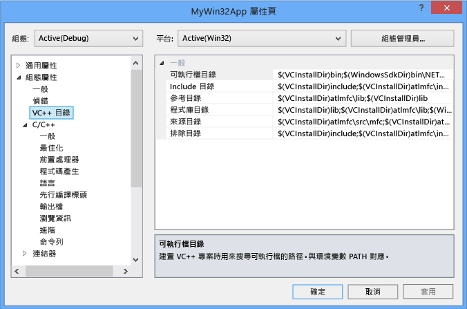
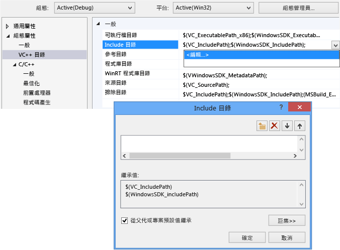
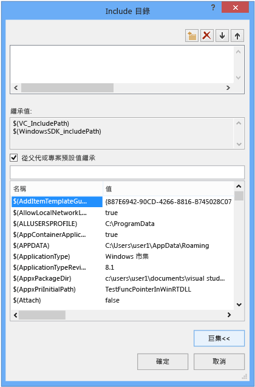
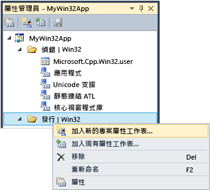

# <a name="working-with-project-properties"></a>使用專案屬性

在 IDE 中，建置專案所需的所有資訊都會公開為「屬性」。 此資訊包含應用程式名稱、副檔名 (例如 DLL、LIB、EXE)、編譯器選項、連結器選項、偵錯工具設定、自訂建置步驟，以及許多其他項目。 通常，您可以使用「屬性頁」(**[專案] &#124; [屬性]**) 來檢視和修改這些屬性。

當您建立專案時，系統會指派各種屬性值。 預設值會依據專案類型以及您在應用程式精靈中選擇的選項而稍有不同。 例如，ATL 專案具有與 MIDL 檔案相關的屬性，但這些屬性不存在於基本的主控台應用程式中。 預設屬性會顯示在 [屬性頁] 的 [一般] 窗格中：


某些屬性 (例如應用程式名稱) 適用於所有組建變異，而不論目標平台為何或它是偵錯組建還是發行組建。 但大部分的屬性都與組態相關。 這是因為，編譯器必須知道將在哪個特定平台上執行程式，以及要使用哪些特定的編譯器選項以產生正確的程式碼。 因此，當您設定屬性時，請務必注意新值應該套用到哪個組態與平台。 它應該只套用到偵錯 Win32 組建，還是也應該套用到偵錯 ARM 和偵錯 x64？ 例如，根據預設，[最佳化] 屬性在發行組態中設定為 [最快速度 (/O2)]，但在偵錯組態中已停用。

屬性頁的設計可讓您隨時查看，以及在需要時修改應該會套用屬性值的組態與平台。 下圖顯示在頂端的清單方塊中包含組態與平台資訊的屬性頁。 如果在此處設定 [最佳化] 屬性，它只會套用到偵錯 Win32 組建，這正好是使用中的組態，如紅色箭頭所示。


下圖顯示相同的專案屬性頁，但組態已變更為 [發行]。 請注意 [最佳化] 屬性的不同值。 另外請注意，使用中的組態仍然是 [偵錯]。 您可以在此處設定任何組態的屬性；它不一定是使用中的組態。


專案系統本身是以 MSBuild 為基礎，它可定義用於建置任何類型專案的檔案格式和規則。 MSBuild 會管理針對多個組態與平台建置時所產生的大部分複雜性，但是您需要稍微了解其運作方式。 如果您想要定義自訂組態，或建立可重複使用的屬性集以便共用或匯入多個專案，這一點特別重要。

專案屬性會直接儲存在專案檔 (*.vcxproj) 中，或儲存在專案檔所匯入且提供預設值的其他 .xml 或 .props 檔案中。 如先前所示，相同組態的相同屬性可能會在不同的檔案中指派不同的值。 當您建置專案時，MSBuild 引擎會以妥善定義的順序 (如下所述) 評估專案檔與所有匯入的檔案。 評估每個檔案時，任何在該檔案中定義的屬性值都會覆寫現有值。 任何未指定的值則會從稍早所評估的檔案繼承。 因此，當您使用屬性頁設定屬性時，請務必也要注意設定的位置。 如果在 .props 檔案中將屬性設定為 "X"，但此屬性在專案檔中設定為 "Y"，則專案將在屬性設定為 "Y" 的情況下建置。 如果相同屬性在專案項目 (例如 .cpp 檔案) 上設定為 "Z"，則 MSBuild 引擎會使用 "Z" 值。 如需詳細資訊，請參閱本文稍後的[屬性繼承](#bkmkPropertyInheritance)。

## <a name="build-configurations"></a>組建組態

組態只是已指定名稱的任意一組屬性。 Visual Studio 提供一些偵錯和發行組態，每個都會針對偵錯組建或發行組建適當地設定各種屬性。 您可以使用 [組態管理員]，將自訂組態定義為針對組建之特定類別來分組屬性的便利方式。 [屬性管理員] 用於進階處理屬性，但我們將在此處進行介紹，因為它可協助視覺化屬性組態。 您可以從 [檢視] &#124; [屬性管理員] 或 [檢視] &#124; [其他視窗] &#124; [屬性管理員] 存取它，這取決於您的設定。 它包含專案中每個組態/平台配對的節點。 每個節點下都是屬性工作表 (.props 檔案) 的節點，可為該組態設定一些特定屬性。


如果您移至 [屬性頁] 中的 [一般] 窗格 (請參閱上圖)，並將 [字元集] 屬性設定為 [未設定] 而非 [使用 Unicode]，然後按一下 [確定]，[屬性管理員] 會顯示目前的組態沒有 [Unicode 支援] 屬性工作表，但它仍會用於其他組態。

如需 [屬性管理員] 和屬性工作表的詳細資訊，請參閱本文稍後的[建立可重複使用的屬性組態](#bkmkPropertySheets)。

> [!TIP]
> .user 檔案是一項舊版功能，建議您將其刪除，以根據組態/平台將屬性正確分組。

## <a name="target-platforms"></a>目標平台

「目標平台」指的是可執行檔將在其上執行之裝置及/或作業系統的類型。 您可以為多個平台建置專案。 C++ 專案可用的目標平台取決於專案類型；它們包括但不限於 Win32、x64、ARM、Android 和 iOS。     您可能會在 [組態管理員] 中看到的 **X86** 目標平台，等同於原生 C++ 專案中的 **Win32**。 Win32 表示 32 位元 Windows，而 **x64** 表示 64 位元 Windows。 如需這兩個平台的詳細資訊，請參閱[執行 32 位元應用程式](/windows/desktop/WinProg64/running-32-bit-applications)。

您可能會在 [組態管理員] 中看到的 [任何 CPU] 目標平台值，對原生 C++ 專案沒有任何影響；它與 C++/CLI 和其他 .NET 專案類型有關。 如需詳細資訊，請參閱 [/CLRIMAGETYPE (指定 CLR 映像類型)](../build/reference/clrimagetype-specify-type-of-clr-image.md)。

## <a name="property-pages"></a>「屬性頁」

如同稍早所述，Visual C++ 專案系統是以 [MSBuild](/visualstudio/msbuild/msbuild-properties) 為基礎，而且值會儲存在 XML 專案檔中，預設為 .props 和 .targets 檔案。 若為 Visual Studio 2015，這些檔案位於 **\Program Files (x86)\MSBuild\Microsoft.Cpp\v4.0\V140**。 若為 Visual Studio 2017，這些檔案位於 **\\Program Files (x86)\\Microsoft Visual Studio\\2017\\_edition_\\Common7\\IDE\\VC\\VCTargets**，其中 _edition_ 是安裝的 Visual Studio 版本。 屬性也會儲存在您可能新增至自己專案的任何自訂 .props 檔案中。 除非您非常了解 MSBuild，否則強烈建議您不要手動編輯這些檔案，並改為在 IDE 中使用屬性頁來修改所有屬性，特別是那些參與繼承的屬性。

下圖顯示 Visual C++ 專案的屬性頁。 左窗格中已選取 [VC++ 目錄*規則*]，則右窗格中會列出與該規則建立關聯的屬性。 `$(...)`值不巧稱為「巨集」。 這些「不是」 C/C++ 巨集，而只是編譯時間常數。 (本文稍後的[屬性頁巨集](#bkmkPropertiesVersusMacros)一節會討論巨集。)



> [!WARNING]
> 舊版 Visual Studio 中的 [通用屬性] 組態已遭到移除。 若要將參考新增至專案，您現在會使用與受控語言相同的方式，透過 [新增參考] 對話方塊來完成。 請參閱[管理專案中的參考](/visualstudio/ide/managing-references-in-a-project)。

#### <a name="to-set-a-property-for-a-project"></a>若要設定專案的屬性

1. 在大部分情況下，您可以在專案層級設定屬性，而不需要建立自訂屬性工作表。 在主功能表上，選擇 [專案] &#124; [屬性]，或以滑鼠右鍵按一下 [方案總管] 中的專案節點，並選擇 [屬性]。

2. 使用對話方塊頂端的 [組態] 和 [平台] 清單方塊來指定應該套用變更的屬性群組。 在許多情況下，[所有平台] 和 [所有組態] 是正確的選擇。 若只是要設定某些組態的屬性，請在 [屬性管理員] 中複選屬性，然後開啟捷徑功能表並選擇 [屬性]。

[屬性頁] 對話方塊只會顯示適用於目前專案的屬性頁。 例如，如果專案沒有 .idl 檔案，就不會顯示 MIDL 屬性頁。

當您反白顯示屬性頁中的屬性時，可以按 **F1** 移至參考主題，以取得對應的編譯器或連結器參數的詳細資訊。

您可以在這些主題中找到每個屬性頁的詳細資訊：

- [一般屬性頁面 (專案)](../ide/general-property-page-project.md)

- [一般屬性頁 (檔案)](../ide/general-property-page-file.md)

- [命令列屬性頁](../ide/command-line-property-pages.md)

- [C++ 偵錯組態的專案設定](/visualstudio/debugger/project-settings-for-a-cpp-debug-configuration)

- [NMake 屬性頁](../ide/nmake-property-page.md)

- [連結器屬性頁](../ide/linker-property-pages.md)

- [資源屬性頁](../ide/resources-property-pages.md)

- [MIDL 屬性頁](../ide/midl-property-pages.md)

- [Web 參考屬性頁](../ide/web-references-property-page.md)

- [XML 資料產生器工具屬性頁](../ide/xml-data-generator-tool-property-page.md)

## <a name="to-quickly-browse-and-search-all-properties"></a>快速瀏覽和搜尋所有屬性

[所有選項] 屬性頁 (在 [屬性頁] 對話方塊中的 [組態屬性] &#124; [C/C++] 節點底下) 提供快速的方式，讓您瀏覽和搜尋目前內容中可用的屬性。 其中有特別的搜尋方塊和協助篩選結果的簡單語法：

沒有前置詞：<br/>
只在屬性名稱中搜尋 (不區分大小寫的子字串)。

'/' 或 '-'：<br/>
只在編譯器參數中搜尋 (不區分大小寫的前置詞)

v:<br/>
只在值中搜尋 (不區分大小寫的子字串)。

##  <a name="bkmkPropertiesVersusMacros"></a> 屬性頁巨集

「巨集」是一個編譯時間常數，可以參考由 Visual Studio 或 MSBuild 系統所定義的值或使用者定義的值。 藉由使用巨集而不使用硬式編碼值 (例如目錄路徑)，您可以更輕鬆地在電腦之間以及在 Visual Studio 版本之間共用屬性設定，並且更能確保您的專案設定正確參與屬性繼承。 您可以使用屬性編輯器來檢視所有可用巨集的值。

### <a name="predefined-macros"></a>預先定義巨集

全域巨集<br/>
套用至專案組態中的所有項目。 具有語法 `$(name)`。 例如，`$(VCInstallDir)` 即是全域巨集，這會儲存 Visual Studio 安裝根目錄。 全域巨集對應於 MSBuild 中的 `PropertyGroup`。

項目巨集<br/>
具有語法 `%(name)`。 對於檔案，項目巨集只套用至該檔案。例如，您可以使用 `%(AdditionalIncludeDirectories)` 來指定只套用至特定檔案的 Include 目錄。 這類型的項目巨集對應於 MSBuild 中的 `ItemGroup` 中繼資料。 在專案組態的內容中使用時，項目巨集會套用至特定類型的所有檔案。 例如，C/C++ [前置處理器定義] 組態屬性可以接受套用至專案中所有 .cpp 檔案的 `%(PreprocessorDefinitions)` 項目巨集。 這類型的項目巨集對應於 MSBuild 中的 `ItemDefinitionGroup` 中繼資料。 如需詳細資訊，請參閱[項目定義](/visualstudio/msbuild/item-definitions)。

### <a name="user-defined-macros"></a>使用者定義巨集

您可以建立「使用者定義巨集」，在專案組建中當作變數使用。 例如，您可以建立使用者定義巨集，提供自訂建置步驟或自訂建置工具的值。 使用者定義巨集是名稱/值組。 在專案檔中，使用 **$(**<em>name</em>**)** 標記法來存取值。

使用者定義巨集會儲存在屬性工作表中。 如果您的專案沒有包含屬性工作表，請遵循[建立可重複使用的屬性組態](#bkmkPropertySheets)底下的步驟來建立屬性工作表。

##### <a name="to-create-a-user-defined-macro"></a>建立使用者定義巨集

1. 在 [屬性管理員] 視窗 (在功能表列上，選擇 [檢視]、[屬性管理員])，開啟屬性工作表 (其名稱以 .user 結尾) 的捷徑功能表，然後選擇 [屬性]。 該屬性工作表的 [屬性頁] 對話方塊隨即開啟。

1. 在對話方塊的左窗格中，選取 [使用者巨集]。 在右窗格中，選擇 [新增巨集] 按鈕以開啟 [新增使用者巨集] 對話方塊。

1. 在對話方塊中，指定巨集的名稱和值。 或者，選取 [設定此巨集作為建置環境中的環境變數] 核取方塊。

## <a name="property-editor"></a>屬性編輯器

您可以使用屬性編輯器，修改特定字串屬性和選擇巨集做為值。 若要存取屬性編輯器，請選取屬性頁上的屬性，然後選擇右邊的向下箭號按鈕。 如果下拉式清單包含 [\<編輯>]，則可以選擇它來顯示該屬性的屬性編輯器。



在屬性編輯器中，您可以選擇 [巨集] 按鈕來檢視可用巨集及其目前值。 下圖顯示選擇 [巨集] 按鈕之後，[其他 Include 目錄] 屬性的屬性編輯器。 當 [從父代或專案預設值繼承] 核取方塊已選取，而且您新增新值時，這個值會附加至目前繼承的任何值。 如果您清除此核取方塊，則新值會取代繼承的值。 在大部分情況下，讓核取方塊保持已選取狀態。



##  <a name="bkmkPropertySheets"></a> 共用可重複使用的屬性組態

雖然可以按照每個使用者、每台電腦基準設定「全域」屬性，但是我們已不建議使用。 相反地，建議您使用 [屬性管理員] 建立「屬性工作表」，以儲存您希望可以重複使用或與他人共用的每一種專案設定。 屬性工作表也會減少不慎變更其他專案類型之屬性設定的可能性。 [建立可重複使用的屬性組態](#bkmkPropertySheets)會詳細討論屬性工作表。

> [!IMPORTANT]
> **.user 檔案，以及其問題的原因**
>
> Visual Studio 的過去版本會使用具有 .user 副檔名且位於 \<使用者設定檔>\AppData\Local\Microsoft\MSBuild\v4.0\ 資料夾的全域屬性工作表中。 我們已不建議使用，因為這些檔案是按照每位使用者、每台電腦基準來設定專案組態的屬性。 這類「全域」設定可能干擾組建，尤其是在您以組建電腦上的多個平台為目標時。 例如，如果您同時有 MFC 專案和 Windows Phone 專案，那麼 .user 屬性對其中一個專案會是無效的。 可重複使用的屬性工作表具有較大彈性且更為穩固。
>
> 雖然 .user 檔案仍舊由 Visual Studio 安裝並且參與屬性繼承，但預設為空白。 最佳做法是在 [屬性管理員] 中刪除其參考，以確保您的專案獨立運作，不受每個使用者、每部電腦設定的影響。這點對確保在 SCC (原始程式碼控制) 環境中產生正確行為非常重要。

若要顯示 [屬性管理員]，請在功能表列上，選擇 [檢視]、[其他視窗]、[屬性管理員]。

如果您有一組要套用至多個專案的常用共同屬性，您可以使用 [屬性管理員] ，將這些屬性擷取到可重複使用的「屬性工作表」檔案，其依慣例具有 .props 副檔名。 您可以將一個或多個工作表套用至新的專案，這樣就不需要從頭設定其屬性。 若要存取 [屬性管理員]，請在功能表列上，選擇 [檢視]、[屬性管理員]。



在每個組態節點下，您會看到該組態所套用的每個屬性工作表的節點。 系統會新增屬性工作表，這些屬性工作表是在您建立專案時，根據應用程式精靈中選擇的選項設定值。 請以滑鼠右鍵按一下任何節點，然後選擇 [屬性]，以查看套用到該節點的屬性。 所有屬性工作表都會自動匯入專案的「主要」屬性工作表 (ms.cpp.props)，並依 [屬性管理員] 中的出現順序進行評估。 您可以移動它們以變更評估順序。 稍後評估的屬性工作表將會覆寫先前評估之工作表中的值。

如果您選擇 [新增專案屬性工作表]，然後選擇 (例如) MyProps.props 屬性工作表，就會出現屬性頁對話方塊。 請注意，這會套用至 MyProps 屬性工作表。您所做的任何變更都將寫入至工作表，而非專案檔 (.vcxproj)。

如果直接在 .vcxproj 檔案中設定相同屬性，就會覆寫屬性工作表中的屬性。

您可以視需要匯入屬性工作表。 方案中的多個專案可以繼承同一個屬性工作表中的設定，而且專案可以有多個工作表。 屬性工作表本身可以繼承另一個屬性工作表中的設定。

您也可以為多個組態建立一個屬性工作表。 若要這麼做，請建立每個組態的屬性工作表，開啟其中一個工作表的捷徑功能表，選擇 [新增現有屬性工作表]，然後新增其他工作表。 不過，如果您使用一個通用屬性工作表，請注意當您設定屬性時，這個屬性是針對工作表所套用至的所有組態來設定；還要知道 IDE 不會告訴您哪些專案或其他屬性工作表是繼承自指定的屬性工作表。

在具有許多個專案的大型方案中，建立方案層級的屬性工作表會很有用。 當您將專案新增至方案時，請使用 [屬性管理員] 將該屬性工作表新增至專案。 如果這必須在專案層級進行，您可以加入新的屬性工作表來設定專案特定值。

> [!IMPORTANT]
> 由於 .props 檔案不是建立做為專案項目，因此預設不參與原始檔控制。 如果要在原始檔控制中包含這個檔案，可以手動將其加入做為方案項目。

#### <a name="to-create-a-property-sheet"></a>建立屬性工作表

1. 在功能表列上，選擇 [檢視]、[屬性管理員]。 [屬性管理員] 隨即開啟。

2. 若要定義屬性工作表的範圍，請選取套用的項目。 這可以是特定組態，或其他屬性工作表。 開啟這個項目的捷徑功能表，然後選擇 [新增專案屬性工作表]。 指定名稱和位置。

3. 在 [屬性管理員] 中，開啟新的屬性工作表，然後設定您要包含的屬性。

##  <a name="bkmkPropertyInheritance"></a> 屬性繼承

專案屬性是有層次的。 每一層都會繼承上一層的值，但是繼承的值可以藉由明確設定屬性來覆寫。 以下是基本繼承樹狀：

1. MSBuild CPP Toolset 的預設設定 (..\Program Files\MSBuild\Microsoft.Cpp\v4.0\Microsoft.Cpp.Default.props，由 .vcxproj 檔案匯入)。

2. 屬性工作表

3. .vcxproj 檔案  (可以覆寫預設及屬性工作表設定)。

4. 項目中繼資料

> [!TIP]
> 在屬性頁中，以 `bold` 表示的屬性是在目前內容中定義的。 以一般字型表示的屬性是繼承的。

專案檔 (.vcxproj) 會在建置階段匯入其他屬性工作表。 匯入所有屬性工作表之後，將會對專案檔進行評估，任何屬性值的最後一個定義就是使用的值。 有時候，檢視展開的檔案以判斷指定的屬性值如何繼承，十分有用。 若要檢視展開的版本，請在 Visual Studio 命令提示字元輸入下列命令  (將預留位置檔案名稱變更為您要使用的名稱)。

**msbuild /pp:** *temp* **.txt** *myapp* **.vcxproj**

除非您熟悉 MSBuild，不然展開的專案檔可能很龐大，而且難以了解。 以下是專案檔的基本結構：

1. 基本專案屬性，IDE 不會公開這些屬性。

2. 匯入 Microsoft.cpp.default.props，這會定義一些與工具組無關的基本屬性。

3. 全域組態屬性 (在 [組態概觀] 頁面上公開為 **PlatformToolset** 和 **Project** 預設屬性)。 這些屬性會決定 Microsoft.cpp.props 在下一個步驟中匯入哪些工具組和內建屬性工作表。

4. 匯入 Microsoft.cpp.props，這會設定大部分的專案預設值。

5. 匯入所有屬性工作表，包括 .user 檔案。 這些屬性工作表可能會覆寫除了 **PlatformToolset** 和 **Project** 預設屬性以外的所有屬性。

6. 剩餘的專案組態屬性。 這些值可以覆寫屬性工作表上已設定的屬性。

7. 項目 (檔案) 以及其中繼資料。 這些項目永遠握有 MSBuild 評估規則的最後決定權，即使是在其他屬性和匯入之前出現。

如需詳細資訊，請參閱 [MSBuild 屬性](/visualstudio/msbuild/msbuild-properties)。

## <a name="adding-an-include-directory-to-the-set-of-default-directories"></a>將 Include 目錄加入至一組預設目錄

當您將 Include 目錄加入至專案時，注意不要覆寫所有的預設目錄。 正確新增目錄的方式是附加新路徑 (例如 "C:\MyNewIncludeDir\")，然後將 **$(IncludePath)** 巨集附加至屬性值。

## <a name="setting-environment-variables-for-a-build"></a>設定組建的環境變數

Visual C++ 編譯器 (cl.exe) 會辨識某些環境變數，特別是 LIB、LIBPATH、PATH 和 INCLUDE。 當您使用 IDE 進行建置時，在 [VC++ 目錄屬性頁](../ide/vcpp-directories-property-page.md)屬性頁中設定的屬性會用來設定這些環境變數。 如果已經設定 LIB、LIBPATH 和 INCLUDE 值 (例如，透過開發人員命令提示字元)，這些值會取代為對應 MSBuild 屬性的值。 組建接著會在 PATH 之前加上 [VC++ 目錄] 可執行檔目錄屬性的值。 您可以設定使用者定義的環境變數，做法是建立使用者定義巨集，然後核取顯示 [設定此巨集作為建置環境中的環境變數] 的方塊。

## <a name="setting-environment-variables-for-a-debugging-session"></a>設定偵錯工作階段的環境變數

在專案的 [屬性頁] 對話方塊的左窗格中，展開 [組態屬性]，然後選取 [偵錯]。

在右窗格中，修改 [環境] 或 [合併環境] 專案設定，然後選擇 [確定] 按鈕。

## <a name="modifying-properties-and-targets-without-changing-the-project-file"></a>修改屬性和目標而不變更專案檔

您可以從 MSBuild 命令提示字元覆寫專案屬性和目標，而不需變更專案檔。 當您想要暫時或偶爾套用某些屬性時，這非常有用。 它會假設需要一些 MSBuild 知識。 如需詳細資訊，請參閱 [MSBUild](https://docs.microsoft.com/en-us/visualstudio/msbuild/msbuild)。

> [!IMPORTANT]
> 您可以使用 Visual Studio 的 XML 編輯器或任何文字編輯器來建立 .props 或 .targets 檔案。 請勿使用此案例中的 [屬性管理員]，因為它會將屬性新增至專案檔。

若要覆寫專案屬性：

1. 建立 .props 檔案，以指定您想要覆寫的屬性。

1. 從命令提示字元：設定 ForceImportBeforeCppTargets="C:\sources\my_props.props"

若要覆寫專案目標：

1. 建立具有其實作或特定目標的 .targets 檔案

2. 從命令提示字元：設定 ForceImportAfterCppTargets ="C:\sources\my_target.targets"

您也可以使用 /p: 選項，在 msbuild 命令列上設定其中一個選項：

```cmd
> msbuild myproject.sln /p:ForceImportBeforeCppTargets="C:\sources\my_props.props"
> msbuild myproject.sln /p:ForceImportAfterCppTargets="C:\sources\my_target.targets"
```

以這種方式覆寫屬性和目標，相當於將下列匯入項目新增至方案中的所有 .vcxproj 檔案：

```cmd
<Import Project=="C:\sources\my_props.props" />
<Import Project="$(VCTargetsPath)\Microsoft.Cpp.targets" />
<Import Project==" C:\sources\my_target.targets"" />
```

## <a name="see-also"></a>另請參閱

[建立和管理 Visual C++ 專案](../ide/creating-and-managing-visual-cpp-projects.md)<br/>
[.vcxproj 和.props 檔案結構](vcxproj-file-structure.md)<br/>
[屬性頁面 XML 檔案](property-page-xml-files.md)<br/>
