# 撰寫及重構程式碼 (C++)
[!INCLUDE[vs2017banner](../assembler/inline/includes/vs2017banner.md)]

Visual C\+\+ 程式碼編輯器和 IDE 提供許多程式碼撰寫的輔助工具。  有些是 C\+\+ 獨有，有些則基本上對所有 Visual Studio 語言都相同。  啟用及設定這些功能的選項位於文字編輯器 \[C\+\+ 進階\] 對話方塊中 \(\[工具 &#124; 選項 &#124; 文字編輯器 &#124; C\/C\+\+ &#124;進階\] 或在 \[快速啟動\] 輸入「C\+\+ 進階」\)。  選擇您想要設定的選項之後，您可以在對話方塊顯示時按下 **F1** 取得更多說明。  對於一般程式碼格式設定選項，請將 `Editor C++` 輸入至 **QuickLaunch**。  
  
## 加入新的程式碼  
 建立專案之後，您可以開始在為您所產生的檔案中撰寫程式碼。  若要新增檔案，請在 \[方案總管\] 中的專案節點上按右鍵，並選擇 **\[加入\] &#124; \[新增\]**。  
  
 若要設定格式選項，例如縮排、以大括號完成和顏色標示，請將 `C++ Formatting` 輸入至 **QuickLaunch** 視窗。  
  
### IntelliSense  
 IntelliSense 是一組功能的名稱，提供有關成員、類型和函式多載的內嵌資訊。  下圖顯示您在輸入時會出現的下拉式成員清單。  您可以按下 \[tab\] 鍵，將選取的項目文字輸入到您的程式碼檔案。  
  
   
  
 如需完整資訊，請參閱 [Visual C\+\+ Intellisense](../Topic/Visual%20C++%20Intellisense.md)。  
  
### 插入程式碼片段  
 程式碼片段是預先定義的原始碼片段。  以滑鼠右鍵按一下單點或選取的文字，可插入程式碼片段或以程式碼片段圍繞選取的文字。  下圖顯示以 for 迴圈圍繞所選陳述式的三個步驟。  最終影像中的黃色反白顯示就是您使用 tab 鍵存取的可編輯欄位。  如需詳細資訊，請參閱[程式碼片段](../Topic/Code%20Snippets.md)。  
  
 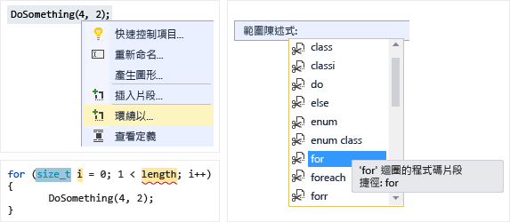  
  
### 加入類別  
 使用 \[類別精靈\] 從 \[專案\] 功能表加入新的類別。  
  
 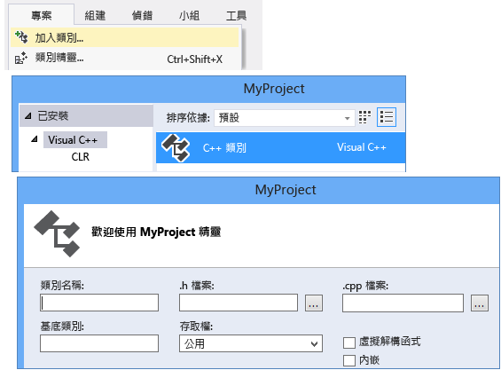  
  
### 類別精靈  
 使用 \[類別精靈\] 修改或檢查現有的類別，或加入新的類別。  如需詳細資訊，請參閱[使用 &#91;程式碼精靈&#93; 加入功能 \(C\+\+\)](../ide/adding-functionality-with-code-wizards-cpp.md)。  
  
 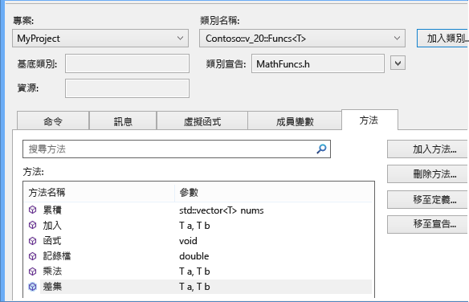  
  
## 重構  
 重構可以從 \[快速動作\] 內容功能表項目下取得，或是按一下編輯器中的[燈泡](../Topic/Perform%20quick%20actions%20with%20light%20bulbs.md)。  
  
### 重新命名  
 當類型、函式或變數用於指定的範圍時，請將其重新命名。  在下圖中，`Eat` 方法將會在衍生和基底類別中重新命名為 `Devour`。  
  
 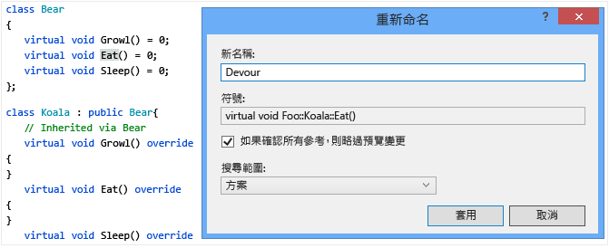  
  
### 快速動作：移動定義位置  
 將一或多個函式定義移至與程式碼檔案具有相同名稱的標頭檔中。  如果標頭不存在，則會建立新標頭。  產生的定義會內嵌顯示在查看視窗中。  
  
 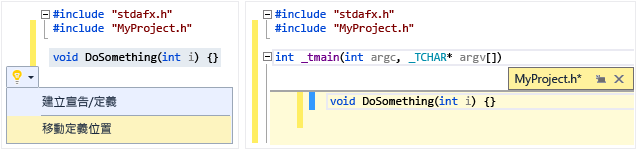  
  
### 快速動作：建立宣告\/定義  
 在相關聯的程式碼檔案中針對所選的標頭宣告建立一或多個定義。  
  
 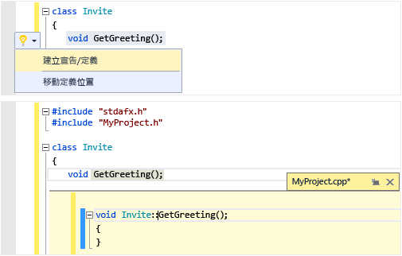  
  
### 快速動作：實作類別的所有純虛擬函式  
 快速產生類別中所有繼承虛擬函式的空白實作虛設常式。  若要只實作特定基底類別中的虛擬函式，只要在衍生的類別宣告中反白顯示基底類別即可。  
  
 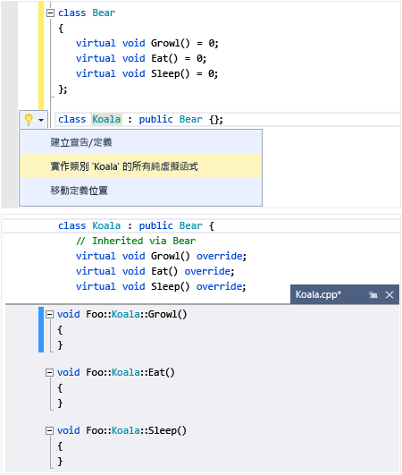  
  
### 轉換為原始字串常值  
 當您將游標放置於字串常值上時，可以用滑鼠右鍵按一下並選擇 \[快速動作 &#124; 轉換為原始字串常值\]，將一般字串轉換為 C\+\+ 11 原始字串常值。  
  
 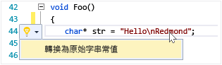  
  
### 擷取函式 \(Visual Studio 擴充功能\)  
 使用擷取函式功能 \(可從 [Visual Studio 組件庫上的擴充功能](https://visualstudiogallery.msdn.microsoft.com/a081dc8c-c805-4589-9b8b-c2c309a05789)取得\)，將一段程式碼移至其函式中，並以對該函式的呼叫取代程式碼。  
  
 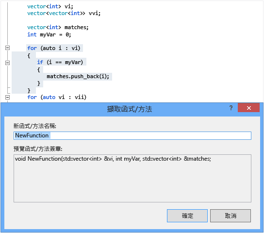  
  
## 巡覽和了解  
  
### QuickInfo  
 將滑鼠暫留在變數上，可檢視其類型資訊。  QuickInfo  
  
   
  
### 開啟文件 \(巡覽至標頭\)  
 在 `#include` 指示詞中的標頭名稱上按一下滑鼠右鍵，並開啟標頭檔。  
  
 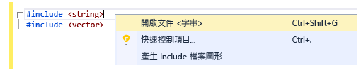  
  
### 查看定義  
 將滑鼠暫留在變數或函式宣告上，按一下滑鼠右鍵，然後選擇 \[查看定義\]，查看其定義的內嵌檢視。  如需詳細資訊，請參閱[查看定義 \(Alt\+F12\)](../Topic/How%20to:%20View%20and%20Edit%20Code%20by%20Using%20Peek%20Definition%20\(Alt+F12\).md)。  
  
   
  
### 移至定義  
 將滑鼠暫留在變數或函式宣告中，按一下滑鼠右鍵，然後選擇 \[移至定義\]，開啟在其中定義物件的文件。  
  
### 檢視呼叫階層  
 以滑鼠右鍵按一下任何函式呼叫，並檢視它呼叫的所有函式 \(以及呼叫它的所有函式\) 之遞迴清單。  清單中的每個函式都可以用相同方式展開。  如需詳細資訊，請參閱[呼叫階層](../Topic/Call%20Hierarchy.md)。  
  
   
  
### 切換標頭\/程式碼檔  
 以滑鼠右鍵按一下，然後選擇 \[切換標頭 \/ 程式碼檔案\]，在標頭檔和其相關聯的程式碼檔案之間來回切換。  
  
### 大綱  
 在原始程式碼檔案中的任何位置按一下滑鼠右鍵，然後選擇 \[大綱\] 可摺疊或展開定義和\/或自訂區域，讓您更方便僅瀏覽感興趣的部分。  如需詳細資訊，請參閱[大綱](../Topic/Outlining.md)。  
  
   
  
### 捲軸對應模式  
 捲軸對應模式可讓您快速地捲動及瀏覽程式碼檔案，而不需要實際離開目前位置。  或按一下 Code Map 上的任何位置，直接移至該處。  
  
 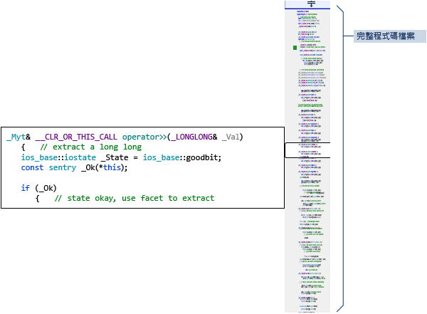  
  
### 產生 Include 檔圖形  
 在專案中的程式碼檔案上按一下滑鼠右鍵，然後選擇 \[產生 Include 檔圖形\]，查看被其他檔案包含之檔案的圖形。  
  
   
  
### F1 說明  
 將游標放在任何類型、關鍵字或函式之處或之後，然後按 \[F1\] 鍵即可直接跳到相關的 MSDN 參考主題。  F1 鍵也適用於錯誤清單中及許多對話方塊中的項目。  
  
### 快速啟動  
 若要輕鬆地巡覽至 Visual Studio 中的任何視窗或工具，只要在 UI 右上角的 \[快速啟動\] 視窗中輸入其名稱即可。  當您輸入時，就會篩選自動完成清單。  
  
 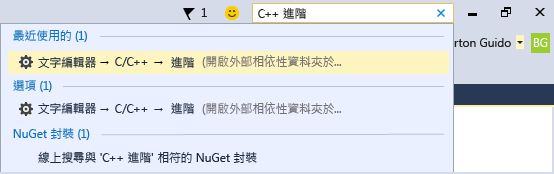