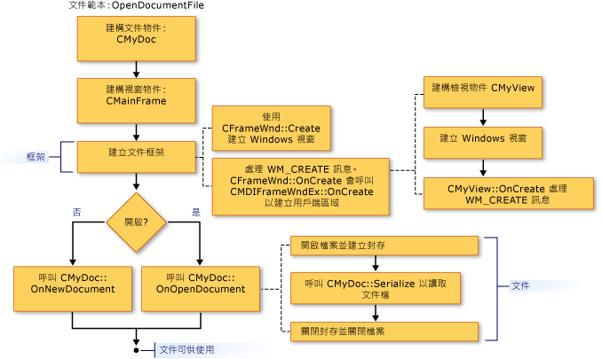

# 建立新文件、視窗和檢視

下圖提供文件、檢視和框架視窗的建立程序概觀。 將焦點放在提供詳細資料之參與物件的其他文件。

在完成此程序之後，會存在相互合作的物件，且會儲存彼此指標。 下圖顯示物件建立的序列。 您可以遵循圖表到圖表的序列。

  
建立文件的序列

  
建立框架視窗的序列

  
建立檢視的序列

如需架構如何初始化新檔、視圖和框架視窗物件的詳細資訊，請參閱 MFC 程式庫參考中的類別[CDocument](reference/cdocument-class.md)、 [CView](reference/cview-class.md)、 [CFrameWnd](reference/cframewnd-class.md)、 [CMDIFrameWnd](reference/cmdiframewnd-class.md)和[CMDIChildWnd](reference/cmdichildwnd-class.md) 。 另請參閱[技術提示 22](tn022-standard-commands-implementation.md)，其中說明在其對 [檔案] 功能表上**新**的和**開啟**專案的架構標準命令討論時，進一步探討**File**的建立和初始化程式。

## 將您自己的新增專案初始化為這些類別

上述圖也建議可以覆寫成員函式以初始化應用程式物件的點。 在您檢視類別的 `OnInitialUpdate` 覆寫，是初始化檢視的最佳位置。 在建立框架視窗，以及並在框架視窗內的檢視附加至其文件後，會立即呼叫 `OnInitialUpdate`。 例如，若您的視圖是捲動檢視 (衍生自 `CScrollView` 而非 `CView`)，您應該根據您的 `OnInitialUpdate` 覆寫的文件大小來設定視圖大小。 （此程式會在類別[CScrollView](reference/cscrollview-class.md)的描述中說明）。您可以覆寫 `CDocument` 成員函 `OnNewDocument` 式，並 `OnOpenDocument` 提供應用程式特定的檔初始化。 通常必須覆寫兩個，因為文件可以用兩種方式建立。

在大部分情況下，您的覆寫應該呼叫基底類別版本。 如需詳細資訊，請參閱 MFC 程式庫參考中的[CDocument](reference/cdocument-class.md)、 [CView](reference/cview-class.md)、 [CFrameWnd](reference/cframewnd-class.md)和[CWinApp](reference/cwinapp-class.md)類別的命名成員函式。

## 另請參閱

[檔範本和檔/視圖建立程式](document-templates-and-the-document-view-creation-process.md) 
[文件樣板建立](document-template-creation.md) 
[文件/檢視建立](document-view-creation.md) 
[MFC 物件關聯性](relationships-among-mfc-objects.md)
