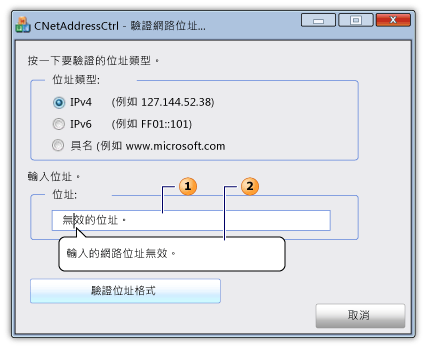

# <a name="cnetaddressctrl-class"></a>CNetAddressCtrl 類別

`CNetAddressCtrl` 類別表示網路位址控制項，您可以用來輸入和驗證 IPv4、IPv6 和具名 DNS 位址的格式。

## <a name="syntax"></a>語法

```
class CNetAddressCtrl : public CEdit
```

## <a name="members"></a>成員

### <a name="public-constructors"></a>公用建構函式

|名稱|描述|
|----------|-----------------|
|[CNet位址::CNetAddressCtrl](#cnetaddressctrl)|建構 `CNetAddressCtrl` 物件。|

### <a name="public-methods"></a>公用方法

|名稱|描述|
|----------|-----------------|
|[CNetAddressCtrl::建立](#create)|建立具有指定樣式的網路位址控制項並將其附加到當前`CNetAddressCtrl`物件。|
|[CNetAddressCtrl::創建Ex](#createex)|創建具有指定擴展樣式的網路位址控制項,並將其附加到當前`CNetAddressCtrl`物件。|
|[CNetAddressCtrl::D播放錯誤提示](#displayerrortip)|當使用者在當前網路位址控件中輸入不受支援的網路位址時,將顯示錯誤氣球提示。|
|[CNetAddressCtrl::取得位址](#getaddress)|檢索與當前網路位址控件關聯的網路位址的已驗證和解析表示形式。|
|[CNetAddressCtrl::取得允許類型](#getallowtype)|檢索當前網路位址控件可以支援的網路地址類型。|
|[CNetAddressCtrl::SetAllow類型](#setallowtype)|設置當前網路位址控制項可支援的網路位址類型。|

## <a name="remarks"></a>備註

網路位址控制件驗證使用者輸入的位址格式是否正確。 控件實際上未連接到網路位址。 [CNetAddressCtrl:setAllowType](#setallowtype)方法指定[了 CNetAddressCtrl::getAddress](#getaddress)方法可以解析和驗證的一種或多種位址類型。 位址可以是 IPv4、IPv6 或伺服器、網路、主機或廣播消息目標的命名位址。 如果位址的格式不正確,則可以使用[CNetAddressCtrl::DisplayErrorTip](#displayerrortip)方法顯示一個資訊提示訊息框,該消息框以圖形方式指向網路位址控件的文本框並顯示預定義的錯誤消息。

類`CNetAddressCtrl`派生自[CEdit](../../mfc/reference/cedit-class.md)類。 因此,網路位址控制件提供對所有 Windows 編輯控制消息的訪問。

下圖描述了包含網路位址控件的對話方塊。 網路位址控制項的文字框 (1) 包含無效的網路位址。 如果網路位址無效,將顯示資訊提示消息 (2)。



## <a name="example"></a>範例

以下代碼示例是驗證網路地址的對話框的一部分。 三個單選按鈕的事件處理程式指定網路位址可以是三種位址類型之一。 使用者在網路控制項的文字框中輸入位址,然後按下一個按鈕來驗證位址。 如果位址有效,將顯示成功消息;如果位址有效,則會顯示成功消息。否則,將顯示預定義的資訊提示錯誤消息。

[!code-cpp[NVC_MFC_CNetAddressCtrl_s1#1](../../mfc/reference/codesnippet/cpp/cnetaddressctrl-class_1.cpp)]

## <a name="example"></a>範例

對話框標頭檔中的以下代碼範例定義[CNetAddressCtrl::getAddress](#getaddress)方法所需的[NC_ADDRESS](/windows/win32/api/shellapi/ns-shellapi-nc_address)[和NET_ADDRESS_INFO](/windows/win32/shell/hkey-type)變數。

[!code-cpp[NVC_MFC_CNetAddressCtrl_s1#2](../../mfc/reference/codesnippet/cpp/cnetaddressctrl-class_2.h)]

## <a name="inheritance-hierarchy"></a>繼承階層架構

[CObject](../../mfc/reference/cobject-class.md)

[CCmdTarget](../../mfc/reference/ccmdtarget-class.md)

[CWnd](../../mfc/reference/cwnd-class.md)

[CEdit](../../mfc/reference/cedit-class.md)

`CNetAddressCtrl`

## <a name="requirements"></a>需求

**標頭：** afxcmn.h

此類在 Windows Vista 和更高版本中受支援。

此類的其他要求在 Windows [Vista 通用控件的生成要求中](../../mfc/build-requirements-for-windows-vista-common-controls.md)介紹。

## <a name="cnetaddressctrlcnetaddressctrl"></a><a name="cnetaddressctrl"></a>CNet位址::CNetAddressCtrl

建構 `CNetAddressCtrl` 物件。

```
CNetAddressCtrl();
```

### <a name="remarks"></a>備註

使用[CNetAddressCtrl::建立](#create)或[CNetAddressCtrl:createEx](#createex)方法創建網路控制元件`CNetAddressCtrl`並將其附加到 物件。

## <a name="cnetaddressctrlcreate"></a><a name="create"></a>CNetAddressCtrl::建立

建立具有指定樣式的網路位址控制項並將其附加到當前`CNetAddressCtrl`物件。

```
virtual BOOL Create(
    DWORD dwStyle,
    const RECT& rect,
    CWnd* pParentWnd,
    UINT nID);
```

### <a name="parameters"></a>參數

|參數|描述|
|---------------|-----------------|
|*dwStyle*|[在]要應用於控制的樣式的位組合。 有關詳細資訊,請參閱[編輯樣式](../../mfc/reference/styles-used-by-mfc.md#edit-styles)。|
|*矩形*|[在]對包含控制項位置和大小的[RECT](/windows/win32/api/windef/ns-windef-rect)結構的引用。|
|*pparentwnd*|[在]指向作為控制項的父視窗的[CWnd](../../mfc/reference/cwnd-class.md)物件的非空指標。|
|*nID*|[在]控件的識別碼。|

### <a name="return-value"></a>傳回值

如果此方法成功,則為 TRUE;否則,FALSE。

## <a name="cnetaddressctrlcreateex"></a><a name="createex"></a>CNetAddressCtrl::創建Ex

創建具有指定擴展樣式的網路位址控制項,並將其附加到當前`CNetAddressCtrl`物件。

```
virtual BOOL CreateEx(
    DWORD dwExStyle,
    DWORD dwStyle,
    const RECT& rect,
    CWnd* pParentWnd,
    UINT nID);
```

### <a name="parameters"></a>參數

|參數|描述|
|---------------|-----------------|
|*dwExStyle*|[在]要應用於控制項的擴展樣式的位組合 (OR)。 有關詳細資訊,請參閱[CreateWindowEx](/windows/win32/api/winuser/nf-winuser-createwindowexw)函數的*dwExStyle*參數。|
|*dwStyle*|[在]要應用於控制的樣式的位組合 (OR)。 有關詳細資訊,請參閱[編輯樣式](../../mfc/reference/styles-used-by-mfc.md#edit-styles)。|
|*矩形*|[在]對包含控制項位置和大小的[RECT](/windows/win32/api/windef/ns-windef-rect)結構的引用。|
|*pparentwnd*|[在]指向作為控制項的父視窗的[CWnd](../../mfc/reference/cwnd-class.md)物件的非空指標。|
|*nID*|[在]控件的識別碼。|

### <a name="return-value"></a>傳回值

如果此方法成功,則為 TRUE;否則,FALSE。

## <a name="cnetaddressctrldisplayerrortip"></a><a name="displayerrortip"></a>CNetAddressCtrl::D播放錯誤提示

在與當前網路位址控件關聯的氣球提示中顯示一條錯誤消息。

```
HRESULT DisplayErrorTip();
```

### <a name="return-value"></a>傳回值

此方法成功`S_OK`時的值;否則,錯誤代碼。

### <a name="remarks"></a>備註

使用[CNetAddressCtrl::SetAllowType](#setallowtype)方法指定當前網路位址控制項可以支援的位址類型。 使用[CNetAddressCtrl::GetAddress](#getaddress)方法驗證和分析使用者輸入的網路位址。 如果[CNetAddressCtrl::getAddress](#getaddress)方法不成功,請使用[CNetAddressCtrl::DisplayErrorTip](#displayerrortip)方法顯示錯誤訊息資訊提示。

此消息調用[NetAddr_DisplayErrorTip](/windows/win32/api/shellapi/nf-shellapi-netaddr_displayerrortip)宏,這在 Windows SDK 中介紹。 該巨集傳`NCM_DISPLAYERRORTIP`送訊息 。

## <a name="cnetaddressctrlgetaddress"></a><a name="getaddress"></a>CNetAddressCtrl::取得位址

檢索與當前網路位址控件關聯的網路位址的已驗證和已分析表示形式。

```
HRESULT GetAddress(PNC_ADDRESS pAddress) const;
```

### <a name="parameters"></a>參數

*p 位址*<br/>
[進出]指向[NC_ADDRESS](/windows/win32/api/shellapi/ns-shellapi-nc_address)結構的指標。  在調用 GetAddress 方法之前,將此結構的*pAddrInfo*成員設置為[NET_ADDRESS_INFO](/windows/win32/shell/hkey-type)結構的位址。

### <a name="return-value"></a>傳回值

如果此方法成功,則該值S_OK;否則,COM 錯誤代碼。 有關可能的錯誤代碼的詳細資訊,請參閱[NetAddr_GetAddress](/windows/win32/api/shellapi/nf-shellapi-netaddr_getaddress)宏的返回值部分。

### <a name="remarks"></a>備註

如果此方法成功[,NET_ADDRESS_INFO](/windows/win32/shell/hkey-type)結構包含有關網路位址的其他資訊。

使用[CNetAddressCtrl::SetAllowType](#setallowtype)方法指定當前網路位址控制項可以支援的位址類型。 使用[CNetAddressCtrl::GetAddress](#getaddress)方法驗證和分析使用者輸入的網路位址。 如果[CNetAddressCtrl::getAddress](#getaddress)方法不成功,請使用[CNetAddressCtrl::DisplayErrorTip](#displayerrortip)方法顯示錯誤訊息資訊提示。

此方法調用[NetAddr_GetAddress](/windows/win32/api/shellapi/nf-shellapi-netaddr_getaddress)宏,這在 Windows SDK 中介紹。 該宏發送NCM_GETADDRESS消息。

## <a name="cnetaddressctrlgetallowtype"></a><a name="getallowtype"></a>CNetAddressCtrl::取得允許類型

檢索當前網路位址控件可以支援的網路地址類型。

```
DWORD GetAllowType() const;
```

### <a name="return-value"></a>傳回值

指定網路位址控制項可支援的位址類型的標誌的位組合 (OR)。 有關詳細資訊,請參閱[NET_STRING](/windows/win32/shell/net-string)。

### <a name="remarks"></a>備註

此消息調用[NetAddr_GetAllowType](/windows/win32/api/shellapi/nf-shellapi-netaddr_getallowtype)宏,這在 Windows SDK 中介紹。 該宏發送NCM_GETALLOWTYPE消息。

## <a name="cnetaddressctrlsetallowtype"></a><a name="setallowtype"></a>CNetAddressCtrl::SetAllow類型

設置當前網路位址控制項可支援的網路位址類型。

```
HRESULT SetAllowType(DWORD dwAddrMask);
```

### <a name="parameters"></a>參數

|參數|描述|
|---------------|-----------------|
|*德瓦德爾·馬斯克*|[在]指定網路位址控制項可支援的位址類型的標誌的位組合 (OR)。 有關詳細資訊,請參閱[NET_STRING](/windows/win32/shell/net-string)。|

### <a name="return-value"></a>傳回值

S_OK此方法是否成功;如果此方法成功,則否則,COM 錯誤代碼。

### <a name="remarks"></a>備註

使用[CNetAddressCtrl::SetAllowType](#setallowtype)方法指定當前網路位址控制項可以支援的位址類型。 使用[CNetAddressCtrl::GetAddress](#getaddress)方法驗證和分析使用者輸入的網路位址。 如果[CNetAddressCtrl::getAddress](#getaddress)方法不成功,請使用[CNetAddressCtrl::DisplayErrorTip](#displayerrortip)方法顯示錯誤訊息資訊提示。

此消息調用[NetAddr_SetAllowType](/windows/win32/api/shellapi/nf-shellapi-netaddr_setallowtype)宏,這在 Windows SDK 中介紹。 該宏發送NCM_SETALLOWTYPE消息。

## <a name="see-also"></a>另請參閱

[CNetAddressCtrl 類別](../../mfc/reference/cnetaddressctrl-class.md)<br/>
[階層架構圖表](../../mfc/hierarchy-chart.md)<br/>
[CEdit Class](../../mfc/reference/cedit-class.md)
