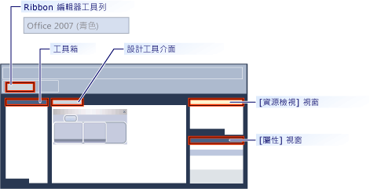

# 功能區設計工具 (MFC)
[!INCLUDE[vs2017banner](../assembler/inline/includes/vs2017banner.md)]

功能區設計工具可讓您建立和自訂 MFC 應用程式中的功能區。  功能區是可將命令組織成邏輯群組的使用者介面 \(UI\) 項目。  這些群組可出現在跨視窗頂端區域中的個別索引標籤上。  功能區取代了功能表列和工具列。  功能區可大幅改善應用程式可用性。  如需詳細資訊，請參閱[功能區](http://go.microsoft.com/fwlink/?LinkId=129233)。  下圖顯示功能區。  
  
   
  
 在舊版的 Visual Studio 中，必須透過撰寫使用 MFC 功能區類別 \(例如 [CMFCRibbonBar Class](../mfc/reference/cmfcribbonbar-class.md)\) 的程式碼來建立功能區。  在 [!INCLUDE[vs_dev10_long](../build/includes/vs_dev10_long_md.md)] 中，功能區設計工具提供建置功能區的替代方法。 首先，建立及自訂功能區作為資源。  然後從 MFC 應用程式中的程式碼載入功能區資源。  您甚至可以一起使用功能區資源和 MFC 功能區類別。  例如，您可以建立功能區資源，然後使用程式碼在執行階段以程式設計方式將多個項目新增至其中。  
  
## 了解功能區設計工具  
 功能區設計工具會建立功能區並將其儲存為資源。  當您建立功能區資源時，功能區設計工具會執行下列三項動作：  
  
-   新增專案資源定義指令碼 \(\*.rc\) 中的項目。  在下列範例中，`IDR_RIBBON` 是識別功能區資源的唯一名稱，`RT_RIBBON_XML` 是資源類型，而 `ribbon.mfcribbon-ms` 是資源檔的名稱。  
  
    ```  
    IDR_RIBBON             RT_RIBBON_XML                      "res\\ribbon.mfcribbon-ms"  
    ```  
  
-   將命令 ID 的定義新增至 resource.h。  
  
    ```  
    #define IDR_RIBBON            307  
    ```  
  
-   建立功能區資源檔 \(\*.mfcribbon\-ms\)，其中包含定義功能區按鈕、控制項和屬性的 XML 程式碼。  功能區設計工具中的功能區變更會以 XML 格式儲存在資源檔中。  下列程式碼範例顯示 \*.mfcribbon\-ms 檔的部分內容：  
  
    ```  
    <RIBBON_BAR>  
      <ELEMENT_NAME>RibbonBar</ELEMENT_NAME>  
      <IMAGE>  
        <ID>  
          <NAME>IDB_BUTTONS</NAME>  
          <VALUE>113</VALUE>  
        </ID> …  
    ```  
  
 若要使用 MFC 應用程式中的功能區資源，請呼叫 [CMFCRibbonBar::LoadFromResource](../Topic/CMFCRibbonBar::LoadFromResource.md) 以載入資源。  
  
## 使用功能區設計工具建立功能區  
 下列兩個方法可將功能區資源新增至您的 MFC 專案中：  
  
-   建立 MFC 應用程式並設定 MFC 專案精靈以建立功能區。  如需詳細資訊，請參閱[逐步解說：使用 MFC 建立功能區應用程式](../mfc/walkthrough-creating-a-ribbon-application-by-using-mfc.md)。  
  
-   在現有的 MFC 專案中，建立功能區資源並將其載入。  如需詳細資訊，請參閱[逐步解說：更新 MFC Scribble 應用程式 \(第 1 部分\)](../mfc/walkthrough-updating-the-mfc-scribble-application-part-1.md)。  
  
 如果您的專案已經以手動方式為功能區編碼，MFC 會具有函式，可用來將現有的功能區轉換為功能區資源。  如需詳細資訊，請參閱[如何：將現有的 MFC 功能區轉換為功能區資源](../mfc/how-to-convert-an-existing-mfc-ribbon-to-a-ribbon-resource.md)。  
  
> [!NOTE]
>  在對話方塊架構應用程式中，無法建立功能區。  如需詳細資訊，請參閱[MFC 應用程式精靈、應用程式類型](../mfc/reference/application-type-mfc-application-wizard.md)。  
  
## 自訂功能區  
 若要在功能區設計工具中開啟功能區，請按兩下資源檢視中的功能區資源。  在設計工具中，您可以新增、移除及自訂功能區、應用程式按鈕或快速存取工具列上的項目。  您也可以將事件 \(例如按一下按鈕事件和功能表事件\) 連結到應用程式中的方法。  
  
 下圖顯示功能區設計工具中的不同元件。  
  
   
  
-   **工具箱：**包含可以拖曳至設計工具介面的控制項。  
  
-   **設計工具介面：**包含功能區資源的視覺表示法。  
  
-   **屬性視窗：**列出在設計工具介面上選取之項目的屬性。  
  
-   **資源檢視視窗：**顯示專案中包含功能區資源的資源。  
  
-   **功能區編輯器工具列：**包含可讓您預覽功能區並變更其視覺化佈景主題的命令。  
  
 下列主題描述如何在功能區設計工具中使用這些功能。  
  
-   [如何：自訂應用程式按鈕](../mfc/how-to-customize-the-application-button.md)  
  
-   [如何：自訂快速存取工具列](../mfc/how-to-customize-the-quick-access-toolbar.md)  
  
-   [如何：加入功能區控制項和事件處理常式](../mfc/how-to-add-ribbon-controls-and-event-handlers.md)  
  
-   [如何：從 MFC 應用程式載入功能區應用程式](../mfc/how-to-load-a-ribbon-resource-from-an-mfc-application.md)  
  
## 功能區項目定義  
   
  
-   **應用程式按鈕：**出現在功能區左上角的按鈕。  應用程式按鈕會取代 \[檔案\] 功能表，而且即使功能區最小化時也會出現。  按一下按鈕時，會顯示具有命令列表的功能表。  
  
-   **快速存取工具列：**小型、可自訂的工具列，會顯示經常使用的命令。  
  
-   **分類**：代表功能區索引標籤內容的邏輯群組。  
  
-   **分類預設按鈕：**功能區最小化時，會出現在功能區的按鈕。  按一下按鈕時，分類會以功能表的形式出現。  
  
-   **面板：**顯示一組相關控制項的功能區列區域。  每個功能區分類包含一或多個功能區面板。  
  
-   **功能區項目：**面板中的控制項，例如按鈕和下拉式方塊。  若要查看可以裝載於功能區上的各種控制項，請參閱 [RibbonGadgets 範例：功能區小工具應用程式](../top/visual-cpp-samples.md)。  
  
## 請參閱  
 [使用者介面項目](../mfc/user-interface-elements-mfc.md)   
 [Working with Resource Files](../mfc/working-with-resource-files.md)