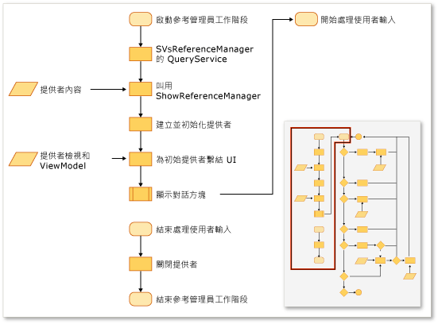
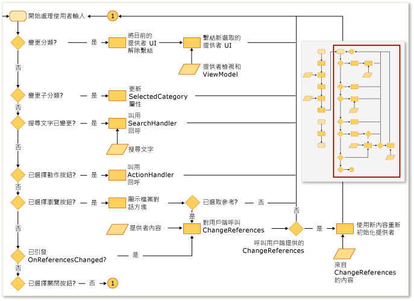

# 擴充參考管理員
您可以使用 Visual Studio 擴充功能中的參考管理員，將參考加入專案中。 您的專案必須設定參考管理員從正確位置顯示資料，資料管理員才會出現。 例如，以 [!INCLUDE[net_v40_short](../misc/includes/net_v40_short_md.md)] 為目標的專案所填入的組件必須來自與以 [!INCLUDE[net_v35_long](../misc/includes/net_v35_long_md.md)] 為目標的專案不同的資料夾。  
  
 您通常會使用來自下列提供者的 ProviderContexts 集合，來設定參考管理員：  
  
-   <xref:Microsoft.VisualStudio.Shell.Interop.IVsAssemblyReferenceProviderContext>  
  
-   <xref:Microsoft.VisualStudio.Shell.Interop.IVsComReferenceProviderContext>  
  
-   <xref:Microsoft.VisualStudio.Shell.Interop.IVsFileReferenceProviderContext>  
  
-   <xref:Microsoft.VisualStudio.Shell.Interop.IVsProjectReferenceProviderContext>  
  
-   <xref:Microsoft.VisualStudio.Shell.Interop.IVsPlatformReferenceProviderContext>  
  
 用戶端元件會透過在 Visual Studio 服務 SVsReferenceManager 上呼叫 ShowReferenceManager 方法，來顯示參考管理員。 IVsReferenceProviderContext 類別的集合會當做引數傳入這個方法。 這些內容會決定哪些索引標籤會出現在 \[參考管理員\] 對話方塊的左側。 每個提供者都包含所有必要的資訊，讓對話方塊可以填入並顯示必要資料，以便您將參考加入專案中。  
  
 下圖摘要說明此程序。  
  
   
  
   
  
## 加入自訂索引標籤  
 若要加入自訂索引標籤，您必須實作 IReferenceProvider、IVsReference 和 IVsReferenceProviderContext。  
  
#### 加入自訂索引標籤  
  
1.  實作 IReferenceProvider 介面，然後透過 Managed Extensibility Framework \(MEF\) 匯出以供參考管理員使用。  
  
     參考管理員使用 ReferenceProvider 物件，來產生出現在參考管理員中的項目。 該物件的介面定義於 Microsoft.VisualStudio.ReferenceManager.Contracts.dll。  
  
2.  實作 ProviderContext 物件。  
  
     參考管理員會使用這個物件的 GUID 屬性，來比對內容與提供者。 當參考管理員初始化時，會將透過 ShowReferenceManager 方法傳入的 ProviderContext 傳遞給提供者。 ProviderContext 應該包含提供者列舉 IVsReferences 所需的全部資訊。  
  
3.  擴充 StandardReferenceProviderContext 類別。  
  
     參考管理員會提供您可用來開始進行的一些基底類別，例如 StandardReferenceProviderContext 類別。 您的提供者類別可以擴充 StandardReferenceProvider，而參考項目可以擴充 StandardReferenceItem。  
  
 您的提供者類別可能類似下列範例：  
  
```  
[Export(typeof(IReferenceProvider))] [ExportMetadata("Name", "AssemblyReferenceProvider")] [ExportMetadata("Guid", VSConstants.AssemblyReferenceProvider_string)] internal class AssemblyReferenceProvider : StandardReferenceProvider { }  
```  
  
 您的內容類別可能類似下列範例：  
  
```  
  
[Export(typeof(IVsReferenceProviderContext))] [Export(typeof(IVsAssemblyReferenceProviderContext))] [Export("AssemblyReferenceProviderContext", typeof(IVsReferenceProviderContext))] [Export(VSConstants.AssemblyReferenceProvider_string, typeof(IVsReferenceProviderContext))] [PartCreationPolicy(System.ComponentModel.Composition.CreationPolicy.NonShared)] [ExportMetadata("Name", "AssemblyReferenceProviderContext")] [ExportMetadata("Guid", VSConstants.AssemblyReferenceProvider_string)] public class AssemblyReferenceProviderContext : StandardReferenceProviderContext<IVsAssemblyReference, AssemblyIdentity>, IVsAssemblyReferenceProviderContext { }  
```  
  
 建議您針對參考項目類別實作 IWatchableReference，並將您的類別設為可序列化。 依照這種方法，您除了 ReferenceWatcher 服務，還可利用 StandardReferenceProvider 類別中的快取序列化方法，在對話方塊中的各種索引標籤之間自動同步處理項目檢查：  
  
```  
[Serializable] public class StandardReferenceItem : IWatchableReference { }  
```  
  
 ReferenceProvider 類別包含兩個重要的方法。 第一個方法是 Initialize，只會在提供者第一次載入對話方塊時呼叫一次。 第二個方法是 SetContext，會在 Initialize 之後立即呼叫，但可在專案系統無法加入您指定並嘗試認可的任何參考時再次呼叫。  
  
> [!NOTE]
>  由於提供者在程式執行期間會保存，因此可以儲存工作階段之間的狀態，但如果使用者關閉對話方塊後再快速地重新開啟，則可能會發生競爭的情況。  
  
## 覆寫索引標籤列舉的現有原始程式碼  
 某些提供者內容具有一個稱為索引標籤的屬性，其類型為 uint。 這個屬性是位元遮罩，且其值可控制提供者要顯示哪些索引標籤。  例如，IVsAssemblyReferenceProviderContext 介面會定義 Tabs 屬性，您可以將該屬性設定為下列值：  
  
```  
namespace Microsoft.VisualStudio.Shell.Interop { public enum __VSASSEMBLYPROVIDERTAB { TAB_ASSEMBLY_FRAMEWORK = 1, TAB_ASSEMBLY_EXTENSIONS = 2, TAB_ASSEMBLY_ALL = 3, } }  
```  
  
 IVsPlatformReferenceProviderContext 類別具有類似的屬性。 您無法變更索引標籤名稱，但可以控制使用者選擇索引標籤時所出現的標頭文字。 您可以在 IVsAssemblyProviderContext 類別上，透過下列方法來控制這個值：  
  
```  
void SetTabTitle(uint etabId, string szTabTitle);  
```  
  
## 覆寫瀏覽對話方塊中的篩選  
 您可以變更 IFileReferenceProviderContext 物件上的 BrowseFilter 屬性值，以將自訂類型篩選提供給參考管理員中的 \[瀏覽\] 對話方塊。  下列範例透過機器碼來示範這項技術：  
  
```  
  
// Holds a list of provider contexts CComSafeArray<LPUNKNOWN> spProviderContexts; // Creates the file reference context for Browse vsReferenceManager->CreateProviderContext(GUID_FileReferenceProvider, &pFileRefProviderContext)); // Sets the Browse filter pFileRefProviderContext->put_BrowseFilter(wszFilter); spProviderContexts.Add(pFileRefProviderContext); // Show the reference manager hr = srpRefMgr->ShowReferenceManager( spVsRefMgrUser, spProviderContexts, strTitle, HELPKEYWORD_AddReference, GUID_AssemblyReferenceProvider, wszFilter, m_bstrStartBrowse);  
```  
  
## 請參閱  
 [如何：使用參考管理員新增或移除參考](../Topic/How%20to:%20Add%20or%20Remove%20References%20By%20Using%20the%20Reference%20Manager.md)