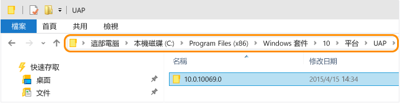
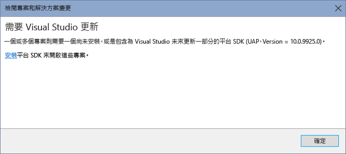

# 將應用程式移轉至通用 Windows 平台 (UWP)
視需要手動變更現有使用 Visual Studio 2015 RC 為 Windows 市集 8.1 應用程式、Windows Phone 8.1 應用程式或通用 Windows 應用程式所建立的專案檔案，使其能夠用於 Visual Studio 2015 RTM。 \(如果您的 Windows 8.1 通用應用程式同時具有 Windows 應用程式專案和 Windows Phone 專案，則需要遵循移轉每個專案的步驟\)。  
  
 現在有了通用 Windows 平台之後，您的應用程式就能以多種個裝置系列為目標。 如需通用 Windows App 的詳細資訊，請查看本[平台指南](https://msdn.microsoft.com/library/windows/apps/dn894631.aspx)。  
  
-   [移轉現有 C\#\/VB Windows 市集 8.1 或 Windows Phone 8.1 應用程式](#MigrateCSharp)以使用通用 Windows 平台。  
  
-   [移轉現有 C\+\+ Windows 市集 8.1 或 Windows Phone 8.1 應用程式](#MigrateCPlusPlus)以使用通用 Windows 平台。  
  
-   [您必須變更現有使用 Visual Studio 2015 CTP 所建立的通用 Windows 應用程式](#PreviousVersions)。  
  
-   [您必須變更現有使用 Visual Studio 2015 CTP 所建立之通用 Windows 應用程式的單元測試專案](#MigrateUnitTest)。  
  
 若您不想執行上述變更，可了解如何[移植您現有的應用程式](http://msdn.microsoft.com/library/windows/apps/xaml/mt238321.aspx)到新的通用 Windows 專案。  
  
##  <a name="MigrateCSharp"></a> 移轉 C\#\/VB Windows 市集 8.1 或 Windows Phone 8.1 應用程式以使用通用 Windows 平台  
  
#### 移轉 C\#\/VB 專案檔  
  
1.  若要尋找您已安裝的通用 Windows 平台，請開啟下列資料夾：**\\Program Files \(x86\)\\Windows Kits\\10\\Platforms\\UAP**。 這包含每個已安裝的通用 Windows 平台的資料夾清單。 資料夾名稱就是您已安裝的通用 Windows 平台版本。 例如此 Windows 10 裝置安裝了 10.0.10240.0 版的通用 Windows 平台。  
  
       
  
     可以安裝多個通用 Windows 平台版本。 建議您針對應用程式使用最新版本。  
  
2.  使用檔案總管，前往 UWP 專案的儲存資料夾。 在此資料夾中建立 .json 檔案。 將檔案命名為 project.json，然後將下列內容加入此檔案中：  
  
    ```json  
    { "dependencies": { "Microsoft.ApplicationInsights": "1.0.0", "Microsoft.ApplicationInsights.PersistenceChannel": "1.0.0", "Microsoft.ApplicationInsights.WindowsApps": "1.0.0", "Microsoft.NETCore.UniversalWindowsPlatform": "5.0.0" }, "frameworks": { "uap10.0": {} }, "runtimes": { "win10-arm": {}, "win10-arm-aot": {}, "win10-x86": {}, "win10-x86-aot": {}, "win10-x64": {}, "win10-x64-aot": {} } }  
  
    ```  
  
3.  建立稱為 default.rd.xml 並具有下列內容的檔案。 如果您有 VB 專案，請將這個檔案加入您專案的 \[我的專案\] 目錄。 如果您有 C\# 專案，請將這個檔案加入您專案的 \[屬性\] 目錄。  
  
    ```xml  
    <?xml version="1.0"?> <!-- This file contains Runtime Directives used by .NET Native. The defaults here are suitable for most developers. However, you can modify these parameters to modify the behavior of the .NET Native optimizer. Runtime Directives are documented at http://go.microsoft.com/fwlink/?LinkID=391919 To fully enable reflection for App1.MyClass and all of its public/private members <Type Name="App1.MyClass" Dynamic="Required All"/> To enable dynamic creation of the specific instantiation of AppClass<T> over System.Int32 <TypeInstantiation Name="App1.AppClass" Arguments="System.Int32" Activate="Required Public" /> Using the Namespace directive to apply reflection policy to all the types in a particular namespace <Namespace Name="DataClasses.ViewModels" Seralize="All" /> --> <Directives xmlns="http://schemas.microsoft.com/netfx/2013/01/metadata"><Application> <!-- An Assembly element with Name="*Application*" applies to all assemblies in the application package. The asterisks are not wildcards. --> <Assembly Dynamic="Required All" Name="*Application*"/> <!-- Add your application specific runtime directives here. --> </Application></Directives>  
    ```  
  
4.  在 Visual Studio 中，開啟包含現有 Windows 市集 8.1 應用程式或 Windows Phone 8.1 應用程式的方案。  
  
5.  在方案總管中，於您應用程式所屬的現有專案上按一下滑鼠右鍵，然後選取 \[卸載專案\]。 卸載專案之後，再次以滑鼠右鍵按一下專案檔，然後選擇編輯 .csproj 或 .vbproj 檔案。  
  
       
  
6.  尋找 \<PropertyGroup\> 項目，其中包含值為 8.1 的 \<TargetPlatformVersion\> 項目。 針對這個 \<PropertyGroup\> 項目，採取下列步驟：  
  
    1.  將 \<Platform\> 項目的值設定為：**x86**。  
  
    2.  加入 \<TargetPlatformIdentifier\> 項目，並將它的值設定為：**UAP**。  
  
    3.  將 \<TargetPlatformVersion\> 項目的現有值變更為您已安裝的通用 Windows 平台版本值。 一併加入 \<TargetPlatformMinVersion\> 項目，並提供相同的值。  
  
    4.  將 \<MinimumVisualStudioVersion\> 項目的值變更為：**14**。  
  
    5.  取代 \<ProjectTypeGuids\> 項目，如下所示：  
  
         若為 C\#：  
  
        ```xml  
        <ProjectTypeGuids>{A5A43C5B-DE2A-4C0C-9213-0A381AF9435A};{FAE04EC0-301F-11D3-BF4B-00C04F79EFBC}</ProjectTypeGuids>  
        ```  
  
         若為 VB：  
  
        ```xml  
        <ProjectTypeGuids>{A5A43C5B-DE2A-4C0C-9213-0A381AF9435A};{F184B08F-C81C-45F6-A57F-5ABD9991F28F}</ProjectTypeGuids>  
        ```  
  
    6.  加入 \<EnableDotNetNativeCompatibleProfile\> 項目，並將它的值設定為：**true**。  
  
    7.  通用 Windows 應用程式的預設資產縮放比例為 200。 若您專案所含資產的縮放比例不是 200，必須在此 PropertyGroup 中加入 \<UapDefaultAssetScale\> 項目，並將其值設為您資產的縮放比例。 深入了解 [資產與縮放比例](http://msdn.microsoft.com/library/jj679352.aspx)。  
  
         現在，您的 \<PropertyGroup\> 項目應該與這個範例類似：  
  
        ```xml  
        <PropertyGroup> … <Platform Condition=" '$(Platform)' == '' ">x86</Platform> <TargetPlatformVersion>10.0.10240.0</TargetPlatformVersion> <TargetPlatformMinVersion>10.0.10240.0</TargetPlatformMinVersion> <TargetPlatformIdentifier>UAP</TargetPlatformIdentifier> <MinimumVisualStudioVersion>14</MinimumVisualStudioVersion> <ProjectTypeGuids>{A5A43C5B-DE2A-4C0C-9213-0A381AF9435A};{FAE04EC0-301F-11D3-BF4B-00C04F79EFBC}</ProjectTypeGuids> <EnableDotNetNativeCompatibleProfile>true</EnableDotNetNativeCompatibleProfile> <UapDefaultAssetScale>100</UapDefaultAssetScale> … </PropertyGroup>  
        ```  
  
7.  將 12.0 的任何執行個體都取代為 14.0，以反映現在正在使用的 Visual Studio 版本。 例如這些執行個體：  
  
    ```xml  
    <Project Tools Version="14.0" DefaultTargets="Build" xmlns="http://schemas.microsoft.com/developer/msbuild/2003">  
    ```  
  
    ```  
    <PropertyGroup Condition=" '$(VisualStudioVersion)' == '' or '$(VisualStudioVersion)' < '14.0' "> <VisualStudioVersion>14.0</VisualStudioVersion>  
    ```  
  
8.  尋找針對 AnyCPU 平台設定為條件屬性一部分的 \<PropertyGroup\> 項目。 移除這些項目和其所有子系。 使用 Visual Studio 2015 建立的 Windows 10 應用程式不支援 AnyCPU。 例如，您應該移除 \<PropertyGroup\> 項目，例如下列項目：  
  
    ```xml  
    <PropertyGroup Condition=" '$(Configuration)|$(Platform)' == 'Debug|AnyCPU' "> <PlatformTarget>AnyCPU</PlatformTarget> <DebugSymbols>true</DebugSymbols> <DebugType>full</DebugType> <Optimize>false</Optimize> <OutputPath>bin\Debug\</OutputPath> <DefineConstants>DEBUG;TRACE;NETFX_CORE;WINDOWS_UAP</DefineConstants> <ErrorReport>prompt</ErrorReport> <WarningLevel>4</WarningLevel> </PropertyGroup> <PropertyGroup Condition=" '$(Configuration)|$(Platform)' == 'Release|AnyCPU' "> <PlatformTarget>AnyCPU</PlatformTarget> <DebugType>pdbonly</DebugType> <Optimize>true</Optimize> <OutputPath>bin\Release\</OutputPath> <DefineConstants>TRACE;NETFX_CORE;WINDOWS_UAP</DefineConstants> <ErrorReport>prompt</ErrorReport> <WarningLevel>4</WarningLevel> </PropertyGroup>  
    ```  
  
9. 對於每個剩餘的 \<PropertyGroup\> 項目，檢查項目是否具有含發行組態的條件屬性。 如果是這樣，但它未包含 \<UseDotNetNativeToolchain\> 項目，則請加入該項目。 將 \<UseDotNetNativeToolchain\> 項目的值設定為 true，如下：  
  
    ```xml  
    <PropertyGroup Condition="'$(Configuration)|$(Platform)' == 'Release|x64'"> <OutputPath>bin\x64\Release\</OutputPath> <DefineConstants>TRACE;NETFX_CORE;WINDOWS_UAP</DefineConstants> <Optimize>true</Optimize> <NoWarn>;2008</NoWarn> <DebugType>pdbonly</DebugType> <PlatformTarget>x64</PlatformTarget> <UseVSHostingProcess>false</UseVSHostingProcess> <ErrorReport>prompt</ErrorReport> <Prefer32Bit>true</Prefer32Bit> <UseDotNetNativeToolchain>true</UseDotNetNativeToolchain> </PropertyGroup>  
    ```  
  
10. 僅針對 Windows Phone 專案，移除 \<PropertyGroup\> 項目，其包含值為 WindowsPhoneApp 的 \<TargetPlatformIdentifier\> 項目。 也請移除這個項目的任何子系：  
  
    ```xml  
    <PropertyGroup Condition=" '$(TargetPlatformIdentifier)' == '' "> <TargetPlatformIdentifier>WindowsPhoneApp</TargetPlatformIdentifier> </PropertyGroup>  
    ```  
  
11. 尋找包含 \<AppxManifest\> 項目的 \<ItemGroup\> 項目。 將下列 \<None\> 項目加入 \<ItemGroup\> 項目中成為其子系：  
  
    ```xml  
    <None Include="project.json" />  
    ```  
  
12. 尋找 \<ItemGroup\> 項目，其包含加入專案的其他資產 \(例如標誌 .png 檔案\) \(\<Content Include\="Assets\\Logo.scale\-100.png" \/\>\)。 將下列 \<Content\> 子項目加入這個 \<ItemGroup\> 項目：  
  
     **若為 C\#：**  
  
    ```xml  
    <Content Include="Properties\default.rd.xml" />  
    ```  
  
     **若為 VB：**  
  
    ```xml  
    <Content Include="My Project\default.rd.xml" />  
    ```  
  
13. 尋找包含 NuGet 封裝之 \<Reference\> 子系項目的 \<ItemGroup\> 項目。 當您的專案重新載入後，您會需要使用 NuGet 封裝管理員下載這些封裝，所以請記下您所使用的 NuGet 封裝。 移除此 \<ItemGroup\> 及其子系。 例如 UWP 專案可能需要移除下列 NuGet 封裝：  
  
    ```xml  
    <ItemGroup> <Reference Include="Microsoft.ApplicationInsights, Version=0.14.3.177, Culture=neutral, PublicKeyToken=31bf3856ad364e35, processorArchitecture=MSIL"> <HintPath>..\packages\Microsoft.ApplicationInsights.0.14.3-build00177\lib\portable-win81+wpa81\Microsoft.ApplicationInsights.dll</HintPath> <Private>True</Private> </Reference> <Reference Include="Microsoft.ApplicationInsights.Extensibility.Windows, Version=0.14.3.177, Culture=neutral, PublicKeyToken=31bf3856ad364e35, processorArchitecture=MSIL"> <HintPath>..\packages\Microsoft.ApplicationInsights.WindowsApps.0.14.3-build00177\lib\win81\Microsoft.ApplicationInsights.Extensibility.Windows.dll</HintPath> <Private>True</Private> </Reference> <Reference Include="Microsoft.ApplicationInsights.PersistenceChannel, Version=0.14.3.186, Culture=neutral, PublicKeyToken=31bf3856ad364e35, processorArchitecture=MSIL"> <HintPath>..\packages\Microsoft.ApplicationInsights.PersistenceChannel.0.14.3-build00177\lib\portable-win81+wpa81\Microsoft.ApplicationInsights.PersistenceChannel.dll</HintPath> <Private>True</Private> </Reference> <Reference Include="System.Numerics.Vectors, Version=4.0.0.0, Culture=neutral, PublicKeyToken=b03f5f7f11d50a3a, processorArchitecture=MSIL"> <HintPath>..\packages\System.Numerics.Vectors.4.0.0\lib\win8\System.Numerics.Vectors.dll</HintPath> <Private>True</Private> </Reference> <Reference Include="System.Numerics.Vectors.WindowsRuntime, Version=4.0.0.0, Culture=neutral, PublicKeyToken=b03f5f7f11d50a3a, processorArchitecture=MSIL"> <HintPath>..\packages\System.Numerics.Vectors.4.0.0\lib\win8\System.Numerics.Vectors.WindowsRuntime.dll</HintPath> <Private>True</Private> </Reference> </ItemGroup>  
    ```  
  
14. 儲存您的變更。  
  
15. 關閉 .csproj 或 .vbproj 檔案。  
  
16. 在方案總管中，以滑鼠右鍵按一下專案，然後從內容功能表中選擇 \[重新載入專案\]。 您專案中的所有檔案現在應該都顯示在方案總管中。  
  
17. 使用 NuGet 管理員加回您在前述步驟中刪除的封裝。  
  
     您現在必須遵循步驟，為您的 Windows 市集 8.1 或 Windows Phone 8.1 專案[更新封裝資訊清單檔](#PackageManifest)。  
  
##  <a name="MigrateCPlusPlus"></a> 移轉 C\+\+ Windows 市集 8.1 或 Windows Phone 8.1 應用程式以使用通用 Windows 平台  
  
#### 移轉 C\+\+ 專案檔  
  
1.  若要尋找您已安裝的通用 Windows 平台，請開啟下列資料夾：**\\Program Files \(x86\)\\Windows Kits\\10\\Platforms\\UAP**。 這包含每個已安裝的通用 Windows 平台的資料夾清單。 資料夾名稱就是您已安裝的通用 Windows 平台版本。 例如此 Windows 10 裝置安裝了 10.0.10240.0 版的通用 Windows 平台。  
  
       
  
     可以安裝多個通用 Windows 平台版本。 建議您針對應用程式使用最新版本。  
  
2.  在 Visual Studio 中，開啟包含現有 C\+\+ Windows 市集 8.1 應用程式或 Windows Phone 8.1 應用程式的方案。  
  
     在方案總管中，以滑鼠右鍵按一下現有專案，然後選取 \[卸載專案\]。 卸載專案之後，再次以滑鼠右鍵按一下專案檔，然後選擇編輯 .vcxproj 檔案。  
  
       
  
3.  尋找包含值為 8.1 之 \<ApplicationTypeRevision\> 項目的 \<PropertyGroup\> 項目。 針對這個 \<PropertyGroup\> 項目，採取下列步驟：  
  
    1.  加入 \<WindowsTargetPlatformVersion\> 項目及 \<WindowsTargetPlatformMinVersion\> 項目，將其值設為所安裝的通用 Windows 平台版本。  
  
    2.  將 ApplicationTypeRevision 項目的值從 8.1 更新為 10.0。  
  
    3.  將 \<MinimumVisualStudioVersion\> 項目的值變更為 14。  
  
    4.  加入 \<EnableDotNetNativeCompatibleProfile\> 項目，並將其值設定為 true。  
  
    5.  通用 Windows 應用程式的預設資產縮放比例為 200。 若您專案所含資產的縮放比例不是 200，必須在此 PropertyGroup 中加入 \<UapDefaultAssetScale\> 項目，並將其值設為您資產的縮放比例。 深入了解[資產與縮放比例](http://msdn.microsoft.com/library/jj679352.aspx)。  
  
    6.  僅限 Windows Phone 專案：將 \<ApplicationType\> 的值從 Windows Phone 變更為 Windows 市集。  
  
         現在，您的 \<PropertyGroup\> 項目應該與這個範例類似：  
  
        ```xml  
        <PropertyGroup> … <WindowsTargetPlatformVersion>10.0.10240.0</WindowsTargetPlatformVersion> <WindowsTargetPlatformMinVersion>10.0.10240.0</WindowsTargetPlatformMinVersion> <ApplicationType>Windows Store</ApplicationType> <ApplicationTypeRevision>10.0</ApplicationTypeRevision> <MinimumVisualStudioVersion>14</MinimumVisualStudioVersion> <EnableDotNetNativeCompatibleProfile>true</EnableDotNetNativeCompatibleProfile> <UapDefaultAssetScale>100</UapDefaultAssetScale> … </PropertyGroup>  
        ```  
  
4.  將 \<PlatformToolset\> 項目的所有執行個體值都變更為 v140。 例如：  
  
    ```xml  
    <PropertyGroup Condition="'$(Configuration)|$(Platform)'=='Release|Win32'" Label="Configuration"> <ConfigurationType>Application</ConfigurationType> <UseDebugLibraries>false</UseDebugLibraries> <WholeProgramOptimization>true</WholeProgramOptimization> <PlatformToolset>v140</PlatformToolset> <UseDotNetNativeToolchain>true</UseDotNetNativeToolchain> </PropertyGroup>  
    ```  
  
5.  對於每個剩餘的 \<PropertyGroup\> 項目，檢查項目是否具有含發行組態的條件屬性。 如果是這樣，但它未包含 \<UseDotNetNativeToolchain\> 項目，則請加入該項目。 將 \<UseDotNetNativeToolchain\> 項目的值設定為 true，如下：  
  
    ```xml  
    <PropertyGroup Condition="'$(Configuration)|$(Platform)'=='Release|X64'" Label="Configuration"> <ConfigurationType>Application</ConfigurationType> <UseDebugLibraries>false</UseDebugLibraries> <WholeProgramOptimization>true</WholeProgramOptimization> <PlatformToolset>v140</PlatformToolset> <UseDotNetNativeToolchain>true</UseDotNetNativeToolchain> </PropertyGroup>  
  
    ```  
  
6.  儲存您的變更。 然後關閉專案檔。  
  
7.  在方案總管中，以滑鼠右鍵按一下專案檔，然後從內容功能表中選擇 \[重新載入專案\]。 您專案中的所有檔案現在應該都顯示在方案總管中。  
  
     您現在必須遵循步驟，為您的 Windows 市集 8.1 或 Windows Phone 8.1 專案[更新封裝資訊清單檔](#PackageManifest)。  
  
##  <a name="PackageManifest"></a> 更新所有 Windows 市集 8.1 或 Windows Phone 8.1 專案的封裝資訊清單檔  
 您必須更新方案中每個專案的封裝資訊清單檔。  
  
#### 更新封裝資訊清單檔  
  
1.  在專案中，開啟 Package.appxmanifest 檔案。 您需要編輯每個 Windows 市集和 Windows Phone 專案的 Package.AppxManifest 檔案。  
  
2.  您需要根據現有專案類型，將 \<Package\> 項目更新為新的結構描述。 先根據是否有 Windows 市集或 Windows Phone 專案，移除下面的結構描述。  
  
     **對 Windows 市集專案而言是舊的：**\<Package\> 項目將與下面類似。  
  
    ```xml  
    <Package xmlns="http://schemas.microsoft.com/appx/2010/manifest" xmlns:m2="http://schemas.microsoft.com/appx/2013/manifest">  
  
    ```  
  
     **對 Windows Phone 專案而言是舊的：**\<Package\> 項目將與下面類似。  
  
    ```xml  
    <Package xmlns="http://schemas.microsoft.com/appx/2010/manifest" xmlns:m2="http://schemas.microsoft.com/appx/2013/manifest" xmlns:m3="http://schemas.microsoft.com/appx/2014/manifest" xmlns:mp="http://schemas.microsoft.com/appx/2014/phone/manifest">  
    ```  
  
     **對通用 Windows 平台專案而言是新的：**將下面的結構描述加入 \<Package\> 項目。 從剛剛移除之結構描述的項目中，移除任何相關聯的命名空間識別碼前置詞。 將 IgnorableNamespaces 屬性更新為：uap mp。 您的新 \<Package\> 項目應該與這個項目類似。  
  
    ```xml  
    <Package xmlns="http://schemas.microsoft.com/appx/manifest/foundation/windows10" xmlns:uap="http://schemas.microsoft.com/appx/manifest/uap/windows10" xmlns:mp="http://schemas.microsoft.com/appx/2014/phone/manifest" IgnorableNamespaces= "uap mp">  
  
    ```  
  
3.  將 \<Dependencies\> 子項目加入 \<Package\> 項目。 然後將 \<TargetDeviceFamily\> 子項目加入這個具有 Name、MinVersion 和 MaxVersionTested 屬性的 \<Dependencies\> 項目。 將下列值提供給名稱屬性：Windows.Universal。 將您已安裝的通用 Windows 平台版本值提供給 MinVersion 和 MaxVersionTested。 這個項目應該與下列項目類似：  
  
    ```xml  
    <Dependencies> <TargetDeviceFamily Name="Windows.Universal" MinVersion="10.0.10069.0" MaxVersionTested="10.0.10069.0" /> </Dependencies>  
    ```  
  
4.  **僅針對 Windows 市集：**您需要將 \<mp:PhoneIdentity\> 子項目加入 \<Package\> 項目。 加入 PhoneProductId 屬性和 PhonePublisherId 屬性。 將 PhoneProductId 設定為具有與 \<Identity\> 項目中名稱屬性相同的值。 將 PhonePublishedId 值設定為：00000000\-0000\-0000\-0000\-000000000000。 與下列類似：  
  
    ```xml  
    <Identity Name="aa3815a1-2d97-4c71-8c99-578135b28cd8" Publisher="CN=xxxxxxxx" Version="1.0.0.0" /> <mp:PhoneIdentity PhoneProductId="aa3815a1-2d97-4c71-8c99-578135b28cd8" PhonePublisherId="00000000-0000-0000-0000-000000000000"/>  
    ```  
  
5.  尋找 \<Prerequisites\> 項目，並刪除這個項目和其任何子項目。  
  
6.  將 **uap** 命名空間加入下列 \<Resource\> 項目：Scale、DXFeatureLevel。 例如：  
  
    ```xml  
    <Resources> <Resource Language="en-us"/> <Resource uap:Scale="180"/> <Resource uap:DXFeatureLevel="dx11"/> </Resources>  
  
    ```  
  
7.  將 **uap** 命名空間加入下列 \<Capability\> 項目：documentsLibrary、picturesLibrary、videosLibrary、musicLibrary、enterpriseAuthentication、sharedUserCertificates、removableStorage、appointments 和 contacts。 例如：  
  
    ```xml  
    <Capabilities> <uap:Capability Name="documentsLibrary"/> <uap:Capability Name="removableStorage"/> </Capabilities>  
  
    ```  
  
8.  將 **uap** 命名空間加入 \<VisualElements\> 項目和其任何子項目。 例如：  
  
    ```xml  
    <uap:VisualElements DisplayName="My WWA App" Square150x150Logo="images/150x150.png" Square44x44Logo="images/44x44.png" Description="My WWA App" BackgroundColor="#777777"> <uap:SplashScreen Image="images/splash.png"/> </uap:VisualElements>  
  
    ```  
  
     **僅適用於 Windows 市集：**並排顯示大小名稱已變更。 變更 \<VisualElements\> 項目中的屬性，以反映新的收斂並排顯示大小。 70x70 變成 71x71，而 30x30 變成 44x44。  
  
     **舊：**並排顯示大小名稱。  
  
    ```xml  
    <m2:VisualElements … Square30x30Logo="Assets\SmallLogo.png" …> <m2:DefaultTile … Square70x70Logo="images/70x70.png"> </m2:VisualElements>  
  
    ```  
  
     **新：**並排顯示大小名稱。  
  
    ```xml  
    <uap:VisualElements … Square44x44Logo="Assets\SmallLogo.png" …> <uap:DefaultTile … Square71x71Logo="images/70x70.png"> </uap:VisualElements>  
  
    ```  
  
9. 將 **uap** 命名空間加入 \<ApplicationContentUriRules\> 和其所有子項目。 例如：  
  
    ```xml  
    <uap:ApplicationContentUriRules> <uap:Rule Type="include" Match="https://www.microsoft.com/"/> <uap:Rule Type="exclude" Match="*.pdf"/> </uap:ApplicationContentUriRules>  
  
    ```  
  
10. 將 **uap** 命名空間加入下列 \<Extension\> 項目和其所有子項目：windows.accountPictureProvide、windows.alarm、windows.appointmentsProvider windows.autoPlayContent、windows.autoPlayDevice、windows.cachedFileUpdate、windows.cameraSettings、windows.fileOpenPicker、windows.fileTypeAssociation、windows.fileSavePicke、windows.lockScreenCall、windows.printTaskSettings、windows.protocol、windows.search、windows.shareTarget。 例如：  
  
    ```xml  
    <Extensions> <uap:Extension Category="windows.alarm"/> <uap:Extension Category="windows.search" EntryPoint="MyActivateableClassId.baz"/> <uap:Extension Category="windows.protocol"> <uap:Protocol Name="mailto" DesiredView="useHalf"> <uap:DisplayName>MailTo Protocol</uap:DisplayName> </uap:Protocol> </uap:Extension> </Extensions>  
  
    ```  
  
11. 將 **uap** 命名空間加入 chatMessageNotification 類型的背景工作。 例如：  
  
    ```xml  
    <Extension Category="windows.backgroundTasks" EntryPoint="Fabrikam.BackgroundTask" Executable="MyBackground.exe"> <BackgroundTasks ServerName="MyBackgroundTasks"> <uap:Task Type="chatMessageNotification"/> </BackgroundTasks> </Extension>  
  
    ```  
  
12. 變更架構相依性。 將 Publisher 名稱加入所有 \<PackageDependency\> 項目，並指定 MinVersion \(如果尚未指定\)。  
  
     **舊：**\<PackageDependency\> 項目  
  
    ```xml  
    <Dependencies> <PackageDependency Name="Microsoft.VCLibs.120.00" /> </Dependencies>  
  
    ```  
  
     **新：**\<PackageDependency\> 項目  
  
    ```xml  
    <Dependencies> <PackageDependency Name="Microsoft.VCLibs.120.00" Publisher="CN=Microsoft Corporation, O=Microsoft Corporation, L=Redmond, S=Washington, C=US" MinVersion="12.0.30113.0" /> </Dependencies>  
  
    ```  
  
     使用所使用實際架構的適當 Publisher 和 MinVersion 值。 請注意，在 Windows 10 中，這些名稱可能會變更。  
  
13. 將 gattCharacteristicNotification 和 rfcommConnection 背景類型工作取代為 Bluetooth 類型工作。 例如：  
  
     **舊：**  
  
    ```xml  
    <Extension Category="windows.backgroundTasks" EntryPoint="Fabrikam.BackgroundTask" Executable="MyBackground.exe"> <BackgroundTasks ServerName="MyBackgroundTasks"> <Task Type="rfcommConnection"/> <Task Type="gattCharacteristicNotification"/> </BackgroundTasks> </Extension>  
    ```  
  
     **新：**使用 Bluetooth 類型工作。  
  
    ```xml  
    <Extension Category="windows.backgroundTasks" EntryPoint="Fabrikam.BackgroundTask" Executable="MyBackground.exe"> <BackgroundTasks ServerName="MyBackgroundTasks"> <Task Type="bluetooth"/> </BackgroundTasks> </Extension>  
    ```  
  
14. 將 Bluetooth 裝置功能 bluetooth.rfcomm 和 bluetooth.genericAttributeProfile 取代為一般 Bluetooth 功能。 例如：  
  
     **舊：**  
  
    ```xml  
    <Capabilities> <m2:DeviceCapability Name="bluetooth.rfcomm"> <m2:Device Id="any"> <m2:Function Type="serviceId:34B1CF4D-1069-4AD6-89B6-E161D79BE4D8"/> </m2:Device> </m2:DeviceCapability> <m2:DeviceCapability Name="bluetooth.genericAttributeProfile"> <m2:Device Id="any"> <m2:Function Type="name:heartRate"/> </m2:Device> </m2:DeviceCapability> </Capabilities>  
    ```  
  
     **新：**取代為一般 Bluetooth 功能。  
  
    ```xml  
    <Capabilities> <uap:DeviceCapability Name="bluetooth"/> </Capabilities>  
  
    ```  
  
15. 移除任何已取代的項目。  
  
    1.  \<VisualElements\> 的這些屬性已遭取代，應該予以移除：  
  
        -   \<VisualElements\> 屬性：ForegroundText、ToastCapable  
  
        -   \<DefaultTile\> 屬性 DefaultSize  
  
        -   \<ApplicationView\> 項目  
  
         例如：  
  
        ```xml  
        <m2:VisualElements … ForegroundText="dark" ToastCapable="true"> <m2:DefaultTile DefaultSize="square150x150Logo"/> <m2:ApplicationView MinWidth="width320"/> </m2:VisualElements>  
  
        ```  
  
    2.  移除 Windows.contact 和 windows.contactPicker 擴充功能，以及這些擴充功能下的所有項目。  
  
16. 儲存 Package.appxmanifest 檔案。 然後關閉 Visual Studio。  
  
17. 您需要先移除一些隱藏檔案，才能重新開啟方案。  
  
    1.  開啟檔案總管，並按一下工具列中的 \[檢視\]，然後選取 \[隱藏項目\] 和 \[副檔名\]。 在電腦上，開啟下列資料夾：\<方案位置路徑\>\\.vs\\{Project Name}\\v14。 如果檔案的副檔名是 .suo，則請予以刪除。  
  
    2.  現在，請回到您方案所在的資料夾。 開啟方案中現有專案的任何資料夾。 如果其中任何專案資料夾內檔案的副檔名為 .csproj.user 或 .vbproj.user，則請予以刪除。  
  
         您現在可以在 Visual Studio 中重新開啟方案。 您已經準備好使用通用 Windows 平台來編寫、建置和偵錯應用程式。  
  
         了解如何[調整程式碼](https://msdn.microsoft.com/library/windows/apps/dn954974.aspx)，以利用通用 Windows 平台的新功能。  
  
##  <a name="PreviousVersions"></a> 您必須變更現有使用 Visual Studio 2015 RC 所建立的通用 Windows 應用程式。  
 若是使用 Visual Studio 2015 RC 建立 Windows 10 通用應用程式，必須重新設定目標專案，如此您所安裝的通用 Windows 平台版本才能與最新版的 Visual Studio 2015 一起使用。 不支援任何先前的版本。 所需的變更會根據您用來建立應用程式的語言而不同：  
  
-   [C\#\/VB 應用程式](#RCUpdate10CSharp)  
  
-   [C\+\+ 應用程式](#RCUpdate10CPlusPlus)  
  
###  <a name="RCUpdate10CSharp"></a> 更新 C\# \/VB 專案以使用最新的通用 Windows 平台  
 當您開啟您現有應用程式的方案時，會顯示應用程式需要更新：  
  
   
  
 若選擇從方案總管中重新載入此專案，會出現下列對話方塊：  
  
   
  
 因為現在不支援專案的通用 Windows 平台 SDK，所以您將無法安裝它。 只要按一下 \[確定\]，然後遵循下面的步驟。  
  
##### 更新 C\# \/VB 專案以使用最新的通用 Windows 平台  
  
1.  若要尋找您已安裝的通用 Windows 平台，請開啟下列資料夾：**\\Program Files \(x86\)\\Windows Kits\\10\\Platforms\\UAP**。 這包含每個已安裝的通用 Windows 平台的資料夾清單。 資料夾名稱就是您已安裝的通用 Windows 平台版本。 例如此 Windows 10 裝置安裝了 10.0.10240.0 版的通用 Windows 平台。  
  
       
  
     可以安裝多個通用 Windows 平台版本。 建議您針對應用程式使用最新版本。  
  
2.  使用檔案總管，前往 UWP 專案的儲存資料夾。 刪除檔案 packages.config，然後在此資料夾中建立新的 .json 檔案。 將檔案命名為 project.json，然後將下列內容加入此檔案中：  
  
    ```json  
  
    { "dependencies": { "Microsoft.ApplicationInsights": "1.0.0", "Microsoft.ApplicationInsights.PersistenceChannel": "1.0.0", "Microsoft.ApplicationInsights.WindowsApps": "1.0.0", "Microsoft.NETCore.UniversalWindowsPlatform": "5.0.0" }, "frameworks": { "uap10.0": {} }, "runtimes": { "win10-arm": {}, "win10-arm-aot": {}, "win10-x86": {}, "win10-x86-aot": {}, "win10-x64": {}, "win10-x64-aot": {} } }  
  
    ```  
  
3.  使用 Visual Studio 開啟內含 C\#\/VB 通用 Windows 應用程式的方案。 您會看到需要更新專案檔 \(.csproj 或.vbproj 檔案\)。 以滑鼠右鍵按一下專案檔，然後選擇編輯這個檔案。  
  
       
  
4.  尋找包含 \<TargetPlatformVersion\> 和 \<TargetPlatformMinVersion\> 項目的 \<PropertyGroup\> 項目。 將 \<TargetPlatformVersion\> 和 \<TargetPlatformMinVersion\> 項目的現有值變更為您已安裝的通用 Windows 平台的相同版本。  
  
     通用 Windows 應用程式的預設資產縮放比例為 200。 使用 Visual Studio 2015 RC 建立之專案所含的資產縮放比例為 100，因此您必須將 \<UapDefaultAssetScale\> 項目加入此 PropertyGroup 中，並將其值設為 100。 深入了解[資產與縮放比例](http://msdn.microsoft.com/library/jj679352.aspx)。  
  
5.  您先前如有加入任何 UWP 擴充功能 SDK 的參考 \(例如 Windows Mobile SDK\)，必須更新 SDK 版本。 例如此 \<SDKReference\> 項目：  
  
    ```xml  
    <SDKReference Include="WindowsMobile, Version=10.0.0.1"> <Name>Microsoft Mobile Extension SDK for Universal App Platform</Name> </SDKReference>  
  
    ```  
  
     應變更為：  
  
    ```xml  
    <SDKReference Include="WindowsMobile, Version=10.0.10240.0"> <Name>Microsoft Mobile Extension SDK for Universal App Platform</Name> </SDKReference>  
  
    ```  
  
6.  使用名稱屬性值 EnsureNuGetPackageBuildImports 尋找 \<Target\> 項目。 刪除此項目及其所有子系。  
  
    ```xml  
    <Target Name="EnsureNuGetPackageBuildImports" BeforeTargets="PrepareForBuild"> <PropertyGroup> <ErrorText>This project references NuGet package(s) that are missing on this computer. Use NuGet Package Restore to download them.  For more information, see http://go.microsoft.com/fwlink/?LinkID=322105. The missing file is {0}.</ErrorText> </PropertyGroup> <Error Condition="!Exists('..\packages\Microsoft.Diagnostics.Tracing.EventSource.Redist.1.1.16-beta\build\portable-net45+win8+wpa81\Microsoft.Diagnostics.Tracing.EventSource.Redist.targets')" Text="$([System.String]::Format('$(ErrorText)', '..\packages\Microsoft.Diagnostics.Tracing.EventSource.Redist.1.1.16-beta\build\portable-net45+win8+wpa81\Microsoft.Diagnostics.Tracing.EventSource.Redist.targets'))" /> <Error Condition="!Exists('..\packages\Microsoft.ApplicationInsights.0.14.3-build00177\build\portable-win81+wpa81\Microsoft.ApplicationInsights.targets')" Text="$([System.String]::Format('$(ErrorText)', '..\packages\Microsoft.ApplicationInsights.0.14.3-build00177\build\portable-win81+wpa81\Microsoft.ApplicationInsights.targets'))" /> </Target>  
    ```  
  
7.  尋找專案及條件屬性參考 Microsoft.Diagnostics.Tracing.EventSource 與 Microsoft.ApplicationInsights 的 \<Import\> 項目，例如：  
  
    ```xml  
    <Import Project="..\packages\Microsoft.Diagnostics.Tracing.EventSource.Redist.1.1.16-beta\build\portable-net45+win8+wpa81\Microsoft.Diagnostics.Tracing.EventSource.Redist.targets" Condition="Exists('..\packages\Microsoft.Diagnostics.Tracing.EventSource.Redist.1.1.16-beta\build\portable-net45+win8+wpa81\Microsoft.Diagnostics.Tracing.EventSource.Redist.targets')" /> <Import Project="..\packages\Microsoft.ApplicationInsights.0.14.3-build00177\build\portable-win81+wpa81\Microsoft.ApplicationInsights.targets" Condition="Exists('..\packages\Microsoft.ApplicationInsights.0.14.3-build00177\build\portable-win81+wpa81\Microsoft.ApplicationInsights.targets')" />  
  
    ```  
  
8.  尋找 NuGet 封裝中具有 \<Reference\> 子系項目的 \<ItemGroup\>。 記下所參考的 NuGet 封裝，以供後續步驟使用。 Visual Studio 2015 RC 與 Visual Studio 2015 RTM 之 Windows 10 專案格式的最大不同，就是 RTM 格式會使用 [NuGet](http://docs.nuget.org/) 第 3 版。  
  
     移除 \<ItemGroup\> 及其所有子系。 例如，使用 Visual Studio RC 建立的 UWP 專案可能包含下列需要移除的 NuGet 套件：  
  
    ```xml  
    <ItemGroup> <Reference Include="Microsoft.ApplicationInsights, Version=0.14.3.177, Culture=neutral, PublicKeyToken=31bf3856ad364e35, processorArchitecture=MSIL"> <HintPath>..\packages\Microsoft.ApplicationInsights.0.14.3-build00177\lib\portable-win81+wpa81\Microsoft.ApplicationInsights.dll</HintPath> <Private>True</Private> </Reference> <Reference Include="Microsoft.ApplicationInsights.Extensibility.Windows, Version=0.14.3.177, Culture=neutral, PublicKeyToken=31bf3856ad364e35, processorArchitecture=MSIL"> <HintPath>..\packages\Microsoft.ApplicationInsights.WindowsApps.0.14.3-build00177\lib\win81\Microsoft.ApplicationInsights.Extensibility.Windows.dll</HintPath> <Private>True</Private> </Reference> <Reference Include="Microsoft.ApplicationInsights.PersistenceChannel, Version=0.14.3.186, Culture=neutral, PublicKeyToken=31bf3856ad364e35, processorArchitecture=MSIL"> <HintPath>..\packages\Microsoft.ApplicationInsights.PersistenceChannel.0.14.3-build00177\lib\portable-win81+wpa81\Microsoft.ApplicationInsights.PersistenceChannel.dll</HintPath> <Private>True</Private> </Reference> <Reference Include="System.Numerics.Vectors, Version=4.0.0.0, Culture=neutral, PublicKeyToken=b03f5f7f11d50a3a, processorArchitecture=MSIL"> <HintPath>..\packages\System.Numerics.Vectors.4.0.0\lib\win8\System.Numerics.Vectors.dll</HintPath> <Private>True</Private> </Reference> <Reference Include="System.Numerics.Vectors.WindowsRuntime, Version=4.0.0.0, Culture=neutral, PublicKeyToken=b03f5f7f11d50a3a, processorArchitecture=MSIL"> <HintPath>..\packages\System.Numerics.Vectors.4.0.0\lib\win8\System.Numerics.Vectors.WindowsRuntime.dll</HintPath> <Private>True</Private> </Reference> </ItemGroup>  
  
    ```  
  
9. 尋找包含 \<AppxManifest\> 項目的 \<ItemGroup\> 項目。 若 \<None\> 項目的 Include 屬性設定為 packages.config，請予以刪除。 此外，請加入具有 Include 屬性的 \<None\> 項目，並將其值設為 project.json。  
  
10. 儲存您的變更。 然後關閉專案檔。  
  
11. 在方案總管中，以滑鼠右鍵按一下專案檔，然後從內容功能表中選擇 \[重新載入專案\]。 您專案中的所有檔案現在應該都顯示在方案總管中。  
  
12. 在方案總管中選取檔案 ApplicationInsights.config，然後開啟其屬性。 將 \[建置動作\] 屬性變更為 \[內容\]，再將 \[複製到輸出目錄\] 屬性設定為 \[有更新時才複製\]。  
  
13. 在專案中，開啟 Package.appxmanifest 檔案。  
  
    1.  尋找 \<TargetDeviceFamily\> 項目。 將其 MinVersion 及 MaxVersionTested 屬性變更為您所安裝之通用 Windows 平台的對應版本。 與下列類似：  
  
        ```xml  
        <TargetDeviceFamily Name="Windows.Universal" MinVersion="10.0.10240.0" MaxVersionTested="10.0.10240.0" />  
        ```  
  
    2.  儲存您的變更。  
  
14. 使用 NuGet 管理員加入您在前述步驟中刪除的封裝。 Visual Studio 2015 RC 與 Visual Studio 2015 RTM 之 Windows 10 專案格式的最大不同，就是 RTM 格式會使用 [NuGet](http://docs.nuget.org/) 第 3 版。  
  
 您現在可以編寫、建置和偵錯應用程式。  
  
 若您的通用 Windows 應用程式已有單元測試專案，也必須遵循[這些步驟](#MigrateUnitTest)。  
  
###  <a name="RCUpdate10CPlusPlus"></a> 更新 C\+\+ 專案以使用最新的通用 Windows 平台  
  
1.  若要尋找您已安裝的通用 Windows 平台，請開啟下列資料夾：**\\Program Files \(x86\)\\Windows Kits\\10\\Platforms\\UAP**。 這包含每個已安裝的通用 Windows 平台的資料夾清單。 資料夾名稱就是您已安裝的通用 Windows 平台版本。 例如此 Windows 10 裝置安裝了 10.0.10240.0 版的通用 Windows 平台。  
  
       
  
     可以安裝多個通用 Windows 平台版本。 建議您針對應用程式使用最新版本。  
  
2.  開啟包含 C\+\+ Windows 通用應用程式的方案。 以滑鼠右鍵按一下專案 .vcxproj 檔案，然後選擇卸載專案檔。 卸載專案之後，再次以滑鼠右鍵按一下專案檔，然後選擇進行編輯。  
  
       
  
3.  尋找不包含條件屬性，但包含 \<ApplicationTypeRevision\> 項目的 \<PropertyGroup\> 項目。 將 ApplicationTypeRevision 值從 8.2 更新為 10.0。 加入 \<WindowsTargetPlatformVersion\> 及 \<WindowsTargetPlatformMinVersion\> 項目，並將其值設為所安裝之通用 Windows 平台版本的值。  
  
     加入 \<EnableDotNetNativeCompatibleProfile\> 項目。若尚無此項目，請將其值設為 true。  
  
     通用 Windows 應用程式的預設資產縮放比例為 200。 使用 Visual Studio 2015 RC 建立之專案所含的資產縮放比例為 100，因此您必須將 \<UapDefaultAssetScale\> 項目加入此 PropertyGroup 中，並將其值設為 100。 深入了解[資產與縮放比例](http://msdn.microsoft.com/library/jj679352.aspx)。  
  
     因此，這個 \<PropertyGroup\> 項目現在會與下列項目類似：  
  
    ```xml  
    <PropertyGroup Label="Globals"> … <MinimumVisualStudioVersion>14.0</MinimumVisualStudioVersion> <ApplicationType>Windows Store</ApplicationType> <ApplicationTypeRevision>10.0</ApplicationTypeRevision> <WindowsTargetPlatformVersion>10.0.10240.0</WindowsTargetPlatformVersion> <WindowsTargetPlatformMinVersion>10.0.10240.0</WindowsTargetPlatformMinVersion> <EnableDotNetNativeCompatibleProfile>true</EnableDotNetNativeCompatibleProfile> <UapDefaultAssetScale>100</UapDefaultAssetScale> </PropertyGroup>  
  
    ```  
  
4.  對於每個剩餘的 \<PropertyGroup\> 項目，檢查項目是否具有含發行組態的條件屬性。 如果是這樣，但它未包含 \<UseDotNetNativeToolchain\> 項目，則請加入該項目。 將 \<UseDotNetNativeToolchain\> 項目的值設定為 true，如下：  
  
    ```xml  
    <PropertyGroup Condition="'$(Configuration)|$(Platform)'=='Release|Win32'" Label="Configuration"> <ConfigurationType>Application</ConfigurationType> <UseDebugLibraries>false</UseDebugLibraries> <WholeProgramOptimization>true</WholeProgramOptimization> <PlatformToolset>v140</PlatformToolset> <UseDotNetNativeToolchain>true</UseDotNetNativeToolchain> </PropertyGroup>  
  
    ```  
  
5.  您需要更新 \<EnableDotNetNativeCompatibleProfile\> 項目和 \<UseDotNetNativeToolchain\> 項目，才能啟用 .NET Native，但C\+\+ 範本中則未啟用 .NET Native。  
  
     儲存您的變更。 然後關閉專案檔。  
  
6.  在方案總管中，以滑鼠右鍵按一下專案檔，然後從內容功能表中選擇 \[重新載入專案\]。 您專案中的所有檔案現在應該都顯示在方案總管中。  
  
7.  在專案中，開啟 Package.appxmanifest 檔案。  
  
    1.  尋找 \<TargetDeviceFamily\> 項目。 將其 MinVersion 及 MaxVersionTested 屬性變更為您所安裝之通用 Windows 平台的對應版本。 與下列類似：  
  
        ```xml  
        <TargetDeviceFamily Name="Windows.Universal" MinVersion="10.0.10240.0" MaxVersionTested="10.0.10240.0" />  
        ```  
  
    2.  儲存您的變更。  
  
         您現在可以編寫、建置和偵錯應用程式。  
  
         若您的通用 Windows 應用程式已有單元測試專案，也必須遵循[這些步驟](#MigrateUnitTest)。  
  
##  <a name="MigrateUnitTest"></a> 您必須變更使用 Visual Studio 2015 RC 所建立之現有通用 Windows 應用程式的單元測試專案。  
 若是使用 Visual Studio 2015 RC 建立 Windows 10 通用應用程式的單元測試專案，您必須另外對您的專案檔案進行這些額外的變更，才能利用最新版 Visual Studio 2015 所提供的這些測試專案。 所需的變更會根據您用來建立應用程式的語言而不同：  
  
-   [C\#\/VB 應用程式](#UnitTestRCUpdate10CSharp)  
  
-   [C\+\+ 應用程式](#UnitTestRCUpdate10CPlusPlus)  
  
###  <a name="UnitTestRCUpdate10CSharp"></a> 更新您的 C\#\/VB 單元測試專案  
  
1.  使用 Visual Studio 開啟包含 C\#\/VB 單元測試專案的方案。 將 \<OuttputType\> 項目的值變更為 AppContainerExe。  
  
    ```xml  
  
    <OutputType>AppContainerExe</OutputType>  
  
    ```  
  
2.  以下列項目取代此項目 \<EnableCoreRuntime\>false\<\/EnableCoreRuntime\>：  
  
    ```xml  
  
    <EnableDotNetNativeCompatibleProfile>true</EnableDotNetNativeCompatibleProfile>  
  
    ```  
  
3.  移除下列各行：  
  
    ```xml  
  
    <PropertyGroup> <AppXPackage>True</AppXPackage> <AppxPackageIncludePrivateSymbols>true</AppxPackageIncludePrivateSymbols> </PropertyGroup> <PropertyGroup Condition=" '$(Configuration)|$(Platform)' == 'Debug|AnyCPU' "> <PlatformTarget>AnyCPU</PlatformTarget> <DebugSymbols>true</DebugSymbols> <DebugType>full</DebugType> <Optimize>false</Optimize> <OutputPath>bin\Debug\</OutputPath> <DefineConstants>DEBUG;TRACE;NETFX_CORE;WINDOWS_UAP</DefineConstants> <ErrorReport>prompt</ErrorReport> <WarningLevel>4</WarningLevel> </PropertyGroup> <PropertyGroup Condition=" '$(Configuration)|$(Platform)' == 'Release|AnyCPU' "> <PlatformTarget>AnyCPU</PlatformTarget> <DebugType>pdbonly</DebugType> <Optimize>true</Optimize> <OutputPath>bin\Release\</OutputPath> <DefineConstants>TRACE;NETFX_CORE;WINDOWS_UAP</DefineConstants> <ErrorReport>prompt</ErrorReport> <WarningLevel>4</WarningLevel> </PropertyGroup>  
  
    ```  
  
4.  加入此項目 \<UseDotNetNativeToolchain\>true\<\/UseDotNetNativeToolchain\>，成為些屬性群組的子項目：  
  
    ```xml  
  
    <PropertyGroup Condition="'$(Configuration)|$(Platform)' == 'Release|ARM'"> <PropertyGroup Condition="'$(Configuration)|$(Platform)' == 'Release|X86'"> <PropertyGroup Condition="'$(Configuration)|$(Platform)' == 'Release|X64'">  
  
    ```  
  
5.  刪除下列 \<ItemGroup\> 項目：  
  
    ```xml  
  
    <ItemGroup> <Compile Include="Properties\AssemblyInfo.cs" /> <Compile Include="UnitTest.cs" /> </ItemGroup> <ItemGroup> <AppxManifest Include="Package.appxmanifest"> <SubType>Designer</SubType> </AppxManifest> <None Include="packages.config" /> <None Include="UnitTestProject1_TemporaryKey.pfx" /> </ItemGroup> <ItemGroup> <Content Include="Properties\Default.rd.xml" /> <Content Include="Assets\Logo.scale-240.png" /> <Content Include="Assets\SmallLogo.scale-240.png" /> <Content Include="Assets\SplashScreen.scale-240.png" /> <Content Include="Assets\Square71x71Logo.scale-240.png" /> <Content Include="Assets\StoreLogo.scale-240.png" /> <Content Include="Assets\WideLogo.scale-240.png" /> </ItemGroup>  
  
    ```  
  
     以下列項目取代它們：  
  
    ```xml  
  
    <ItemGroup> <Compile Include="Properties\AssemblyInfo.cs" /> <Compile Include="UnitTestApp.xaml.cs"> <DependentUpon>UnitTestApp.xaml</DependentUpon> </Compile> <Compile Include="UnitTest.cs" /> </ItemGroup> <ItemGroup> <ApplicationDefinition Include="UnitTestApp.xaml"> <Generator>MSBuild:Compile</Generator> <SubType>Designer</SubType> </ApplicationDefinition> </ItemGroup> <ItemGroup> <AppxManifest Include="Package.appxmanifest"> <SubType>Designer</SubType> </AppxManifest> <None Include="UnitTestProject1_TemporaryKey.pfx" /> </ItemGroup> <ItemGroup> <Content Include="Properties\UnitTestApp.rd.xml" /> <Content Include="Assets\LockScreenLogo.scale-200.png" /> <Content Include="Assets\SplashScreen.scale-200.png" /> <Content Include="Assets\Square150x150Logo.scale-200.png" /> <Content Include="Assets\Square44x44Logo.scale-200.png" /> <Content Include="Assets\Square44x44Logo.targetsize-24_altform-unplated.png" /> <Content Include="Assets\StoreLogo.png" /> <Content Include="Assets\Wide310x150Logo.scale-200.png" /> </ItemGroup>  
    ```  
  
6.  建立新的單元測試專案，並將新專案中的 UnitTestApp.xaml 及 UnitTestApp.xaml.cs 檔案，複製到您要更新的現有單元測試專案。  
  
7.  從新單元測試專案的 \[屬性\] 資料夾，將 UnitTestApp.rd.xml 檔案複製到您要更新之現有單元測試專案的 \[屬性\] 資料夾中。  
  
8.  在專案中，開啟 Package.appxmanifest 檔案。 接著刪除其中的這些項目：  
  
    ```xml  
  
    <Applications> <Application Id="vstest.executionengine.universal.App" Executable="vstest.executionengine.appcontainer.uap.exe" EntryPoint="Microsoft.VisualStudio.TestPlatform.TestExecutor.AppContainer.App"> <uap:VisualElements DisplayName="UnitTestProject1" Square150x150Logo="Assets\Logo.png" Square44x44Logo="Assets\SmallLogo.png" Description="UnitTestProject1" BackgroundColor="#464646"> <uap:SplashScreen Image="Assets\SplashScreen.png" /> </uap:VisualElements> </Application> </Applications> <Capabilities> <Capability Name="internetClientServer" /> </Capabilities>  
    ```  
  
     以下列項目取代這些已刪除的項目。 根據專案的名稱為 ProjectName 指定適當的值，而不要使用下列項目中的 UnitTestProject1：  
  
    ```xml  
  
    <Applications> <Application Id="vstest.executionengine.universal.App" Executable="$targetnametoken$.exe" EntryPoint="UnitTestProject1.App"> <uap:VisualElements DisplayName="UnitTestProject1" Square150x150Logo="Assets\Square150x150Logo.png" Square44x44Logo="Assets\Square44x44Logo.png" Description="UnitTestProject1" BackgroundColor="transparent"> <uap:DefaultTile Wide310x150Logo="Assets\Wide310x150Logo.png"/> <uap:SplashScreen Image="Assets\SplashScreen.png" /> </uap:VisualElements> </Application> </Applications> <Capabilities> <Capability Name="internetClient" /> </Capabilities>  
    ```  
  
 您現在已可執行單元測試。  
  
###  <a name="UnitTestRCUpdate10CPlusPlus"></a> 更新 C\+\+ 專案以使用最新的通用 Windows 平台  
  
1.  使用 Visual Studio 開啟包含 C\+\+ 單元測試專案的方案。 移除下列項目：  
  
    ```xml  
  
    <TestApplication>true</TestApplication> <AppxPackage>True</AppxPackage> <CppWindowsStoreUnitTestLibraryType>true</CppWindowsStoreUnitTestLibraryType> <EnableCoreRuntime>false</EnableCoreRuntime>  
  
    ```  
  
2.  若此檔案中尚無這些 \<ProjectConfiguration\> 項目，請將其加入 \<ItemGroup Label\="ProjectConfigurations"\> 之下：  
  
    ```xml  
  
    <ProjectConfiguration Include="Debug|x64"> <Configuration>Debug</Configuration> <Platform>x64</Platform> </ProjectConfiguration> <ProjectConfiguration Include="Release|x64"> <Configuration>Release</Configuration> <Platform>x64</Platform> </ProjectConfiguration>  
  
    ```  
  
3.  將所有此項目：  
  
    ```xml  
  
    <ConfigurationType>DynamicLibrary</ConfigurationType>  
  
    ```  
  
     取代為下列項目：  
  
    ```xml  
  
    <ConfigurationType>Application</ConfigurationType>  
  
    ```  
  
4.  若檔案中尚無這些 \<PropertyGroup\> 項目，請予加入：  
  
    ```xml  
  
    <PropertyGroup Condition="'$(Configuration)|$(Platform)'=='Debug|x64'" Label="Configuration"> <ConfigurationType>Application</ConfigurationType> <UseDebugLibraries>true</UseDebugLibraries> <PlatformToolset>v140</PlatformToolset> </PropertyGroup> <PropertyGroup Condition="'$(Configuration)|$(Platform)'=='Release|x64'" Label="Configuration"> <ConfigurationType>Application</ConfigurationType> <UseDebugLibraries>false</UseDebugLibraries> <WholeProgramOptimization>true</WholeProgramOptimization> <PlatformToolset>v140</PlatformToolset> <UseDotNetNativeToolchain>true</UseDotNetNativeToolchain> </PropertyGroup>  
  
    ```  
  
5.  將所有此項目：  
  
    ```xml  
  
    <AdditionalIncludeDirectories>$(VCInstallDir)UnitTest\include;$(ProjectDir);$(IntermediateOutputPath);%(AdditionalIncludeDirectories)</AdditionalIncludeDirectories>  
    ```  
  
     取代為下列項目：  
  
    ```xml  
  
    <AdditionalIncludeDirectories>$(VCInstallDir)UnitTest\include\UWP;$(ProjectDir);$(IntermediateOutputPath);%(AdditionalIncludeDirectories)</AdditionalIncludeDirectories>  
  
    ```  
  
6.  將所有此項目：  
  
    ```xml  
  
    <AdditionalLibraryDirectories>$(VCInstallDir)UnitTest\Lib;%(AdditionalLibraryDirectories)</AdditionalLibraryDirectories>  
  
    ```  
  
     取代為下列項目：  
  
    ```xml  
  
    <AdditionalLibraryDirectories>$(VCInstallDir)UnitTest\lib\UWP;%(AdditionalLibraryDirectories)</AdditionalLibraryDirectories>  
  
    ```  
  
7.  在已有其他 \<ItemDefinitionGroup\> 項目的區段中，加入這些 \<ItemDefinitionGroup\> 項目：  
  
    ```xml  
  
    <ItemDefinitionGroup Condition="'$(Configuration)|$(Platform)'=='Debug|x64'"> <ClCompile> <AdditionalOptions>/bigobj %(AdditionalOptions)</AdditionalOptions> <DisableSpecificWarnings>4453;28204</DisableSpecificWarnings> <AdditionalIncludeDirectories>$(VCInstallDir)UnitTest\include\UWP;$(ProjectDir);$(IntermediateOutputPath);%     (AdditionalIncludeDirectories)</AdditionalIncludeDirectories> </ClCompile> <Link> <AdditionalLibraryDirectories>$(VCInstallDir)UnitTest\lib\UWP;%(AdditionalLibraryDirectories)</AdditionalLibraryDirectories> </Link> </ItemDefinitionGroup> <ItemDefinitionGroup Condition="'$(Configuration)|$(Platform)'=='Release|x64'"> <ClCompile> <AdditionalOptions>/bigobj %(AdditionalOptions)</AdditionalOptions> <DisableSpecificWarnings>4453;28204</DisableSpecificWarnings> <AdditionalIncludeDirectories>$(VCInstallDir)UnitTest\include\UWP;$(ProjectDir);$(IntermediateOutputPath);%(AdditionalIncludeDirectories)</AdditionalIncludeDirectories> </ClCompile> <Link> <AdditionalLibraryDirectories>$(VCInstallDir)UnitTest\lib\UWP;%(AdditionalLibraryDirectories)</AdditionalLibraryDirectories> </Link> </ItemDefinitionGroup>  
  
    ```  
  
8.  刪除下列 \<ItemGroup\> 項目：  
  
    ```xml  
  
    <ItemGroup> <Image Include="Assets\Logo.scale-100.png" /> <Image Include="Assets\SmallLogo.scale-100.png" /> <Image Include="Assets\StoreLogo.scale-100.png" /> <Image Include="Assets\SplashScreen.scale-100.png" /> <Image Include="Assets\WideLogo.scale-100.png" /> </ItemGroup>  
  
    ```  
  
     以此 \<ItemGroup\> 項目加以取代：  
  
    ```xml  
  
    <ItemGroup> <Image Include="Assets\LockScreenLogo.scale-200.png" /> <Image Include="Assets\SplashScreen.scale-200.png" /> <Image Include="Assets\Square44x44Logo.scale-200.png" /> <Image Include="Assets\Square44x44Logo.targetsize-24_altform-unplated.png" /> <Image Include="Assets\Square150x150Logo.scale-200.png" /> <Image Include="Assets\StoreLogo.png" /> <Image Include="Assets\Wide310x150Logo.scale-200.png" /> </ItemGroup>  
  
    ```  
  
9. 刪除下列 \<ItemGroup\> 項目：  
  
    ```xml  
  
    <ItemGroup> <ClInclude Include="pch.h" /> </ItemGroup>  
    ```  
  
     以這些 \<ItemGroup\> 項目加以取代：  
  
    ```xml  
  
    <ItemGroup> <ClInclude Include="pch.h" /> <ClInclude Include="UnitTestApp.xaml.h"> <DependentUpon>UnitTestApp.xaml</DependentUpon> </ClInclude> </ItemGroup> <ItemGroup> <ApplicationDefinition Include="UnitTestApp.xaml"> <SubType>Designer</SubType> </ApplicationDefinition> </ItemGroup>  
  
    ```  
  
10. 刪除下列項目：  
  
    ```xml  
    <ClCompile Include="UnitTest.cpp"/>  
    ```  
  
     以這些 \<CICompile\> 項目加以取代：  
  
    ```xml  
  
    <ClCompile Include="UnitTestApp.xaml.cpp"> <DependentUpon>UnitTestApp.xaml</DependentUpon> </ClCompile> <ClCompile Include="UnitTest.cpp"/>  
  
    ```  
  
11. 將此項目：  
  
    ```xml  
    <Import Project="$(VCTargetsPath)\Microsoft.Cpp.targets" />  
    ```  
  
     加入檔案中此項目的上方：  
  
    ```xml  
  
    <ItemGroup> <Xml Include="UnitTestApp.rd.xml" /> </ItemGroup>  
    ```  
  
12. 建立新的單元測試 C\+\+ 專案，並將該專案中的 UnitTestApp.xaml、UnitTestApp.xaml.cpp、UnitTestApp.xaml.h 和 UnitTestApp.rd.xml 檔案，複製到您要更新的現有專案。  
  
13. 在專案中，開啟 Package.appxmanifest 檔案。 接著刪除其中的這些項目：  
  
    ```xml  
  
    <Applications> <Application Id="vstest.executionengine.universal.App" Executable="vstest.executionengine.appcontainer.uap.exe" EntryPoint="Microsoft.VisualStudio.TestPlatform.TestExecutor.AppContainer.App"> <uap:VisualElements DisplayName="UnitTestProject1" Square150x150Logo="Assets\Logo.png" Square44x44Logo="Assets\SmallLogo.png" Description="UnitTestProject1" BackgroundColor="#464646"> <uap:SplashScreen Image="Assets\SplashScreen.png" /> </uap:VisualElements> </Application> </Applications> <Capabilities> <Capability Name="internetClientServer" /> </Capabilities>  
  
    ```  
  
     以下列項目取代這些已刪除的項目。 根據專案的名稱為 ProjectName 指定適當的值，而不要使用下列項目中的 UnitTestProject1：  
  
    ```xml  
  
    <Applications> <Application Id="vstest.executionengine.universal.App" Executable="$targetnametoken$.exe" EntryPoint="UnitTestProject1.App"> <uap:VisualElements DisplayName="UnitTestProject1" Square150x150Logo="Assets\Square150x150Logo.png" Square44x44Logo="Assets\Square44x44Logo.png" Description="UnitTestProject1" BackgroundColor="transparent"> <uap:DefaultTile Wide310x150Logo="Assets\Wide310x150Logo.png"/> <uap:SplashScreen Image="Assets\SplashScreen.png" /> </uap:VisualElements> </Application> </Applications> <Capabilities> <Capability Name="internetClient" /> </Capabilities>  
  
    ```