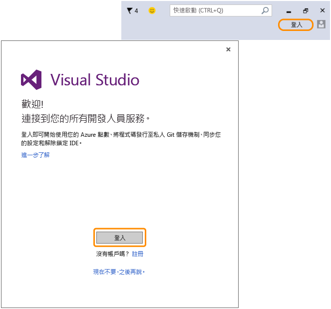

# 返回 Visual Studio 以使用新的 Microsoft 帳戶登入此 IDE！
您已成功建立 Microsoft 帳戶。 返回 Visual Studio，然後在第一次啟動時，從 \[歡迎使用精靈\] 登入，或隨時可從 IDE 右上角登入。  
  
 登入 IDE 來開始使用您的 Azure 信用額度、將程式碼發行至私用 Git 儲存機制、同步您的設定和解除鎖定 IDE。[深入了解](../Topic/Signing%20in%20to%20Visual%20Studio.md)所有開發人員可用的服務。  
  
 