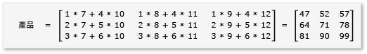
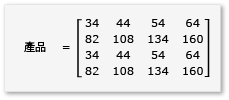

# 逐步解說：矩陣乘法
[!INCLUDE[vs2017banner](../../assembler/inline/includes/vs2017banner.md)]

這個逐步解說會示範如何使用 C\+\+ AMP 加速矩陣乘法的執行。  會出現兩種演算法，一個不使用 tile，另一個使用 tile。  
  
## 必要條件  
 開始之前：  
  
-   讀取 [C\+\+ AMP 概觀](../../parallel/amp/cpp-amp-overview.md)。  
  
-   讀取 [使用磚](../../parallel/amp/using-tiles.md)。  
  
-   請確定您已經在電腦上安裝了[!INCLUDE[win7](../../build/includes/win7_md.md)]， [!INCLUDE[win8](../../build/includes/win8_md.md)]， [!INCLUDE[winsvr08_r2](../../parallel/amp/includes/winsvr08_r2_md.md)]，或[!INCLUDE[winserver8](../../build/includes/winserver8_md.md)]。  
  
### 若要建立專案  
  
1.  在 Visual Studio的功能表列，選擇 \[ **檔案**\]， **新增**， **專案**。  
  
2.  在範本窗格中的 \[**已安裝**\] 底下，選取 \[**Visual C\+\+**\]。  
  
3.  選取 **空專案**，輸入  `MatrixMultiply` 在**名稱** 方塊，然後再選擇 **確定** 按鈕。  
  
4.  選擇**下一步** \] 按鈕。  
  
5.  在**方案總管中**，開啟的快顯功能表 **原始程式檔**，然後選擇 **新增**， **新的項目**。  
  
6.  在 \[**增加新的項目**\] 對話框中，選擇 \[**C\+\+ File \(.cpp\)**\] ，輸入 `MatrixMultiply.cpp`於 \[**檔名**\] 方塊中，然後選擇 \[**新增**\] 的按鈕。  
  
## 不使用 tile 的乘法  
 在本節中，會考慮 兩個矩陣a 和 b的相乘，會以下列方式定義：  
  
   
  
   
  
 A 是 3\-2 矩陣，而 b 則 2\-3 矩陣。  a，b相乘的乘積為以下的 3 x 3 矩陣。  乘積的計算方式是逐項將A的資料列乘以B的資料行。  
  
   
  
### 要相乘而不使用 C\+\+ AMP  
  
1.  開啟 MatrixMultiply.cpp 然後使用下列程式碼來取代現有的程式碼。  
  
    ```cpp  
  
    #include <iostream>  
  
    void MultiplyWithOutAMP() {  
  
        int aMatrix[3][2] = {{1, 4}, {2, 5}, {3, 6}};  
        int bMatrix[2][3] = {{7, 8, 9}, {10, 11, 12}};  
        int product[3][3] = {{0, 0, 0}, {0, 0, 0}, {0, 0, 0}};  
  
        for (int row = 0; row < 3; row++) {  
            for (int col = 0; col < 3; col++) {  
                // Multiply the row of A by the column of B to get the row, column of product.  
                for (int inner = 0; inner < 2; inner++) {  
                    product[row][col] += aMatrix[row][inner] * bMatrix[inner][col];  
                }  
                std::cout << product[row][col] << "  ";  
            }  
            std::cout << "\n";  
        }  
    }  
  
    void main() {  
        MultiplyWithOutAMP();  
        getchar();  
    }  
  
    ```  
  
     這個演算法直接實作了矩陣乘法的定義。  其並未使用任何平行或是多執行緒演算法來減少運算時間。  
  
2.  在功能表列上，選擇\[ **檔案**\]、\[**全部儲存**\]。  
  
3.  選取 F5 鍵盤快速鍵啟動偵錯和驗證輸出是正確的。  
  
4.  選擇Enter結束應用程式。  
  
### 若要使用 C\+\+ AMP 值相乘  
  
1.  在 MatrixMultiply.cpp 中，加入下列程式碼在`main`方法之前。  
  
    ```cpp  
  
    void MultiplyWithAMP() {  
        int aMatrix[] = { 1, 4, 2, 5, 3, 6 };  
        int bMatrix[] = { 7, 8, 9, 10, 11, 12 };  
        int productMatrix[] = { 0, 0, 0, 0, 0, 0, 0, 0, 0 };  
  
        array_view<int, 2> a(3, 2, aMatrix);  
        array_view<int, 2> b(2, 3, bMatrix);  
        array_view<int, 2> product(3, 3, productMatrix);  
  
        parallel_for_each(  
            product.extent,   
             [=](index<2> idx) restrict(amp) {  
                int row = idx[0];  
                int col = idx[1];  
                for (int inner = 0; inner < 2; inner++) {  
                    product[idx] += a(row, inner) * b(inner, col);  
                }  
            }  
        );  
  
        product.synchronize();  
  
        for (int row = 0; row < 3; row++) {  
            for (int col = 0; col < 3; col++) {  
                //std::cout << productMatrix[row*3 + col] << "  ";  
                std::cout << product(row, col) << "  ";  
            }  
            std::cout << "\n";  
        }  
    }  
  
    ```  
  
     放大器程式碼類似於非 AMP 程式碼。  呼叫`parallel_for_each`啟動每個項目中的一個執行緒`product.extent`，並取代`for`迴圈的列和資料行。  位於資料列和資料行的儲存格的值適用於`idx`。  您可以存取`array_view`物件的項目，藉由使用`[]`運算子和索引變數，或`()`運算子和資料列和欄的變數。  此範例會示範這兩種方法。  `array_view::synchronize`方法會複製`product`的值再傳回給`productMatrix`變數。  
  
2.  將下列加入`include`和`using`陳述式在MatrixMultiply.cpp 頂端。  
  
    ```cpp  
  
    #include <amp.h>  
    using namespace concurrency;  
  
    ```  
  
3.  修改`main`方法以呼叫`MultiplyWithAMP`方法。  
  
    ```cpp  
  
    void main() {  
        MultiplyWithOutAMP();  
        MultiplyWithAMP();  
        getchar();  
    }  
  
    ```  
  
4.  選擇啟動偵錯的 Ctrl \+ F5 鍵盤快速鍵，請檢查輸出正確。  
  
5.  選擇 \[空格鍵來結束應用程式\]。  
  
## 乘法與 tile  
 使用 tile 是您將資料分割成大小相等的子集的一種技術，廣泛稱為 tiles。  三個項目變更當您使用 tile。  
  
-   您可以建立`tile_static`變數。  在`tile_static`空間的資料的存取權可以比全域的空間中的資料存取快好幾倍。  `tile_static` 變數的執行個體會為每個 Tile 建立，而且 Tile 中的所有執行緒都可以存取該變數。  tile 的主要優點是受限於`tile_static`存取的效能改善比率。  
  
-   您可以呼叫 [tile\_barrier::wait](../Topic/tile_barrier::wait%20Method.md) 方法即可停止所有的執行緒在指定的一行程式碼的一個 tile 中。  您不能保證執行緒再次執行的順序，只能讓一個 tile 中的所有執行緒都停止，當呼叫`tile_barrier::wait`，在它們繼續執行之前。  
  
-   您可以存取相對於整個`array_view`物件的執行緒的索引和存取相對於 tile 的索引。  藉由使用本機的索引，您可以讓您的程式碼容易閱讀及偵錯。  
  
 若要充分運用 tile 的矩陣相乘的演算，此演算法必須將矩陣分割成 tile，然後將 tile 資料複製到`tile_static`變數，以利快速存取。  在這個範例中，矩陣會分割成相同大小的子矩陣。  乘積可以藉由將子矩陣相乘而得到。  兩個矩陣和它們的乘積，在這個範例是：  
  
   
  
   
  
   
  
 矩陣可分成四個 2x2 矩陣，定義如下：  
  
   
  
   
  
 A 和 B 的乘積可以立即寫入和計算出來，方式如下：  
  
   
  
 因為矩陣`a`到`h`是 2x2 矩陣，所有他們的乘積和加總也是 2x2 矩陣。  它還遵守 A \* B 是一個 4x4 矩陣，如預期般運作。  若要快速檢查演算法，計算第一列中的項目，乘積中的第一個資料行的值。  在範例中，那會是`ae + bg`的第一個資料列和第一欄中的值。  您只需要計算`ae``bg`的第一個資料行、 第一列的每個項目。  `ae` 的值為`1*1 + 2*5 = 11`.  `bg` 的值為 `3*1 + 4*5 = 23`。  最終的值會是`11 + 23 = 34`，這完全正確。  
  
 若要實作這種演算法，程式碼：  
  
-   使用`tiled_extent`物件，而不是`extent`物件在`parallel_for_each`呼叫。  
  
-   使用`tiled_index`物件，而不是`index`物件在`parallel_for_each`呼叫。  
  
-   會建立`tile_static`變數來保存子矩陣。  
  
-   使用`tile_barrier::wait`方法即可停止執行緒計算子矩陣的乘積。  
  
### 若要做相乘使用放大器和 tile  
  
1.  在 MatrixMultiply.cpp 中，加入下列程式碼在`main`方法之前。  
  
    ```cpp  
  
    void MultiplyWithTiling()  
    {  
        // The tile size is 2.  
        static const int TS = 2;  
  
        // The raw data.  
        int aMatrix[] =       { 1, 2, 3, 4, 5, 6, 7, 8, 1, 2, 3, 4, 5, 6, 7, 8 };  
        int bMatrix[] =       { 1, 2, 3, 4, 5, 6, 7, 8, 1, 2, 3, 4, 5, 6, 7, 8 };  
        int productMatrix[] = { 0, 0, 0, 0, 0, 0, 0, 0, 0, 0, 0, 0, 0, 0, 0, 0 };  
  
        // Create the array_view objects.  
        array_view<int, 2> a(4, 4, aMatrix);  
        array_view<int, 2> b(4, 4, bMatrix);  
        array_view<int, 2> product(4, 4, productMatrix);  
  
        // Call parallel_for_each by using  2x2 tiles.  
        parallel_for_each(product.extent.tile< TS, TS >(),  
            [=] (tiled_index< TS, TS> t_idx) restrict(amp)   
            {  
                // Get the location of the thread relative to the tile (row, col) and the entire array_view (rowGlobal, colGlobal).  
                int row = t_idx.local[0];   
                int col = t_idx.local[1];  
                int rowGlobal = t_idx.global[0];  
                int colGlobal = t_idx.global[1];  
                int sum = 0;  
  
                // Given a 4x4 matrix and a 2x2 tile size, this loop executes twice for each thread.  
                // For the first tile and the first loop, it copies a into locA and e into locB.  
                // For the first tile and the second loop, it copies b into locA and g into locB.  
                for (int i = 0; i < 4; i += TS) {  
                    tile_static int locA[TS][TS];  
                    tile_static int locB[TS][TS];  
                    locA[row][col] = a(rowGlobal, col + i);  
                    locB[row][col] = b(row + i, colGlobal);  
                    // The threads in the tile all wait here until locA and locB are filled.  
                    t_idx.barrier.wait();  
  
                    // Return the product for the thread. The sum is retained across  
                    // both iterations of the loop, in effect adding the two products  
                    // together, for example, a*e.  
                    for (int k = 0; k < TS; k++) {  
                        sum += locA[row][k] * locB[k][col];  
                    }  
  
                    // All threads must wait until the sums are calculated. If any threads  
                    // moved ahead, the values in locA and locB would change.        
                    t_idx.barrier.wait();  
                    // Now go on to the next iteration of the loop.            
                }  
  
                // After both iterations of the loop, copy the sum to the product variable by using the global location.  
                product[t_idx.global] = sum;  
        });  
  
            // Copy the contents of product back to the productMatrix variable.  
            product.synchronize();  
  
            for (int row = 0; row < 4; row++) {  
            for (int col = 0; col < 4; col++) {  
                // The results are available from both the product and productMatrix variables.  
                //std::cout << productMatrix[row*3 + col] << "  ";  
                std::cout << product(row, col) << "  ";  
            }  
            std::cout << "\n";  
        }  
  
    }  
  
    ```  
  
     這個範例和不使用 tile 的範例有顯著的差異。  程式碼會使用這些概念的步驟執行：  
  
    1.  將 `a` 的 tile \[0,0\] 的元素複製到 `locA`。  將 `b` 的 tile \[0,0\] 的元素複製到 `locB`。  請注意，`product` \(而非 `a` 和 `b`\) 會劃分成 tile。  因此，您使用通用的索引來存取`a, b`，以及`product`。  `tile_barrier::wait`的呼叫是很重要的。  它就會停止 tile 中所有的執行緒，直到兩者 `locA` 和 `locB` 填滿為止。  
  
    2.  將`locA`和`locB` 相乘，並將結果放`product`。  
  
    3.  將 `a` 的 tile \[0,1\] 的元素複製到 `locA`。  將 `b` 的 tile \[1,0\] 的元素複製到 `locB`。  
  
    4.  將`locA`和`locB` 相乘，並將其新增至已存在`product`中的結果。  
  
    5.  完成 tile \[0,0\] 的乘法運算。  
  
    6.  為其他四個 tile 重複。  沒有特別為 tile 的索引，而執行緒可以以任何順序執行。  當每個執行緒執行時， `tile_static`變數適當地為每個 tile 建立，`tile_barrier::wait`的呼叫控制程式流向。  
  
    7.  當您仔細地檢視演算法，請注意每個子矩陣會被載入至`tile_static`記憶體兩次。  該傳輸的資料的確花時間。  然而，一旦資料位於`tile_static`記憶體，存取資料變得更快。  因為計算產品需要重複的存取子矩陣中的值，整體效能比率沒有改善。  每種演算法，需要實驗才能找出最佳的演算法和 tile 大小。  
  
         在非 AMP 和非 tile 範例中，每個 A 和 B 的元素會被從全域記憶體存取四次來計算乘積。  在 tile 範例中，每個元素被從全域記憶體存取兩次和從 `tile_static` 記憶體存取四次。  這並不是顯著的效能改善比率。  不過，如果 A 和 B 是 1024x1024 矩陣而且 tile 大小是 16，會有顯著的效能改善比率。  在此情況下，每個元素會只被複製到 `tile_static` 記憶體16 次，而且從 `tile_static` 記憶體被存取 1024次。  
  
2.  若要修改主方法來呼叫 `MultiplyWithTiling` ，如下所示。  
  
    ```cpp  
  
    void main() {  
        MultiplyWithOutAMP();  
        MultiplyWithAMP();  
        MultiplyWithTiling();  
        getchar();  
    }  
  
    ```  
  
3.  選擇啟動偵錯的 Ctrl \+ F5 鍵盤快速鍵，請檢查輸出正確。  
  
4.  選擇 \[空格鍵以結束應用程式\]。  
  
## 請參閱  
 [C\+\+ AMP \(C\+\+ Accelerated Massive Parallelism\)](../../parallel/amp/cpp-amp-cpp-accelerated-massive-parallelism.md)   
 [逐步解說：偵錯 C\+\+ AMP 應用程式](../../parallel/amp/walkthrough-debugging-a-cpp-amp-application.md)