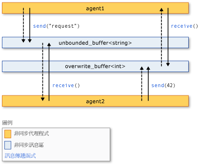

# <a name="asynchronous-agents-library"></a>非同步代理程式程式庫

非同步代理程式程式庫 (或簡稱*代理程式程式庫*) 提供程式設計模型，可讓您增加啟用並行的應用程式開發的穩定性。 代理程式庫是 c + + 樣板程式庫，可提升行動為基礎的程式設計模型和同處理序訊息傳遞進行粗略的資料流程和管線工作。 代理程式的程式庫建置並行執行階段的排程及資源管理元件。

## <a name="programming-model"></a>程式設計模型

代理程式庫會提供共用狀態的替代方案，讓您透過非同步通訊模型為基礎而不是控制流程的資料流程連接獨立的元件。 *資料流程*程式設計是指當所有必要的資料，其中進行計算的模型可以使用;*控制流程*指的是程式設計模型，以預先決定的順序進行計算。

資料流程程式設計模型與「訊息傳遞」的概念有關，其中程式的獨立元件可藉由傳送訊息相互通訊。

代理程式庫由三個元件組成：*非同步代理程式*，*非同步訊息區*，並*訊息傳遞函式*。 代理程式維護狀態，並使用訊息區和訊息傳遞函式來彼此，以及與外部元件進行通訊。 訊息傳遞函式可讓代理程式來傳送和接收訊息的外部元件。 非同步訊息區塊保留訊息，並啟用代理程式進行通訊以同步處理方式。

下圖顯示如何在兩個代理程式，使用訊息區和訊息傳遞函式來進行通訊。 在此圖中，`agent1`傳送訊息給`agent2`利用[concurrency:: send](reference/concurrency-namespace-functions.md#send)函式和[concurrency:: unbounded_buffer](reference/unbounded-buffer-class.md)物件。 `agent2` 會使用[concurrency:: receive](reference/concurrency-namespace-functions.md#receive)函式來讀取訊息。 `agent2` 會使用相同的方法來傳送訊息至`agent1`。 虛線的箭頭代表代理程式之間的資料流程。 實心箭號連接它們寫入或讀取的訊息區塊的代理程式。



實作此圖中的程式碼範例是本主題稍後所示。

代理程式的程式設計模型有其他並行和同步處理的機制，比方說，事件的幾項優點。 其中一個優點是，藉由使用訊息傳遞至傳輸物件之間的狀態變更，您可以找出共用的資源的存取權，進而改善延展性。 訊息傳遞的優點是，它所繫結至資料，而不要將它繫結至外部的同步處理物件的同步處理。 這可簡化元件之間的資料傳輸，並可以排除在您的應用程式的程式設計錯誤。

## <a name="when-to-use-the-agents-library"></a>使用代理程式庫的時機

您必須以非同步方式與彼此通訊的多個作業時，請使用代理程式庫。 訊息區和訊息傳遞函式可讓您撰寫平行應用程式，而不需要同步處理機制，例如鎖定。 這可讓您專注於應用程式邏輯。

代理程式的程式設計模型通常用來建立*資料管線*或是*網路*。 資料管線是一系列元件，其中每個執行特定工作，以便共同完成整體目標。 當它收到訊息時從另一個元件，每個元件為資料流程管線會執行工作。 這項工作的結果會傳遞給管線或網路中的其他元件。 元件可以使用更多更細緻的並行處理功能從其他程式庫，例如，[平行模式程式庫 (PPL)](../../parallel/concrt/parallel-patterns-library-ppl.md)。

## <a name="example"></a>範例

下列範例會實作本主題稍早所示的圖例。

[!code-cpp[concrt-basic-agents#1](../../parallel/concrt/codesnippet/cpp/asynchronous-agents-library_1.cpp)]

這個範例會產生下列輸出：

```Output
agent1: sending request...
agent2: received 'request'.
agent2: sending response...
agent1: received '42'.
```

下列主題說明此範例中使用的功能。

## <a name="related-topics"></a>相關主題

[非同步代理程式](../../parallel/concrt/asynchronous-agents.md)<br/>
描述解決大型運算工作的非同步代理程式的角色。

[非同步訊息區](../../parallel/concrt/asynchronous-message-blocks.md)<br/>
描述代理程式庫所提供的各種訊息區塊類型。

[訊息傳遞函式](../../parallel/concrt/message-passing-functions.md)<br/>
描述各種不同的訊息傳遞常式所提供的代理程式庫。

[如何：實作各種生產者-消費者模式](../../parallel/concrt/how-to-implement-various-producer-consumer-patterns.md)<br/>
描述如何在您的應用程式中實作生產者-消費者模式。

[如何：為呼叫和轉換程式類別提供工作函式](../../parallel/concrt/how-to-provide-work-functions-to-the-call-and-transformer-classes.md)<br/>
說明數種方式可提供工作函式，來[concurrency:: call](../../parallel/concrt/reference/call-class.md)並[concurrency:: transformer](../../parallel/concrt/reference/transformer-class.md)類別。

[如何：在資料管線中使用轉換程式](../../parallel/concrt/how-to-use-transformer-in-a-data-pipeline.md)<br/>
示範如何使用[concurrency:: transformer](../../parallel/concrt/reference/transformer-class.md)資料管線中的類別。

[如何：在已完成的工作之中選取](../../parallel/concrt/how-to-select-among-completed-tasks.md)<br/>
示範如何使用[concurrency:: choice](../../parallel/concrt/reference/choice-class.md)並[concurrency:: join](../../parallel/concrt/reference/join-class.md)類別選取第一個工作完成搜尋演算法。

[如何：定期傳送訊息](../../parallel/concrt/how-to-send-a-message-at-a-regular-interval.md)<br/>
示範如何使用[concurrency:: timer](../../parallel/concrt/reference/timer-class.md)類別定期傳送訊息。

[如何：使用訊息區篩選條件](../../parallel/concrt/how-to-use-a-message-block-filter.md)<br/>
示範如何使用篩選來啟用非同步訊息區塊接受或拒絕訊息。

[平行模式程式庫 (PPL)](../../parallel/concrt/parallel-patterns-library-ppl.md)<br/>
描述如何在您的應用程式中使用不同的平行模式，例如平行演算法。

[並行執行階段](../../parallel/concrt/concurrency-runtime.md)<br/>
說明並行執行階段，它可簡化平行程式設計，並包含相關主題的連結。

