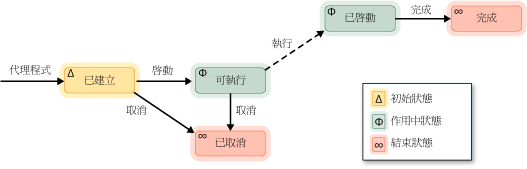

# 非同步代理程式
[!INCLUDE[vs2017banner](../../assembler/inline/includes/vs2017banner.md)]

「*非同步代理程式*」\(Asynchronous Agent\) \(或簡稱「*代理程式*」\(Agent\)\) 是一個應用程式元件，可以用非同步方式配合其他代理程式來解決較複雜的運算工作。  請將代理程式視為已設定生命週期的工作。  例如，假設有一個代理程式負責讀取輸入\/輸出裝置 \(例如鍵盤、磁碟檔案或網路連接\) 中的資料，而另一個代理程式則負責對讀取到的資料執行動作。  第一個代理程式會傳遞訊息來通知第二個代理程式有更多資料可用。  並行執行階段工作排程器提供有效的機制，能夠以合作方式封鎖和產生代理程式，而不需要進行效率較低的先佔封鎖和產生。  
  
 代理程式程式庫定義 [concurrency::agent](../../parallel/concrt/reference/agent-class.md) 類別來表示非同步代理程式。  `agent` 是一個宣告虛擬方法 [concurrency::agent::run](../Topic/agent::run%20Method.md) 的抽象類別。  `run` 方法會執行代理程式所執行的工作。  因為 `run` 是抽象的，所以您必須在每個衍生自 `agent` 的類別中實作這個方法。  
  
## 代理程式生命週期  
 代理程式擁有設定的生命週期。  [concurrency::agent\_status](../Topic/agent_status%20Enumeration.md) 列舉定義代理程式的各種狀態。  下圖是說明代理程式如何從某種狀態進入另一種狀態的狀態圖表。  在這張圖中，實線表示您在應用程式中呼叫的方法，虛線則表示在執行階段呼叫的方法。  
  
   
  
 下表說明 `agent_status` 列舉中的每種狀態。  
  
|代理程式狀態|說明|  
|------------|--------|  
|`agent_created`|尚未排定代理程式執行。|  
|`agent_runnable`|執行階段已排定代理程式執行。|  
|`agent_started`|代理程式已啟動並執行。|  
|`agent_done`|代理程式已完成。|  
|`agent_canceled`|代理程式在進入 `started` 狀態之前即已遭到取消。|  
  
 `agent_created` 是代理程式的最初狀態、`agent_runnable` 和 `agent_started` 是代理程式可作用時的狀態，而 `agent_done` 和 `agent_canceled` 則是代理程式的結束狀態。  
  
 若要擷取 `agent` 物件目前的狀態，請使用 [concurrency::agent::status](../Topic/agent::status%20Method.md) 方法。  雖然 `status` 方法是並行安全的，但是當 `status` 方法傳回時，代理程式的狀態可能又會變更。  例如，當您呼叫 `status` 方法時，代理程式可能為 `agent_started` 狀態，但是在 `status` 方法傳回之後，代理程式又變成 `agent_done` 狀態。  
  
## 方法和功能  
 下表顯示 `agent` 類別底下的一些重要方法。  如需所有 `agent` 類別方法的詳細資訊，請參閱 [agent 類別](../../parallel/concrt/reference/agent-class.md)。  
  
|方法|說明|  
|--------|--------|  
|[start](../Topic/agent::start%20Method.md)|排定 `agent` 物件執行，並將它設定為 `agent_runnable` 狀態。|  
|[run](../Topic/agent::run%20Method.md)|執行要由 `agent` 物件執行的工作。|  
|[done](../Topic/agent::done%20Method.md)|將代理程式變成 `agent_done` 狀態。|  
|[cancel](../Topic/agent::cancel%20Method.md)|如果代理程式尚未啟動，則這個方法會取消執行代理程式，並將它設定為 `agent_canceled` 狀態。|  
|[status](../Topic/agent::status%20Method.md)|擷取 `agent` 物件的目前狀態。|  
|[wait](../Topic/agent::wait%20Method.md)|等候 `agent` 物件進入 `agent_done` 或 `agent_canceled` 狀態。|  
|[wait\_for\_all](../Topic/agent::wait_for_all%20Method.md)|等候所有提供的 `agent` 物件進入 `agent_done` 或 `agent_canceled` 狀態。|  
|[wait\_for\_one](../Topic/agent::wait_for_one%20Method.md)|等候至少一個提供的 `agent` 物件進入 `agent_done` 或 `agent_canceled` 狀態。|  
  
 建立代理程式物件之後，請呼叫 [concurrency::agent::start](../Topic/agent::start%20Method.md) 方法排定該物件執行。  執行階段會在排定代理程式並將之設定為 `agent_runnable` 狀態之後，呼叫 `run` 方法。  
  
 執行階段並不會管理非同步代理程式所擲回的例外狀況。  如需例外狀況處理和代理程式的詳細資訊，請參閱[例外狀況處理](../../parallel/concrt/exception-handling-in-the-concurrency-runtime.md)。  
  
## 範例  
 如需示範如何建立基本的代理程式架構應用程式的範例，請參閱[逐步解說：建立代理程式架構應用程式](../../parallel/concrt/walkthrough-creating-an-agent-based-application.md)。  
  
## 請參閱  
 [非同步代理程式程式庫](../../parallel/concrt/asynchronous-agents-library.md)