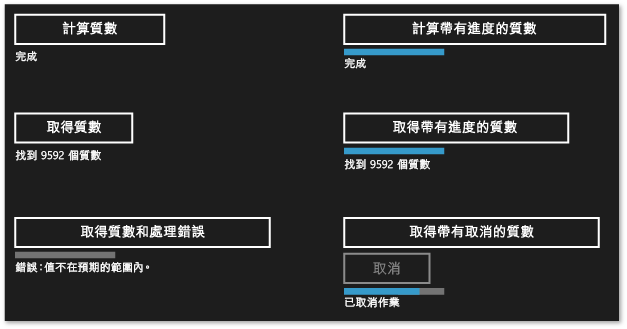

# 建立非同步作業，在C++用於 UWP 應用程式

本文件說明一些重要的觀念，要牢記在心，當您使用 task 類別產生以 Windows 執行緒集區為基礎的通用 Windows 執行階段 」 (UWP) 應用程式中的非同步作業。

使用非同步程式設計是 Windows 執行階段應用程式模型中的主要元件，因為它可讓應用程式保持回應使用者輸入。 您可以啟動長時間執行的工作，而不封鎖 UI 執行緒，而且可以稍後再接收工作的結果。 工作在背景執行時，您也可以取消工作和接收進度通知。 文件[非同步程式設計C++](/windows/uwp/threading-async/asynchronous-programming-in-cpp-universal-windows-platform-apps)概述使用非同步模式的視覺效果中C++來建立 UWP 應用程式。 該文件教您如何使用及建立非同步 Windows 執行階段作業的鏈結。 本章節描述如何使用 ppltasks.h 中的類型，來產生可供另一個 Windows 執行階段元件的非同步作業，並執行如何控制如何非同步作業。 另請閱讀[非同步程式設計模式和秘訣在 Hilo (使用 Windows 市集應用程式C++和 XAML)](https://msdn.microsoft.com/library/windows/apps/jj160321.aspx)若要了解我們如何使用工作類別來實作非同步作業，Windows 執行階段應用程式，使用C++和 XAML。

> [!NOTE]
>  您可以使用[平行模式程式庫](../../parallel/concrt/parallel-patterns-library-ppl.md)(PPL) 和[Asynchronous Agents Library](../../parallel/concrt/asynchronous-agents-library.md) UWP 應用程式中。 不過，您無法使用工作排程器或資源管理員。 本文件說明其他 PPL 提供所提供功能只是 UWP 應用程式，而不適用於傳統型應用程式。

## 重點

- 使用 [concurrency::create_async](reference/concurrency-namespace-functions.md#create_async) 建立其他元件可以使用的非同步作業 (可能是以 C++ 以外的語言撰寫)。

- 使用 [concurrency::progress_reporter](../../parallel/concrt/reference/progress-reporter-class.md) 向呼叫您的非同步作業的元件回報進度通知。

- 使用取消語彙基元可讓內部非同步作業取消。

- `create_async` 函式的行為取決於所收到工作函式的傳回類型。 傳回工作 ( `task<T>` 或 `task<void>`) 的工作函式會在呼叫 `create_async`的內容中同步執行。 傳回 `T` 或 `void` 的工作函式則會在任意內容中執行。

- 您可以使用 [concurrency::task::then](reference/task-class.md#then) 方法建立逐一執行的工作鏈結。 在 UWP app 中，預設的工作接續內容會取決於該工作如何建構中。 如果工作是藉由傳遞非同步動作至工作建構函式所建立，或是藉由傳遞傳回非同步動作的 Lambda 運算式所建立，則該工作的所有預設接續內容都會是目前的內容。 如果工作不是從非同步動作建構，則工作的接續內容會預設為使用任意內容。 您可以使用 [concurrency::task_continuation_context](../../parallel/concrt/reference/task-continuation-context-class.md) 類別覆寫預設內容。

## 本文內容

- [建立非同步作業](#create-async)

- [例如：建立C++Windows 執行階段元件](#example-component)

- [控制執行緒](#exethread)

- [例如：控制使用 Windows 執行階段應用程式中的執行C++和 XAML](#example-app)

##   建立非同步作業

您可以在平行模式程式庫 (PPL) 中使用工作和接續模型，定義背景工作以及會在前一項工作完成時執行的工作。 這項功能是由 [concurrency::task](../../parallel/concrt/reference/task-class.md) 類別所提供。 如需這個模型和 `task` 類別的詳細資訊，請參閱 [Task Parallelism](../../parallel/concrt/task-parallelism-concurrency-runtime.md)的內容中同步執行。

Windows 執行階段是可用來建立只在特殊作業系統環境中執行的 UWP 應用程式的程式設計介面。 這類應用程式使用授權的函式、 資料類型及裝置，並會從 Microsoft Store 散發。 Windows 執行階段由*應用程式二進位介面*(ABI)。 ABI 是讓 Windows 執行階段 Api 等 Visual 程式設計語言中可用的基礎二進位協定C++。

藉由使用 Windows 執行階段，您可以使用各種程式設計語言的最佳功能，並將它們結合到單一應用程式。 例如，您可能在 JavaScript 中建立 UI，並且在 C++ 元件中執行密集運算的應用程式邏輯。 在背景執行這些密集運算作業的能力，就是讓 UI 保持回應的主要因素。 因為`task`類別是特定C++，您必須使用 Windows 執行階段介面來傳達給其他元件的非同步作業 (可能會在其中寫入語言以外的其他C++)。 Windows 執行階段會提供您可用來表示非同步作業的四個介面：

[Windows::Foundation::IAsyncAction](/uwp/api/windows.foundation.iasyncaction) 
表示非同步動作。

[Windows::Foundation::IAsyncActionWithProgress\<TProgress>](https://msdn.microsoft.com/library/windows/apps/br206581.aspx) 
表示報告進度的非同步動作。

[Windows::Foundation::IAsyncOperation\<TResult>](https://msdn.microsoft.com/library/windows/apps/br206598.aspx) 
表示傳回結果的非同步作業。

[Windows::Foundation::IAsyncOperationWithProgress\<TResult, TProgress>](https://msdn.microsoft.com/library/windows/apps/br206594.aspx) 
表示傳回結果和報告進度的非同步作業。

「 *動作* 」(Action) 的概念表示，非同步工作沒有產生值 (想像傳回 `void`的函式)。 「 *作業* 」(Operation) 的概念表示，非同步工作會產生值。 「 *進度* 」(Progress) 的概念表示，工作可以向呼叫端報告進度訊息。 JavaScript、.NET Framework 和 Visual C++ 各提供了自己建立這些介面執行個體的方式，以供跨 ABI 界限使用。 針對 Visual C++，PPL 提供了 [concurrency::create_async](reference/concurrency-namespace-functions.md#create_async) 函式。 此函式會建立 Windows 執行階段非同步動作或作業，代表已完成的工作。 `create_async`函式會將工作函式 （通常是 lambda 運算式），會在內部建立`task`物件，並將其中一種四個非同步 Windows 執行階段介面工作包裝。

> [!NOTE]
>  使用`create_async`僅當您需要建立可從另一種語言或另一個 Windows 執行階段元件的功能。 如果您清楚知道作業是在同一個元件中由 C++ 程式碼所產生和使用，則直接使用 `task` 類別。

`create_async` 的傳回類型取決於其引數的類型。 例如，如果您的工作函式不會傳回值，而且不會報告進度，則 `create_async` 會傳回 `IAsyncAction`。 如果您的工作函式不會傳回值，但是會報告進度，則 `create_async` 會傳回 `IAsyncActionWithProgress`。 若要報告進度，請提供 [concurrency::progress_reporter](../../parallel/concrt/reference/progress-reporter-class.md) 物件做為工作函式的參數。 報告進度的功能可讓您報告已執行多少工作，以及仍剩多少工作 (例如，以百分比表示)。 另外也可在結果產生時讓您報告結果。

`IAsyncAction`、 `IAsyncActionWithProgress<TProgress>`、 `IAsyncOperation<TResult>`和 `IAsyncActionOperationWithProgress<TProgress, TProgress>` 介面各提供了一個 `Cancel` 方法，可讓您取消非同步作業。 `task` 類別可與取消語彙基元一起使用。 當您使用取消語彙基元取消工作時，執行階段就不會啟動訂閱這個語彙基元的新工作。 已在進行的工作可以監視自己的取消語彙基元，並且在可以停止時停止。 這個機制將在 [Cancellation in the PPL](cancellation-in-the-ppl.md)文件中進行詳細說明。 您可以使用 Windows 執行階段來連線工作取消`Cancel`有兩種方法。 一種方式是定義傳遞至 `create_async` 以採用 [concurrency::cancellation_token](../../parallel/concrt/reference/cancellation-token-class.md) 物件的工作函式。 當呼叫 `Cancel` 方法時，這個取消語彙基元就會取消，而且一般取消規則就會套用至支援 `task` 呼叫的基礎 `create_async` 物件。 如果您未提供 `cancellation_token` 物件，則基礎 `task` 物件會隱含定義該物件。 當您需要以合作方式回應工作函式中的取消時，請定義 `cancellation_token` 物件。 區段[範例：控制使用 Windows 執行階段應用程式中的執行C++和 XAML](#example-app)示範如何使用通用 Windows 平台 (UWP) 應用程式中執行取消作業的C#和 XAML 使用自訂的 Windows 執行階段C++元件。

> [!WARNING]
>  在工作接續鏈結中，當取消語彙基元已取消時，一律先清除狀態，再呼叫 [concurrency::cancel_current_task](reference/concurrency-namespace-functions.md#cancel_current_task) 。 如果您提早傳回而不是呼叫 `cancel_current_task`，則作業會轉換成已完成狀態，而不是已取消狀態。

下表摘要說明可在您的應用程式中用來定義非同步作業的組合。

|若要建立此 Windows 執行階段介面|從 `create_async`傳回這個類型。|將這些參數類型傳遞至您的工作函式，以使用隱含取消語彙基元|將這些參數類型傳遞至您的工作函式，以使用明確取消語彙基元|
|----------------------------------------------------------------------------------|------------------------------------------|--------------------------------------------------------------------------------------------|--------------------------------------------------------------------------------------------|
|`IAsyncAction`|`void` 或 `task<void>`|(無)|(`cancellation_token`)|
|`IAsyncActionWithProgress<TProgress>`|`void` 或 `task<void>`|(`progress_reporter`)|(`progress_reporter`, `cancellation_token`)|
|`IAsyncOperation<TResult>`|`T` 或 `task<T>`|(無)|(`cancellation_token`)|
|`IAsyncActionOperationWithProgress<TProgress, TProgress>`|`T` 或 `task<T>`|(`progress_reporter`)|(`progress_reporter`, `cancellation_token`)|

您可以從傳遞至 `task` 函式的工作函式傳回值或 `create_async` 物件。 這些變化會產生不同的行為。 當您傳回值時，工作函式會包裝在 `task` 中，如此它就可以在背景執行緒上執行。 另外，基礎 `task` 會使用隱含取消語彙基元。 相反地，如果您傳回 `task` 物件，則工作函式會同步執行。 因此，如果您傳回 `task` 物件，請確認工作函式中所有冗長的作業也都做為工作執行，讓您的應用程式能夠保持回應。 另外，基礎 `task` 不會使用隱含取消語彙基元。 因此，如果您需要在從 `cancellation_token` 傳回 `task` 物件時支援取消，則需要定義自己的工作函式以接受 `create_async`物件。

下列範例示範建立的各種方式`IAsyncAction`可供另一個 Windows 執行階段元件的物件。

[!code-cpp[concrt-windowsstore-primes#100](../../parallel/concrt/codesnippet/cpp/creating-asynchronous-operations-in-cpp-for-windows-store-apps_1.cpp)]

##   範例：建立C++Windows 執行階段元件，並使用它從C#

請考慮使用 XAML 的應用程式和C#來定義 UI 和C++來執行運算密集作業的 Windows 執行階段元件。 在這個範例中，C++ 元件會計算某個範圍中哪些數字是質數。 為了說明四個 Windows 執行階段非同步工作介面之間的差異，請從在 Visual Studio 中，建立**空白方案**並將它命名`Primes`。 然後在方案中新增 [Windows 執行階段元件]  專案，並將它命名為 `PrimesLibrary`。 將下列程式碼加入至產生的 C++ 標頭檔 (這個範例會將 Class1.h 重新命名為 Primes.h)。 每個 `public` 方法都會定義四個非同步介面的其中一個。 方法會傳回值[ivector&lt\<int >](/uwp/api/Windows.Foundation.Collections.IVector_T_)物件。 報告進度的方法會產生 `double` 值，用以定義整體工作已完成的百分比。

[!code-cpp[concrt-windowsstore-primes#1](../../parallel/concrt/codesnippet/cpp/creating-asynchronous-operations-in-cpp-for-windows-store-apps_2.h)]

> [!NOTE]
>  依照慣例，通常以"Async"結尾 Windows 執行階段中的非同步方法名稱。

將下列程式碼加入至產生的 C++ 原始程式檔 (這個範例會將 Class1.cpp 重新命名為 Primes.cpp)。 `is_prime` 函式會判斷其項目是否為質數。 其餘的方法會實作 `Primes` 類別。 每次呼叫 `create_async` 都會使用與從中進行呼叫的方法相容的簽章。 例如，由於 `Primes::ComputePrimesAsync` 會傳回 `IAsyncAction`，因此提供給 `create_async` 的工作函式不會傳回值，也不會使用 `progress_reporter` 物件做為其參數。

[!code-cpp[concrt-windowsstore-primes#2](../../parallel/concrt/codesnippet/cpp/creating-asynchronous-operations-in-cpp-for-windows-store-apps_3.cpp)]

每個方法會先執行驗證，以確保輸入的參數為非負數。 如果輸入的值為負數，方法會擲回 [Platform::InvalidArgumentException](https://msdn.microsoft.com/library/windows/apps/hh755794.aspx)。 本結稍後將說明錯誤處理。

若要使用這些方法，從 UWP 應用程式，請使用 Visual C#**空白應用程式 (XAML)** 範本將另一個專案加入至 Visual Studio 方案。 這個範例會將專案命名為 `Primes`。 然後從 `Primes` 專案中，新增 `PrimesLibrary` 專案的參考。

將下列程式碼加入至 MainPage.xaml。 這個程式碼會定義 UI，讓您能夠呼叫 C++ 元件並顯示結果。

[!code-xml[concrt-windowsstore-primes#3](../../parallel/concrt/codesnippet/xaml/creating-asynchronous-operations-in-cpp-for-windows-store-apps_4.xaml)]

將下列程式碼加入至 MainPage.xaml 中的 `MainPage` 類別。 這個程式碼會定義 `Primes` 物件和按鈕事件處理常式。

[!code-cs[concrt-windowsstore-primes#4](../../parallel/concrt/codesnippet/csharp/creating-asynchronous-operations-in-cpp-for-windows-store-apps_5.cs)]

在非同步作業完成後，這些方法會使用 `async` 和 `await` 關鍵字更新 UI。 如需非同步 UWP 應用程式中撰寫程式碼的資訊，請參閱[執行緒和非同步程式設計](/windows/uwp/threading-async)。

`getPrimesCancellation` 和 `cancelGetPrimes` 方法可一起使用，讓使用者取消作業。 當使用者選擇**取消** 按鈕，`cancelGetPrimes`方法呼叫[IAsyncOperationWithProgress\<Iasyncoperationwithprogress<tresult，Tprogress> >:: 取消](/uwp/api/windows.foundation.iasyncinfo.cancel)取消作業。 並行執行階段，用來管理基礎的非同步作業，會擲回內部例外狀況類型攔截的 Windows 執行階段，以傳達取消已完成。 如需有關取消模型的詳細資訊，請參閱[取消](../../parallel/concrt/cancellation-in-the-ppl.md)。

> [!IMPORTANT]
>  若要讓 PPL 正確回報給 Windows 執行階段，它已取消作業，不會攔截這個內部例外狀況類型。 這表示，您不應該攔截所有例外狀況 (`catch (...)`)。 如果您必須攔截所有例外狀況重新擲回的例外狀況，以確保 Windows 執行階段能夠完成取消作業。

下圖顯示選擇每個選項之後的 `Primes` 應用程式。

如需使用 `create_async` 建立可供其他語言使用之非同步工作的範例，請參閱 [在 Bing 地圖服務路線最佳化程式範例中使用 C++](https://msdn.microsoft.com/library/windows/apps/hh699891.aspx) 和 [Windows 8 Asynchronous Operations in C++ with PPL](https://code.msdn.microsoft.com/windowsapps/windows-8-asynchronous-08009a0d)(使用 C++ 和 PPL 的 Windows 8 非同步作業)。

##   控制執行緒

Windows 執行階段會使用 COM 執行緒模型。 在這個模型中，物件會根據它們處理同步處理的方式裝載於不同的 Apartment。 安全執行緒物件裝載於多執行緒 Apartment (MTA) 中。 必須由單一執行緒存取的物件裝載於單一執行緒 Apartment (STA) 中。

在有 UI 的應用程式中，ASTA (應用程式 STA) 執行緒負責提取視窗訊息，而且是處理序中唯一可更新 STA 裝載 UI 控制項的執行緒。 這有兩種結果。 首先，為了讓應用程式保持回應，所有 CPU 密集和 I/O 作業都不應該在 ASTA 執行緒上執行。 其次，來自背景執行緒的結果必須封送處理回 ASTA 才能更新 UI。 在C++UWP 應用程式，`MainPage`是在 ATSA 上執行的所有其他 XAML 頁面。 因此根據預設，在 ASTA 上宣告的工作接續都會在該處執行，所以您可以直接在接續主體中更新控制項。 不過，如果您是以巢狀方式處理工作，則該巢狀工作上的任何接續都會在 MTA 中執行。 因此，您需要考慮是否要明確指定這些接續要在哪些內容上執行。

從非同步作業建立的工作 (例如 `IAsyncOperation<TResult>`) 會使用特殊語意協助您忽略執行緒的詳細資料。 雖然作業可能會在背景執行緒上執行 (或沒有任何執行緒支援它)，但是根據預設，其接續仍保證能在啟動接續作業的 Appartment 上執行 (換句話說，就是從呼叫 `task::then`的 Apartment)。 您可以使用 [concurrency::task_continuation_context](../../parallel/concrt/reference/task-continuation-context-class.md) 類別來控制接續的執行內容。 使用這些靜態 Helper 方法建立 `task_continuation_context` 物件：

- 使用 [concurrency::task_continuation_context::use_arbitrary](reference/task-continuation-context-class.md#use_arbitrary) 指定接續在背景執行緒上執行。

- 使用 [concurrency::task_continuation_context::use_current](reference/task-continuation-context-class.md#use_current) 指定接續在呼叫 `task::then`的執行緒上執行。

您可以將 `task_continuation_context` 物件傳遞至 [task::then](reference/task-class.md#then) 方法，藉此明確控制接續的執行內容，您也可以將工作傳遞至另一個 Apartment，然後呼叫 `task::then` 方法隱含控制執行內容。

> [!IMPORTANT]
>  根據預設，STA 上所建立的接續 STA 下執行的 UWP 應用程式的主要 UI 執行緒，因為執行在 sta。 同樣地，您在 MTA 上建立的接續工作也會在 MTA 上執行。

下一節將示範從磁碟讀取檔案、在該檔案中尋找最常見的字詞，然後在 UI 中顯示結果的應用程式。 最後的作業是更新 UI，它會在 UI 執行緒上發生。

> [!IMPORTANT]
> 此行為是 UWP 應用程式專屬的。 如果是傳統型應用程式，您不用控制接續工作執行的位置。 而是由排程器選擇執行每個接續工作所在的背景工作執行緒。

> [!IMPORTANT]
> 不要在 STA 上執行的接續主體中呼叫 [concurrency::task::wait](reference/task-class.md#wait) 。 否則，因為這個方法會封鎖目前的執行緒，而且可能會導致應用程式沒有回應，所以執行階段會擲回 [concurrency::invalid_operation](../../parallel/concrt/reference/invalid-operation-class.md) 。 不過，您可以呼叫 [concurrency::task::get](reference/task-class.md#get) 方法來以工作為基礎連續的形式接收前項工作的結果。

##   範例：控制使用 Windows 執行階段應用程式中的執行C++和 XAML

假設有一個 C++ XAML 應用程式，它會從硬碟讀取檔案、尋找該檔案中最常見的字詞，然後在 UI 中顯示結果。 若要建立此應用程式，首先，在 Visual Studio 中，建立**空白應用程式 (通用 Windows)** 專案，然後將它命名為`CommonWords`。 在您的應用程式資訊清單中指定 [ **文件庫** ] 功能，讓應用程式能夠存取 [我的文件] 資料夾。 另外在應用程式資訊清單的宣告區段中加入 [文字 (.txt)] 檔案類型。 如需應用程式功能和宣告的詳細資訊，請參閱 [應用程式套件與部署 (Windows 執行階段應用程式)](https://msdn.microsoft.com/library/windows/apps/hh464929.aspx)。

將 MainPage.xaml 中的 `Grid` 項目更新，以包含 `ProgressRing` 項目和 `TextBlock` 項目。 `ProgressRing` 會指出作業正在進行，而 `TextBlock` 會顯示計算的結果。

[!code-xml[concrt-windowsstore-commonwords#1](../../parallel/concrt/codesnippet/xaml/creating-asynchronous-operations-in-cpp-for-windows-store-apps_6.xaml)]

將下面的 `#include` 陳述式加入至 pch.h。

[!code-cpp[concrt-windowsstore-commonwords#2](../../parallel/concrt/codesnippet/cpp/creating-asynchronous-operations-in-cpp-for-windows-store-apps_7.h)]

將下列方法宣告加入至 `MainPage` 類別 (MainPage.h)。

[!code-cpp[concrt-windowsstore-commonwords#3](../../parallel/concrt/codesnippet/cpp/creating-asynchronous-operations-in-cpp-for-windows-store-apps_8.h)]

將下列 `using` 陳述式加入至 MainPage.cpp。

[!code-cpp[concrt-windowsstore-commonwords#4](../../parallel/concrt/codesnippet/cpp/creating-asynchronous-operations-in-cpp-for-windows-store-apps_9.cpp)]

在 MainPage.cpp 中，實作 `MainPage::MakeWordList`、 `MainPage::FindCommonWords`和 `MainPage::ShowResults` 方法。 `MainPage::MakeWordList` 和 `MainPage::FindCommonWords` 會執行密集運算的作業。 `MainPage::ShowResults` 方法會在 UI 中顯示計算的結果。

[!code-cpp[concrt-windowsstore-commonwords#5](../../parallel/concrt/codesnippet/cpp/creating-asynchronous-operations-in-cpp-for-windows-store-apps_10.cpp)]

修改 `MainPage` 建構函式以建立接續工作鏈結，在 UI 中顯示荷馬 (Homer) 寫的《伊利亞德》( *The Iliad* ) 這本書中常見的字。 前兩個接續工作會將文字分割成單字並尋找常見字詞，不過非常耗時，因此明確設定為在背景執行。 最後一項接續工作是更新 UI，它不會指定接續內容，因此遵循 Apartment 執行緒規則。

[!code-cpp[concrt-windowsstore-commonwords#6](../../parallel/concrt/codesnippet/cpp/creating-asynchronous-operations-in-cpp-for-windows-store-apps_11.cpp)]

> [!NOTE]
>  這個範例會示範如何指定執行內容以及如何撰寫接續鏈結。 前面說過，根據預設，從非同步作業建立的工作會在呼叫 `task::then`的 Apartment 上執行接續。 因此，這個範例會使用 `task_continuation_context::use_arbitrary` 指定不涉及 UI 的作業將在背景執行緒上執行。

下圖顯示 `CommonWords` 應用程式的結果。

在這個範例中可以支援取消，因為支援 `task` 的 `create_async` 物件使用隱含取消語彙基元。 如果您的工作需要以合作方式回應取消，請定義您的工作函式使其接受 `cancellation_token` 物件。 如需在 PPL 中取消的詳細資訊，請參閱 [Cancellation in the PPL](cancellation-in-the-ppl.md)。

## 另請參閱

[並行執行階段](../../parallel/concrt/concurrency-runtime.md)
