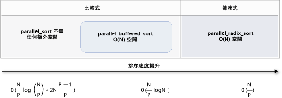

# <a name="parallel-algorithms"></a>平行演算法

平行模式程式庫 (PPL) 提供同時資料集合執行工作的演算法。 這些演算法類似 c + + 標準程式庫所提供。

平行演算法所組成的並行執行階段中的現有功能。 例如， [concurrency:: parallel_for](reference/concurrency-namespace-functions.md#parallel_for)演算法會使用[concurrency:: structured_task_group](../../parallel/concrt/reference/structured-task-group-class.md)物件，以執行平行迴圈反覆項目。 `parallel_for`提供可用的運算資源的數目以最佳方式運作的演算法的資料分割。

##  <a name="top"></a> 章節

- [Parallel_for 演算法](#parallel_for)

- [Parallel_for_each 演算法](#parallel_for_each)

- [Parallel_invoke 演算法](#parallel_invoke)

- [Parallel_transform 和 parallel_reduce 演算法](#parallel_transform_reduce)

    - [Parallel_transform 演算法](#parallel_transform)

    - [Parallel_reduce 演算法](#parallel_reduce)

    - [範例： 執行 Map 和 Reduce 平行](#map_reduce_example)

- [資料分割的運作](#partitions)

- [平行排序](#parallel_sorting)

    - [選擇排序演算法](#choose_sort)

##  <a name="parallel_for"></a> Parallel_for 演算法

[Concurrency:: parallel_for](reference/concurrency-namespace-functions.md#parallel_for)演算法以平行方式重複執行相同的工作。 每個工作是由反覆項目值的參數化。 此演算法是很有用，就不會共用該迴圈的反覆項目間的資源迴圈主體。

`parallel_for`演算法以平行執行的最佳方式分割工作。 它會使用工作竊取演算法和竊取工作負載不平衡時，將這些分割區之間取得平衡的範圍。 當一個迴圈的反覆項目以合作方式封鎖時，執行階段轉散發反覆項目的範圍，顯示指派給其他執行緒或處理器目前的執行緒。 同樣地，當執行緒完成一連串的反覆項目，則執行階段轉散發來自其他執行緒對該執行緒的工作。 `parallel_for`演算法也支援*巢狀平行處理原則*。 當某個平行迴圈包含另一個平行迴圈時，執行階段會協調處理資源之間的迴圈內文，以有效率的方式進行平行執行。

`parallel_for`演算法有數個多載的版本。 開始值，結束值，並將工作函式 （lambda 運算式、 函式物件或函式指標），則會採用第一個版本。 第二個版本會以開始值、 結束值、 值的步驟中，並將工作函式。 此函式的第一個版本做間距值為 1。 剩餘的版本採取 partitioner 物件，可讓您指定如何`parallel_for`應該分割在執行緒之間的範圍。 一節中的更詳細地說明 partitioner[分割工作](#partitions)本文件中。

您可以將許多轉換`for`迴圈，以使用`parallel_for`。 不過，`parallel_for`演算法不同於`for`如下的陳述式：

- `parallel_for`演算法`parallel_for`不會以預先決定的順序執行的工作。

- `parallel_for`演算法不支援任意的終止條件。 `parallel_for`反覆運算變數的目前值是其中之一時，演算法就會停止小於`last`。

- `_Index_type`型別參數必須是整數類資料類型。 此整數類資料類型可以是帶正負號或不帶正負號。

- 迴圈的反覆項目必須是正向。 `parallel_for`演算法會擲回的例外狀況型別的[std::invalid_argument](../../standard-library/invalid-argument-class.md)如果`_Step`參數設為小於 1。

- 例外狀況處理機制`parallel_for`演算法不同於`for`迴圈。 如果平行迴圈主體中同時發生多個例外狀況，執行階段會傳播至呼叫執行緒的例外狀況的其中之一`parallel_for`。 此外，當一個迴圈的反覆項目擲回例外狀況，執行階段不會立即停止整體的迴圈。 相反地，迴圈會置於已取消的狀態和執行階段會捨棄任何尚未開始的工作。 如需有關例外狀況處理和平行演算法的詳細資訊，請參閱[例外狀況處理](../../parallel/concrt/exception-handling-in-the-concurrency-runtime.md)。

雖然`parallel_for`演算法不支援任意的終止條件，您可以使用取消來停止所有工作。 如需有關取消的詳細資訊，請參閱 < [PPL 中的取消](cancellation-in-the-ppl.md)。

> [!NOTE]
>  排程的成本，從負載平衡和支援的功能，例如取消作業的結果可能不會克服以平行方式執行迴圈主體的優點，特別是當迴圈主體是相對較小。 在平行迴圈中使用 partitioner，即可減少這項負擔。 如需詳細資訊，請參閱 <<c0> [ 分割工作](#partitions)本文件稍後的。

### <a name="example"></a>範例

下列範例示範的基本結構`parallel_for`演算法。 此範例會列印至主控台的範圍 [1，5]，以平行方式在每個值。

[!code-cpp[concrt-parallel-for-structure#1](../../parallel/concrt/codesnippet/cpp/parallel-algorithms_1.cpp)]

此範例會產生下列的範例輸出：

```Output
1 2 4 3 5
```

因為`parallel_for`每個項目，以平行方式處理演算法，可能會不同值列印至主控台的順序。

如需使用的完整範例`parallel_for`演算法，請參閱 <<c2> [ 如何： 撰寫 parallel_for 迴圈](../../parallel/concrt/how-to-write-a-parallel-for-loop.md)。

[[靠上](#top)]

##  <a name="parallel_for_each"></a> Parallel_for_each 演算法

[Concurrency:: parallel_for_each](reference/concurrency-namespace-functions.md#parallel_for_each)演算法反覆執行的容器，例如 c + + 標準程式庫提供，以平行方式執行的工作。 它會使用相同的資料分割邏輯的`parallel_for`演算法使用。

`parallel_for_each`演算法類似於 c + + 標準程式庫[std:: for_each](../../standard-library/algorithm-functions.md#for_each)演算法，不同之處在於`parallel_for_each`演算法同時執行的工作。 像其他平行演算法，`parallel_for_each`不會以特定順序執行的工作。

雖然`parallel_for_each`演算法適用於正向迭代器和隨機存取迭代器，它執行得更好的隨機存取迭代器。

### <a name="example"></a>範例

下列範例示範的基本結構`parallel_for_each`演算法。 此範例會列印到主控台中的每個值[std:: array](../../standard-library/array-class-stl.md)以平行方式的物件。

[!code-cpp[concrt-parallel-for-each-structure#1](../../parallel/concrt/codesnippet/cpp/parallel-algorithms_2.cpp)]

此範例會產生下列的範例輸出：

```Output
4 5 1 2 3
```

因為`parallel_for_each`每個項目，以平行方式處理演算法，可能會不同值列印至主控台的順序。

如需使用的完整範例`parallel_for_each`演算法，請參閱 <<c2> [ 如何： 撰寫 parallel_for_each 迴圈](../../parallel/concrt/how-to-write-a-parallel-for-each-loop.md)。

[[靠上](#top)]

##  <a name="parallel_invoke"></a> Parallel_invoke 演算法

[Concurrency:: parallel_invoke](reference/concurrency-namespace-functions.md#parallel_invoke)演算法以平行方式執行一組工作。 它不會傳回每個工作完成為止。 當您有數個您想要在同一時間執行的獨立工作時，此演算法為有用的。

`parallel_invoke`演算法會做為其參數一系列的工作函式 （lambda 函式、 函式物件或函式指標）。 `parallel_invoke`演算法會多載需要二至十個參數。 您傳遞給每個函式`parallel_invoke`必須接受零個參數。

像其他平行演算法，`parallel_invoke`不會以特定順序執行的工作。 本主題[工作平行處理原則](../../parallel/concrt/task-parallelism-concurrency-runtime.md)解釋如何`parallel_invoke`演算法與相關工作和工作群組。

### <a name="example"></a>範例

下列範例示範的基本結構`parallel_invoke`演算法。 這個範例會同時呼叫`twice`三個本機變數的函式，並列印到主控台的結果。

[!code-cpp[concrt-parallel-invoke-structure#1](../../parallel/concrt/codesnippet/cpp/parallel-algorithms_3.cpp)]

這個範例會產生下列輸出：

```Output
108 11.2 HelloHello
```

如需使用的完整範例`parallel_invoke`演算法，請參閱 <<c2> [ 如何： 使用 parallel_invoke 撰寫平行排序常式](../../parallel/concrt/how-to-use-parallel-invoke-to-write-a-parallel-sort-routine.md)並[如何： 使用 parallel_invoke 執行平行作業](../../parallel/concrt/how-to-use-parallel-invoke-to-execute-parallel-operations.md)。

[[靠上](#top)]

##  <a name="parallel_transform_reduce"></a> Parallel_transform 和 parallel_reduce 演算法

[Concurrency:: parallel_transform](reference/concurrency-namespace-functions.md#parallel_transform)並[concurrency:: parallel_reduce](reference/concurrency-namespace-functions.md#parallel_reduce)演算法是 c + + 標準程式庫演算法的平行版本[std:: transform](../../standard-library/algorithm-functions.md#transform)並[std:: accumulate](../../standard-library/numeric-functions.md#accumulate)分別。 並行執行階段版本會表現的 c + + 標準程式庫版本，不同之處在於的作業順序不會決定，因為它們，以平行方式執行。 當您使用夠大，無法取得效能和延展性好處，從平行處理一組時，請使用這些演算法。

> [!IMPORTANT]
>  `parallel_transform`和`parallel_reduce`演算法支援的只有隨機存取，雙向，和正向迭代器，因為這些迭代器會產生穩定的記憶體位址。 此外，這些迭代器都必須產生非`const`左值。

###  <a name="parallel_transform"></a> Parallel_transform 演算法

您可以使用`parallel transform`演算法來執行許多資料平行處理作業。 例如，您可以：

- 調整亮度的映像，並執行其他映像處理作業。

- 加總或需要兩個向量之間的內積，並在向量上執行其他數字的計算。

- 執行 3d 的光跡追蹤，其中每個反覆項目指的是一個必須轉譯的像素。

下列範例示範用來呼叫的基本結構`parallel_transform`演算法。 此範例中變換正負號的每個元素的 std::[向量](../../standard-library/vector-class.md)兩種方式的物件。 第一種方法使用 lambda 運算式。 第二種方式使用[std::negate](../../standard-library/negate-struct.md)，其衍生自[std::unary_function](../../standard-library/unary-function-struct.md)。

[!code-cpp[concrt-basic-parallel-transform#1](../../parallel/concrt/codesnippet/cpp/parallel-algorithms_4.cpp)]

> [!WARNING]
>  此範例示範的基本用法`parallel_transform`。 工作函式不會執行大量的工作，因為此範例中不應該大幅提升效能。

`parallel_transform`演算法都有兩個多載。 第一個多載會採用一個輸入的範圍和一元函式。 一元函式可以是 lambda 運算式，會採用一個引數，函式物件或衍生自類型`unary_function`。 第二個多載會採用兩個輸入的範圍和二元函式。 將二元函式可以是 lambda 運算式使用兩個引數，函式物件，或是衍生自類型[std::binary_function](../../standard-library/binary-function-struct.md)。 下列範例會說明這些差異。

[!code-cpp[concrt-parallel-transform-vectors#2](../../parallel/concrt/codesnippet/cpp/parallel-algorithms_5.cpp)]

> [!IMPORTANT]
>  您提供的輸出迭代器`parallel_transform`必須完全重疊的輸入迭代器，或完全不會重疊。 如果部分重疊的輸入和輸出迭代器，此演算法的行為是未指定。

###  <a name="parallel_reduce"></a> Parallel_reduce 演算法

`parallel_reduce`演算法是很有用，當您有一系列符合關聯屬性的作業。 （此演算法不需要具備交換本質）。以下是一些您可以使用執行的作業`parallel_reduce`:

- 相乘的矩陣，以產生矩陣中的序列。

- 向量乘以矩陣，以產生向量的序列。

- 計算一系列的字串的長度。

- 將項目，例如字串、 清單結合成一個項目中。

下列基本範例示範如何使用`parallel_reduce`演算法結合成一個字串序列的字串。 如同範例`parallel_transform`，效能提升不應在此基本範例。

[!code-cpp[concrt-basic-parallel-reduce#1](../../parallel/concrt/codesnippet/cpp/parallel-algorithms_6.cpp)]

在許多情況下，您可以將`parallel_reduce`使用的簡略形式`parallel_for_each`搭配使用的演算法[concurrency:: combinable](../../parallel/concrt/reference/combinable-class.md)類別。

###  <a name="map_reduce_example"></a> 範例： 執行 Map 和 Reduce 平行

A*地圖*作業函式套用至序列中每個值。 A*減少*作業結合成單一值序列的元素。 您可以使用 c + + 標準程式庫[std:: transform](../../standard-library/algorithm-functions.md#transform)並[std:: accumulate](../../standard-library/numeric-functions.md#accumulate)函式來執行對應和縮減作業。 不過，對於許多的問題，您可以使用`parallel_transform`演算法以平行方式執行 「 對應 」 作業和`parallel_reduce`演算法以平行方式執行縮減作業。

下列範例會比較循序和平行計算質數的數字的總和所花費的時間。 對應階段轉換非質數值 0，並減少階段總和的值。

[!code-cpp[concrt-parallel-map-reduce-sum-of-primes#1](../../parallel/concrt/codesnippet/cpp/parallel-algorithms_7.cpp)]

如需其他範例，會執行對應，並減少作業以平行方式，請參閱[如何： 執行對應和縮減作業，以平行方式](../../parallel/concrt/how-to-perform-map-and-reduce-operations-in-parallel.md)。

[[靠上](#top)]

##  <a name="partitions"></a> 資料分割的運作

若要平行處理資料來源上的作業，必要的步驟是*分割區*成可由多個執行緒並行存取的多個區段的來源。 Partitioner 會指定平行處理演算法應該列印文件的分割，請在執行緒之間的範圍。 如本文件先前所述，PPL 會使用資料分割機制，會建立初始的工作負載，並接著會使用工作竊取演算法及範圍竊取工作負載不平衡時，將這些分割區之間取得平衡的預設值。 例如，一個迴圈的反覆項目完成時的反覆項目範圍，執行階段會轉散發來自其他執行緒對該執行緒的工作。 不過，某些情況下，您可能想要指定不同的資料分割機制，比較適合您的問題。

`parallel_for`， `parallel_for_each`，並`parallel_transform`演算法提供會採用額外的參數的多載的版本`_Partitioner`。 此參數定義會將工時的 partitioner 型別。 以下是 partitioner，PPL 定義的類型：

[concurrency::affinity_partitioner](../../parallel/concrt/reference/affinity-partitioner-class.md)<br/>
將無法編輯固定數目的範圍 （通常是可以用來處理迴圈上的背景工作執行緒的數目）。 此 partitioner 類型類似於`static_partitioner`，但藉由範圍對應至背景工作執行緒的方式，改善快取依存性。 此 partitioner 類型迴圈後執行多次 （例如在迴圈中迴圈中） 相同的資料集和快取中所容納的資料時，可以改善效能。 這個 partitioner 不會完全參與取消。 它也不會使用合作式封鎖的語意，並因此不能搭配有正向的相依性的平行迴圈。

[concurrency::auto_partitioner](../../parallel/concrt/reference/auto-partitioner-class.md)<br/>
除以運作到初始的數字的範圍 （通常是可以用來處理迴圈上的背景工作執行緒的數目）。 執行階段預設會使用這個型別時您不能呼叫多載採用平行演算法`_Partitioner`參數。 每個範圍可以分割成子範圍，並藉此啟用負載平衡發生。 一組工作完成時，執行階段轉散發其他執行緒對該執行緒的工作子的範圍。 如果您的工作負載不會在其中一個其他類別目錄，或您需要完整的支援取消或合作式封鎖，請使用此 partitioner。

[concurrency::simple_partitioner](../../parallel/concrt/reference/simple-partitioner-class.md)<br/>
將工作分成多個範圍，每個範圍至少要有指定的區塊大小所指定的反覆項目數目。 此 partitioner 類型參與負載平衡;不過，執行階段不會將範圍分成子範圍。 每個背景工作角色，執行階段會檢查是否有取消作業，並執行後負載平衡`_Chunk_size`反覆項目完成。

[concurrency::static_partitioner](../../parallel/concrt/reference/static-partitioner-class.md)<br/>
將無法編輯固定數目的範圍 （通常是可以用來處理迴圈上的背景工作執行緒的數目）。 此 partitioner 類型可以改善效能，因為它不會使用工作竊取，因此具有較少額外負荷。 當平行迴圈的每個反覆項目執行的固定攄 擩鶲工作量，且您不需要支援取消或轉送合作式封鎖時，請使用這個 partitioner 型別。

> [!WARNING]
>  `parallel_for_each`並`parallel_transform`演算法都支援使用隨機存取迭代器的容器 (例如 std::[向量](../../standard-library/vector-class.md)) 的靜態、 簡單且和同質性的 partitioner。 使用雙向且正向迭代器的容器將會產生編譯時期錯誤。 預設 partitioner， `auto_partitioner`，支援所有的三個，這些迭代器類型。

一般而言，這些 partitioner 的使用方式相同，除了`affinity_partitioner`。 大部分的 partitioner 類型不會維護狀態，並不會修改執行階段。 因此您可以建立這些 partitioner 物件呼叫位置，如下列範例所示。

[!code-cpp[concrt-static-partitioner#1](../../parallel/concrt/codesnippet/cpp/parallel-algorithms_8.cpp)]

不過，您必須傳遞`affinity_partitioner`物件做為非`const`，左值參考，所以此演算法可供未來的迴圈，重複使用的狀態。 下列範例示範基本的應用程式，以平行方式執行相同作業的資料集上多次。 使用`affinity_partitioner`可以改善效能，因為陣列可能會無法放入快取中。

[!code-cpp[concrt-affinity-partitioner#1](../../parallel/concrt/codesnippet/cpp/parallel-algorithms_9.cpp)]

> [!CAUTION]
>  當您修改現有的程式碼相依於要使用的合作式封鎖語意時請特別小心`static_partitioner`或`affinity_partitioner`。 這些 partitioner 類型不要使用負載平衡或範圍竊取，並因此可以變更您的應用程式的行為。

若要判斷是否要在任何給定的案例中使用 partitioner，最好是進行實驗並測量花費在具代表性的負載和電腦設定完成作業的時間。 例如，在只有幾個核心的多核心電腦上，靜態分割可能會帶來顯著的加速效果，但在有較多核心的電腦上，則可能拖慢速度。

[[靠上](#top)]

##  <a name="parallel_sorting"></a> 平行排序

PPL 提供三種排序演算法： [concurrency:: parallel_sort](reference/concurrency-namespace-functions.md#parallel_sort)， [concurrency:: parallel_buffered_sort](reference/concurrency-namespace-functions.md#parallel_buffered_sort)，並[concurrency:: parallel_radixsort](reference/concurrency-namespace-functions.md#parallel_radixsort)。 當您有受益於平行排序資料集時，這些排序演算法是很有用。 特別是，以平行方式排序適合當您有大型資料集，或當您使用耗費大量運算資源的比較作業來排序資料。 每個演算法來排序在處的項目。

`parallel_sort`和`parallel_buffered_sort`演算法就是這兩個比較為基礎的演算法。 也就是它們來比較項目值。 `parallel_sort`演算法沒有額外的記憶體需求，且適用於一般用途的排序。 `parallel_buffered_sort`演算法可以執行優於`parallel_sort`，但它需要 o （n） 空間。

`parallel_radixsort`演算法是以雜湊為基礎。 也就是說，它會使用整數索引鍵排序項目。 藉由使用金鑰時，此演算法可以直接計算而不是使用比較項目的目的地。 例如`parallel_buffered_sort`，此演算法需要 o （n） 空間。

下表摘要說明三個的平行排序演算法的重要屬性。

|演算法|描述|排序的機制|排序穩定性|記憶體需求|時間複雜性|迭代器存取|
|---------------|-----------------|-----------------------|--------------------|-------------------------|---------------------|---------------------|
|`parallel_sort`|一般用途比較為基礎的排序。|比較為基礎 （遞增）|不穩定|無|O((N/P)log(N/P) + 2N((P-1)/P))|隨機|
|`parallel_buffered_sort`|更快一般用途比較為基礎的 sort 需要 o （n） 空間。|比較為基礎 （遞增）|不穩定|需要額外的 o （n） 空間|O((N/P)log(N))|隨機|
|`parallel_radixsort`|整數索引鍵為基礎的 sort 需要 o （n） 空間。|雜湊式|穩定|需要額外的 o （n） 空間|O(N/P)|隨機|

下圖更以圖形方式顯示重要的三個的平行排序演算法的屬性。



這些平行排序演算法遵循的規則的取消和例外狀況處理。 如需有關取消和例外狀況處理並行執行階段的詳細資訊，請參閱[取消平行演算法](../../parallel/concrt/cancellation-in-the-ppl.md#algorithms)並[例外狀況處理](../../parallel/concrt/exception-handling-in-the-concurrency-runtime.md)。

> [!TIP]
>  這些平行排序演算法支援移動語意。 您可以定義的移動指派運算子，以便更有效率地進行交換作業。 如需有關移動語意和移動指派運算子的詳細資訊，請參閱 < [Rvalue 參考宣告子： & &](../../cpp/rvalue-reference-declarator-amp-amp.md)，並[移動建構函式和移動指派運算子 （c + +）](../../cpp/move-constructors-and-move-assignment-operators-cpp.md)。 如果您未提供的移動指派運算子或交換函式，排序演算法會使用複製建構函式。

下列基本範例示範如何使用`parallel_sort`來排序`vector`的`int`值。 根據預設，`parallel_sort`會使用[std:: less<>](../../standard-library/less-struct.md)來比較值。

[!code-cpp[concrt-basic-parallel-sort#1](../../parallel/concrt/codesnippet/cpp/parallel-algorithms_10.cpp)]

此範例示範如何提供自訂比較函式。 它會使用[std::complex::real](../../standard-library/complex-class.md#real)方法來排序[std:: complex\<雙 >](../../standard-library/complex-double.md)以遞增順序的值。

[!code-cpp[concrt-basic-parallel-sort#2](../../parallel/concrt/codesnippet/cpp/parallel-algorithms_11.cpp)]

此範例示範如何將雜湊函式，以提供`parallel_radixsort`演算法。 此範例排序 3d 點。 點會根據參考點的距離排序。

[!code-cpp[concrt-parallel-sort-points#1](../../parallel/concrt/codesnippet/cpp/parallel-algorithms_12.cpp)]

舉例來說，此範例會使用相對較小的資料集。 您可以增加要試驗較大型資料集的效能改進的向量的初始大小。

此範例會使用 lambda 運算式的雜湊函式。 您也可以使用其中一個內建實作的 std::[hash 類別](../../standard-library/hash-class.md)或定義您自己的特製化。 您也可以使用自訂雜湊函式物件，在此範例中所示：

[!code-cpp[concrt-parallel-sort-points#2](../../parallel/concrt/codesnippet/cpp/parallel-algorithms_13.cpp)]

[!code-cpp[concrt-parallel-sort-points#3](../../parallel/concrt/codesnippet/cpp/parallel-algorithms_14.cpp)]

雜湊函式必須傳回整數型別 ([std::is_integral::value](../../standard-library/is-integral-class.md)必須是`true`)。 此整數類資料類型必須轉換成輸入`size_t`。

###  <a name="choose_sort"></a> 選擇排序演算法

在許多情況下，`parallel_sort`提供的速度和記憶體的效能最佳的平衡。 不過，當您增加您的資料集，可用的處理器數目或您的比較函式的複雜度的大小`parallel_buffered_sort`或`parallel_radixsort`可以較佳。 判斷要在任何給定的案例中使用的排序演算法的最佳方式是進行實驗並測量花費在代表性電腦組態的一般資料進行排序。 當您選擇的排序的策略時，請記住下列指導方針。

- 資料集的大小。 本文件中，*小型*資料集包含少於 1,000 名的項目*中型*資料集包含 10,000 與 100,000 項目，和*大型*資料集包含超過 100,000 個項目。

- 您的比較函式或雜湊函式會執行的工作數量。

- 可用的運算資源數量。

- 您的資料集的特性。 例如，用於幾乎已排序的資料，但也不是完全未排序的資料，可能會執行一種演算法。

- 區塊大小。 選擇性`_Chunk_size`引數會指定當演算法切換從平行序列的排序的實作，它會整體排序細分成較小單元的工作。 例如，如果您要提供 512，此演算法時切換到序列實作的工作單元包含 512 或更少的項目。 序列的實作可以改善整體效能，因為它不是以平行方式處理資料所需的額外負荷。

它可能不值得進行排序的小型資料集，以平行方式，即使您有大量可用的運算資源，或您的比較函式或雜湊函式會執行相當大量的工作。 您可以使用[ivector&lt](../../standard-library/algorithm-functions.md#sort)函式來排序小型資料集。 (`parallel_sort`並`parallel_buffered_sort`呼叫`sort`當您指定的區塊大小大於資料集; 不過，`parallel_buffered_sort`必須配置 o （n） 空間，這可能需要額外的時間，因為鎖定爭用或記憶體配置。)

如果您必須節省記憶體，或您的記憶體配置器受限於鎖定爭用的情況，使用`parallel_sort`排序中型資料集。 `parallel_sort` 需要任何額外的空間;其他演算法需要 o （n） 空間。

使用`parallel_buffered_sort`來排序中型資料集，並當您的應用程式符合額外的 o （n） 空間需求。 `parallel_buffered_sort` 當您有大量的運算資源或昂貴的比較函式或雜湊函式時，可以是特別有用。

使用`parallel_radixsort`來排序大型資料集，並當您的應用程式符合額外的 o （n） 空間需求。 `parallel_radixsort` 相等比較作業時更耗費資源，或當這兩項作業是相當費時，則可以是特別有用。

> [!CAUTION]
>  實作良好的雜湊函式，您需要知道資料集範圍，而且在資料集中的每個項目轉換成對應的不帶正負號值的方式。 因為雜湊作業適用於不帶正負號的值，請考慮不同的排序策略，如果無法產生不帶正負號的雜湊值。

下列範例會比較的效能`sort`， `parallel_sort`， `parallel_buffered_sort`，和`parallel_radixsort`針對相同的大量的隨機資料。

[!code-cpp[concrt-choosing-parallel-sort#1](../../parallel/concrt/codesnippet/cpp/parallel-algorithms_15.cpp)]

在此範例中，假設它是在排序期間配置 o （n） 空間可接受，`parallel_radixsort`在此電腦設定此資料集上執行效能最好。

[[靠上](#top)]

## <a name="related-topics"></a>相關主題

|標題|描述|
|-----------|-----------------|
|[如何：撰寫 parallel_for 迴圈](../../parallel/concrt/how-to-write-a-parallel-for-loop.md)|示範如何使用`parallel_for`演算法來執行矩陣乘法。|
|[如何：撰寫 parallel_for_each 迴圈](../../parallel/concrt/how-to-write-a-parallel-for-each-loop.md)|示範如何使用`parallel_for_each`演算法來計算中質數的計數[std:: array](../../standard-library/array-class-stl.md)以平行方式的物件。|
|[如何：使用 parallel_invoke 撰寫平行排序常式](../../parallel/concrt/how-to-use-parallel-invoke-to-write-a-parallel-sort-routine.md)|顯示如何使用 `parallel_invoke` 演算法，以改善 bitonic 排序演算法的效能。|
|[如何：使用 parallel_invoke 執行平行作業](../../parallel/concrt/how-to-use-parallel-invoke-to-execute-parallel-operations.md)|顯示如何使用 `parallel_invoke` 演算法，以改善在共用資料來源上執行多個作業的程式效能。|
|[如何：平行執行對應和縮減作業](../../parallel/concrt/how-to-perform-map-and-reduce-operations-in-parallel.md)|示範如何使用`parallel_transform`和`parallel_reduce`演算法來執行對應和縮減作業，以計算文字在檔案中的出現次數。|
|[平行模式程式庫 (PPL)](../../parallel/concrt/parallel-patterns-library-ppl.md)|描述 PPL，其提供命令式程式設計模型，可提升延展性和輕鬆使用開發並存應用程式。|
|[PPL 中的取消](cancellation-in-the-ppl.md)|說明 PPL、 如何取消平行工作，以及如何判斷當取消工作群組中的取消作業的角色。|
|[例外狀況處理](../../parallel/concrt/exception-handling-in-the-concurrency-runtime.md)|說明並行執行階段的例外狀況處理的角色。|

## <a name="reference"></a>參考資料

[parallel_for 函式](reference/concurrency-namespace-functions.md#parallel_for)

[parallel_for_each 函式](reference/concurrency-namespace-functions.md#parallel_for_each)

[parallel_invoke 函式](reference/concurrency-namespace-functions.md#parallel_invoke)

[affinity_partitioner 類別](../../parallel/concrt/reference/affinity-partitioner-class.md)

[auto_partitioner 類別](../../parallel/concrt/reference/auto-partitioner-class.md)

[simple_partitioner 類別](../../parallel/concrt/reference/simple-partitioner-class.md)

[static_partitioner 類別](../../parallel/concrt/reference/static-partitioner-class.md)

[parallel_sort 函式](reference/concurrency-namespace-functions.md#parallel_sort)

[parallel_buffered_sort 函式](reference/concurrency-namespace-functions.md#parallel_buffered_sort)

[parallel_radixsort 函式](reference/concurrency-namespace-functions.md#parallel_radixsort)

