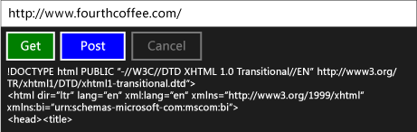

# 逐步解說：使用工作和 XML HTTP 要求連線

此範例示範如何使用[IXMLHTTPRequest2](/previous-versions/windows/desktop/api/msxml6/nn-msxml6-ixmlhttprequest2)並[IXMLHTTPRequest2Callback](/previous-versions/windows/desktop/api/msxml6/nn-msxml6-ixmlhttprequest2callback)介面，以及將 HTTP GET 和 POST 要求傳送至 web 服務在通用 Windows 平台 (UWP 工作) 應用程式。 將 `IXMLHTTPRequest2` 與工作結合之後，您就可以撰寫程式碼來撰寫其他工作。 例如，您可以使用下載工作做為工作鏈結的一部分。 當工作取消時，下載工作也可以回應。

> [!TIP]
>  您也可以使用 c + + REST SDK 來執行 HTTP 要求，從 UWP 應用程式使用 c + + 應用程式，或從桌面 c + + 應用程式。 如需詳細資訊，請參閱 < [c + + REST SDK (Codename"Casablanca")](https://github.com/Microsoft/cpprestsdk)。

如需有關工作的詳細資訊，請參閱[工作平行處理原則](../../parallel/concrt/task-parallelism-concurrency-runtime.md)。 如需如何在 UWP 應用程式中使用工作的詳細資訊，請參閱[c + + 中的非同步程式設計](/windows/uwp/threading-async/asynchronous-programming-in-cpp-universal-windows-platform-apps)並[建立非同步作業以 c + + UWP 應用程式](../../parallel/concrt/creating-asynchronous-operations-in-cpp-for-windows-store-apps.md)。

本文件會先說明如何建立 `HttpRequest` 及其支援的類別。 然後，它會示範如何使用這個類別會使用 c + + 和 XAML 的 UWP 應用程式。

如需使用的範例`IXMLHTTPRequest2`但未使用工作，請參閱 <<c2> [ 快速入門： 使用 XML HTTP 要求 (IXMLHTTPRequest2) 連線](/previous-versions/windows/apps/hh770550\(v=win.10\))。

> [!TIP]
>  `IXMLHTTPRequest2` 和`IXMLHTTPRequest2Callback`是我們建議您針對 UWP 應用程式中使用的介面。 您也可以調整這個範例，讓它能夠用於傳統型應用程式。

## 必要條件

## 定義 HttpRequest、HttpRequestBuffersCallback 和 HttpRequestStringCallback 類別

當您使用 `IXMLHTTPRequest2` 介面建立透過 HTTP 的 Web 要求時，您會實作 `IXMLHTTPRequest2Callback` 介面來接收伺服器回應及回應其他事件。 這個範例會定義 `HttpRequest` 類別用於建立 Web 要求，以及定義 `HttpRequestBuffersCallback` 和 `HttpRequestStringCallback` 類別用於處理回應。 `HttpRequestBuffersCallback` 和 `HttpRequestStringCallback` 類別支援 `HttpRequest` 類別，不過您只會在應用程式程式碼中處理 `HttpRequest` 類別。

`GetAsync` 類別的 `PostAsync` 和 `HttpRequest` 方法可讓您分別啟動 HTTP GET 和 POST 作業。 這些方法會使用 `HttpRequestStringCallback` 類別讀取字串形式的伺服器回應。 `SendAsync` 和 `ReadAsync` 方法可讓您將大型內容區塊串流在一起。 這些方法都會傳回[concurrency:: task](../../parallel/concrt/reference/task-class.md)代表作業。 `GetAsync` 和 `PostAsync` 方法會產生 `task<std::wstring>` 值，而 `wstring` 組件則表示伺服器的回應。 `SendAsync` 和 `ReadAsync` 方法會產生 `task<void>` 值，這些工作會在傳送及讀取作業完成時完成。

因為`IXMLHTTPRequest2`介面以非同步方式執行，此範例會使用[concurrency:: task_completion_event](../../parallel/concrt/reference/task-completion-event-class.md)建立完成之後完成的回呼物件，或取消下載作業的工作。 `HttpRequest` 類別會從這個工作建立工作為主的接續，以設定最終結果。 `HttpRequest` 類別會使用工作為主的接續，確保前一項工作產生錯誤或取消時，接續工作仍會執行。 如需以工作為基礎的接續的詳細資訊，請參閱[工作平行處理原則](../../parallel/concrt/task-parallelism-concurrency-runtime.md)

為了支援取消，`HttpRequest`、`HttpRequestBuffersCallback` 和 `HttpRequestStringCallback` 類別會使用取消語彙基元。 `HttpRequestBuffersCallback`並`HttpRequestStringCallback`類別會使用[3&gt;concurrency::cancellation_token::register_callback&lt;3}](reference/cancellation-token-class.md#register_callback)方法，讓工作完成事件，以回應取消。 這個取消收回呼會中止下載。 如需取消的詳細資訊，請參閱[取消](../../parallel/concrt/exception-handling-in-the-concurrency-runtime.md#cancellation)。

#### 若要定義 HttpRequest 類別

1. 使用 Visual c + +**空白應用程式 (XAML)** 範本來建立空白 XAML 應用程式專案。 這個範例會將專案命名為 `UsingIXMLHTTPRequest2`。

1. 在專案中加入名為 HttpRequest.h 的標頭檔和名為 HttpRequest.cpp 的原始程式檔。

1. 在 pch.h 中加入下列程式碼：

     [!code-cpp[concrt-using-ixhr2#1](../../parallel/concrt/codesnippet/cpp/walkthrough-connecting-using-tasks-and-xml-http-requests_1.h)]

1. 在 HttpRequest.h 中加入下列程式碼：

     [!code-cpp[concrt-using-ixhr2#2](../../parallel/concrt/codesnippet/cpp/walkthrough-connecting-using-tasks-and-xml-http-requests_2.h)]

1. 在 HttpRequest.cpp 中加入下列程式碼：

     [!code-cpp[concrt-using-ixhr2#3](../../parallel/concrt/codesnippet/cpp/walkthrough-connecting-using-tasks-and-xml-http-requests_3.cpp)]

## 在 UWP 應用程式中使用 HttpRequest 類別

本節示範如何使用`HttpRequest`UWP 應用程式中的類別。 應用程式提供了定義 URL 資源的輸入方塊、執行 GET 和 POST 作業的按鈕命令，以及取消目前作業的按鈕命令。

#### 若要使用 HttpRequest 類別

1. 在 MainPage.xaml 中定義[StackPanel](https://msdn.microsoft.com/library/windows/apps/xaml/windows.ui.xaml.controls.stackpanel.aspx) ，如下所示的項目。

     [!code-xml[concrt-using-ixhr2#A1](../../parallel/concrt/codesnippet/xaml/walkthrough-connecting-using-tasks-and-xml-http-requests_4.xaml)]

1. 在 MainPage.xaml.h 中加入這個 `#include` 指示詞：

     [!code-cpp[concrt-using-ixhr2#A2](../../parallel/concrt/codesnippet/cpp/walkthrough-connecting-using-tasks-and-xml-http-requests_5.h)]

1. 在 MainPage.xaml.h 中，將這些 `private` 成員變數加入至 `MainPage` 類別：

     [!code-cpp[concrt-using-ixhr2#A3](../../parallel/concrt/codesnippet/cpp/walkthrough-connecting-using-tasks-and-xml-http-requests_6.h)]

1. 在 MainPage.xaml.h 中宣告 `private` 方法 `ProcessHttpRequest`：

     [!code-cpp[concrt-using-ixhr2#A4](../../parallel/concrt/codesnippet/cpp/walkthrough-connecting-using-tasks-and-xml-http-requests_7.h)]

1. 在 MainPage.xaml.cpp 中加入下列 `using` 陳述式：

     [!code-cpp[concrt-using-ixhr2#A5](../../parallel/concrt/codesnippet/cpp/walkthrough-connecting-using-tasks-and-xml-http-requests_8.cpp)]

1. 在 MainPage.xaml.cpp 中實作 `GetButton_Click` 類別的 `PostButton_Click`、`CancelButton_Click` 和 `MainPage` 方法。

     [!code-cpp[concrt-using-ixhr2#A6](../../parallel/concrt/codesnippet/cpp/walkthrough-connecting-using-tasks-and-xml-http-requests_9.cpp)]

    > [!TIP]

    >  如果您的應用程式不需要支援取消，則會傳遞[concurrency:: cancellation_token:: none](reference/cancellation-token-class.md#none)要`HttpRequest::GetAsync`和`HttpRequest::PostAsync`方法。

1. 在 MainPage.xaml.cpp 中實作 `MainPage::ProcessHttpRequest` 方法。

     [!code-cpp[concrt-using-ixhr2#A7](../../parallel/concrt/codesnippet/cpp/walkthrough-connecting-using-tasks-and-xml-http-requests_10.cpp)]

1. 在專案屬性中，在**連結器**，**輸入**，指定`shcore.lib`和`msxml6.lib`。

執行的應用程式如下：

## 後續步驟

[並行執行階段逐步解說](../../parallel/concrt/concurrency-runtime-walkthroughs.md)

## 另請參閱

[工作平行處理原則](../../parallel/concrt/task-parallelism-concurrency-runtime.md) 
[PPL 中的取消](cancellation-in-the-ppl.md) 
[在 c + + 的非同步程式設計](/windows/uwp/threading-async/asynchronous-programming-in-cpp-universal-windows-platform-apps) 
[在 C++ for UWP 應用程式中建立非同步作業](../../parallel/concrt/creating-asynchronous-operations-in-cpp-for-windows-store-apps.md) 
[快速入門： 使用 XML HTTP 要求 (IXMLHTTPRequest2) 來連接](/previous-versions/windows/apps/hh770550\(v=win.10\))
[task 類別 （並行執行階段）](../../parallel/concrt/reference/task-class.md) 
[task_completion_event 類別](../../parallel/concrt/reference/task-completion-event-class.md)
