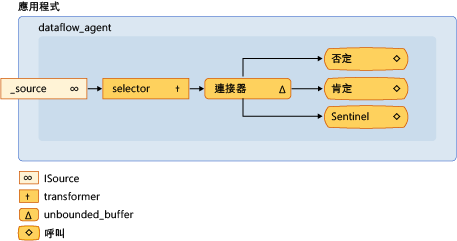

# <a name="walkthrough-creating-a-dataflow-agent"></a>逐步解說：建立資料流程代理程式
本文件將示範如何建立資料流程，而不是控制流程為基礎的代理程式型應用程式。  
  
 *控制流程*指的是在程式中作業的執行順序。 控制流程是藉由使用控制結構，例如條件陳述式、 迴圈等調節。 或者，*資料流程*指計算所進行的所有必要的資料時才可以使用的程式設計模型。 資料流程程式設計模型與相關概念的訊息傳遞，在其中程式的獨立元件相互溝通可藉由傳送訊息。  
  
 非同步代理程式同時支援控制流程與資料流程程式設計模型。 控制流程模型適合在許多情況下，雖然此資料流程模型時，適用於其他項目，例如，代理程式接收資料，並執行的動作，取決於該資料的內容。  
  
## <a name="prerequisites"></a>必要條件  
 在開始這個逐步解說之前，請閱讀下列文件：  
  
- [非同步代理程式](../../parallel/concrt/asynchronous-agents.md)  
  
- [非同步訊息區](../../parallel/concrt/asynchronous-message-blocks.md)  
  
- [如何：使用訊息區篩選條件](../../parallel/concrt/how-to-use-a-message-block-filter.md)  
  
##  <a name="top"></a> 章節  
 本逐步解說包含下列各節：  
  
- [建立基本的控制流程的代理程式](#control-flow)  
  
- [建立基本的資料流程代理程式](#dataflow)  
  
- [建立訊息記錄的代理程式](#logging)  
  
##  <a name="control-flow"></a> 建立基本的控制流程的代理程式  
 請考慮下列範例會定義`control_flow_agent`類別。 `control_flow_agent`類別會在三個訊息的緩衝區上： 其中一個輸入緩衝區和兩個輸出緩衝區。 `run`方法在迴圈中的來源訊息緩衝區所讀取，並使用條件式的陳述式來直接控制程式執行流程。 代理程式遞增一個為非零，負值的計數器，而遞增的非零的正整數值的另一個計數器。 代理程式會收到零 sentinel 值之後，它會傳送至輸出訊息緩衝區之計數器的值。 `negatives`和`positives`方法可讓應用程式從代理程式讀取及負數值的計數。  
  
 [!code-cpp[concrt-dataflow-agent#1](../../parallel/concrt/codesnippet/cpp/walkthrough-creating-a-dataflow-agent_1.cpp)]  
  
 雖然這個範例會在代理程式的控制流程的基本用法，它會示範控制流程基礎的程式設計的序列本質。 每則訊息必須依序處理，即使多個訊息中可能可用的輸入的訊息緩衝區中。 此資料流程模型可讓兩個分支的同時評估的條件陳述式。 此資料流程模型也可讓您建立更複雜的傳訊網路可用時處理的資料。  
  
 [[靠上](#top)]  
  
##  <a name="dataflow"></a> 建立基本的資料流程代理程式  
 本節示範如何將轉換`control_flow_agent`類別來使用此資料流程模型以執行相同的工作。  
  
 資料流程代理程式的運作方式是建立的網路訊息的緩衝區，其中每一個都有特定的用途。 特定訊息區塊接受或拒絕訊息，以根據其裝載使用篩選函數。 篩選函數可確保該訊息區塊只接收特定值。  
  
#### <a name="to-convert-the-control-flow-agent-to-a-dataflow-agent"></a>將轉換資料流程代理程式的流程控制代理程式  
  
1.  複製的主體`control_flow_agent`至另一個類別，類別`dataflow_agent`。 或者，您可以重新命名`control_flow_agent`類別。  
  
2.  移除呼叫在迴圈主體`receive`從`run`方法。  
  
 [!code-cpp[concrt-dataflow-agent#2](../../parallel/concrt/codesnippet/cpp/walkthrough-creating-a-dataflow-agent_2.cpp)]  
  
3.  在`run`方法，將變數初始化之後`negative_count`和`positive_count`，新增`countdown_event`會追蹤作用中的作業數目的物件。  
  
 [!code-cpp[concrt-dataflow-agent#6](../../parallel/concrt/codesnippet/cpp/walkthrough-creating-a-dataflow-agent_3.cpp)]  
  
     `countdown_event`類別在本主題稍後所示。  
  
4.  建立資料流程網路中的訊息會參與的緩衝區物件。  
  
 [!code-cpp[concrt-dataflow-agent#3](../../parallel/concrt/codesnippet/cpp/walkthrough-creating-a-dataflow-agent_4.cpp)]  
  
5.  連線以形成訊息緩衝區。  
  
 [!code-cpp[concrt-dataflow-agent#4](../../parallel/concrt/codesnippet/cpp/walkthrough-creating-a-dataflow-agent_5.cpp)]  
  
6.  等候`event`和`countdown event`要設定的物件。 這些事件發出信號，代理程式已收到 sentinel 值，且所有作業已都完成。  
  
 [!code-cpp[concrt-dataflow-agent#5](../../parallel/concrt/codesnippet/cpp/walkthrough-creating-a-dataflow-agent_6.cpp)]  
  
 下圖顯示完整的資料流程網路的`dataflow_agent`類別：  
  
   
  
 下表描述網路的成員。  
  
|成員|描述|  
|------------|-----------------|  
|`increment_active`|A [concurrency:: transformer](../../parallel/concrt/reference/transformer-class.md)累加作用中事件的計數器，並將輸入的值傳遞給其餘網路的物件。|  
|`negatives`, `positives`|[concurrency:: call](../../parallel/concrt/reference/call-class.md)作用中事件計數器會遞增的數字，並遞減計數的物件。 每個物件會使用篩選來接受負數或正數。|  
|`sentinel`|A [concurrency:: call](../../parallel/concrt/reference/call-class.md)接受只有 sentinel 值的零，並遞減作用中事件計數器的物件。|  
|`connector`|A [concurrency:: unbounded_buffer](reference/unbounded-buffer-class.md)連線到內部網路的來源訊息緩衝區的物件。|  
  
 因為`run`另一個執行緒上呼叫方法、 其他的執行緒可以傳送訊息到網路之前完全連接網路。 `_source`資料成員是`unbounded_buffer`緩衝從代理程式的應用程式傳送的所有輸入的物件。 若要確定網路處理所有輸入的訊息，代理程式第一次連結網路的內部節點，然後連結該網路時，開始`connector`至`_source`資料成員。 這樣可保證的訊息不可以處理為正在建立網路。  
  
 因為在此範例中的網路根據資料流程而定，而非控制流程時，網路必須進行通訊的代理程式它已完成處理每個輸入的值和 sentinel 節點已收到它的值。 這個範例會使用`countdown_event`物件來表示已處理所有輸入的值和[concurrency:: event](../../parallel/concrt/reference/event-class.md)物件，表示 sentinel 節點已收到它的值。 `countdown_event`類別會使用`event`計數器值達到零時發出訊號的物件。 資料流程網路的開頭會在每次它接收到值遞增計數器。 每個終端節點網路遞減的計數器之後，它會處理輸入的值。 代理形成資料流程網路之後，它會等到 sentinel 節點，以設定`event`物件以及`countdown_event`物件來表示它計數器達到零。  
  
 下列範例所示`control_flow_agent`， `dataflow_agent`，和`countdown_event`類別。 `wmain`函式會建立`control_flow_agent`和`dataflow_agent`物件，並使用`send_values`函式以傳送至代理程式的一系列的隨機值。  
  
 [!code-cpp[concrt-dataflow-agent#7](../../parallel/concrt/codesnippet/cpp/walkthrough-creating-a-dataflow-agent_7.cpp)]  
  
 這個範例會產生下列輸出範例：  
  
```Output  
Control-flow agent:  
There are 500523 negative numbers.  
There are 499477 positive numbers.  
Dataflow agent:  
There are 500523 negative numbers.  
There are 499477 positive numbers.  
```  
  
### <a name="compiling-the-code"></a>編譯程式碼  
 範例程式碼複製並將它貼入 Visual Studio 專案中，或將它貼入名為的檔案中`dataflow-agent.cpp`，然後在 Visual Studio 命令提示字元視窗中執行下列命令。  
  
 **cl.exe /EHsc 資料流程 agent.cpp**  
  
 [[靠上](#top)]  
  
##  <a name="logging"></a> 建立訊息記錄的代理程式  
 下列範例所示`log_agent`類別，類似於`dataflow_agent`類別。 `log_agent`類別會實作寫入記錄訊息，到檔案，在主控台的非同步記錄代理程式。 `log_agent`類別可讓應用程式分類為告知性訊息、 警告或錯誤。 它也可讓應用程式指定每個記錄檔類別目錄是否寫入至檔案、 主控台中，或兩者。 這個範例會將所有檔案的記錄訊息和只有錯誤訊息寫入主控台。  
  
 [!code-cpp[concrt-log-filter#1](../../parallel/concrt/codesnippet/cpp/walkthrough-creating-a-dataflow-agent_8.cpp)]  
  
 這個範例會將下列的輸出寫入主控台。  
  
```Output  
error: This is a sample error message.  
```  
  
 這個範例也會產生.log.txt 檔案，其中包含下列文字。  
  
```Output  
info: ===Logging started.=== 
warning: This is a sample warning message.  
error: This is a sample error message.  
info: ===Logging finished.=== 
```  
  
### <a name="compiling-the-code"></a>編譯程式碼  
 範例程式碼複製並將它貼入 Visual Studio 專案中，或將它貼入名為的檔案中`log-filter.cpp`，然後在 Visual Studio 命令提示字元視窗中執行下列命令。  
  
 **cl.exe /EHsc 記錄 filter.cpp**  
  
 [[靠上](#top)]  
  
## <a name="see-also"></a>另請參閱  
 [並行執行階段逐步解說](../../parallel/concrt/concurrency-runtime-walkthroughs.md)

