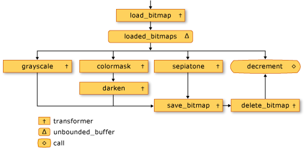
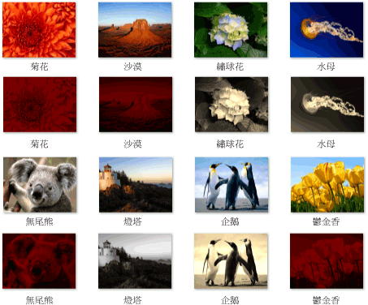

# 逐步解說：建立影像處理網路
本文件將示範如何建立執行映像處理的非同步訊息區的網路。  
  
 網路判斷要以其特性為基礎的映像上執行哪些作業。 這個範例會使用*資料流程*模型來透過網路路由映像。 在資料流程模型中，程式的獨立元件會透過傳送訊息，彼此進行通訊。 當元件接收訊息時，它可以執行某些動作，然後將該動作的結果傳遞至另一個元件。 比較此*控制流程*模型，其中應用程式會使用控制結構，例如、 條件陳述式、 迴圈等，來控制在程式中作業的順序。  
  
 資料流程根據網路建立*管線*的工作。 管線各階段同時執行整體工作的一部分。 以汽車製造的裝配線做比喻。 當每輛汽車通過裝配線時，一站會組裝車架，另一個安裝引擎，依此類推。 啟用能夠同時同時組裝多輛，組件列會提供更佳的輸送量比組裝完成的生產量一一次。  
  
## 必要條件  
 在開始這個逐步解說之前，請閱讀下列文件：  
  
-   [非同步訊息區](../../parallel/concrt/asynchronous-message-blocks.md)  
  
-   [如何：使用訊息區篩選條件](../../parallel/concrt/how-to-use-a-message-block-filter.md)  
  
-   [逐步解說：建立資料流程代理程式](../../parallel/concrt/walkthrough-creating-a-dataflow-agent.md)  
  
 我們也建議您了解的基本概念[!INCLUDE[ndptecgdiplus](../../parallel/concrt/includes/ndptecgdiplus_md.md)]開始本逐步解說之前。  
  
##   章節  
 本逐步解說包含下列各節：  
  
-   [定義處理功能的影像](#functionality)  
  
-   [建立影像處理網路](#network)  
  
-   [完整範例](#complete)  
  
##  定義處理功能的影像  
 此區段會顯示用來處理從磁碟讀取的映像的映像處理網路的支援函數。  
  
 下列函數，`GetRGB`和`MakeColor`、 擷取和分別結合指定的色彩，個別元件。  
  
 [!code-cpp[concrt-image-processing-filter#2](../../parallel/concrt/codesnippet/cpp/walkthrough-creating-an-image-processing-network_1.cpp)]  
  

 下列函式`ProcessImage`，呼叫給定[std:: function](../../standard-library/function-class.md)轉換中的每個像素的色彩值的物件[!INCLUDE[ndptecgdiplus](../../parallel/concrt/includes/ndptecgdiplus_md.md)][點陣圖](https://msdn.microsoft.com/library/ms534420.aspx)物件。 `ProcessImage`函式使用[concurrency:: parallel_for](reference/concurrency-namespace-functions.md#parallel_for)演算法處理以平行方式點陣圖的每個資料列。  

  
 [!code-cpp[concrt-image-processing-filter#3](../../parallel/concrt/codesnippet/cpp/walkthrough-creating-an-image-processing-network_2.cpp)]  
  
 下列函數， `Grayscale`， `Sepiatone`， `ColorMask`，和`Darken`，呼叫`ProcessImage`轉換中的每個像素的色彩值的函式`Bitmap`物件。 所有這些函式使用 lambda 運算式來定義一個像素的色彩轉換。  
  
 [!code-cpp[concrt-image-processing-filter#4](../../parallel/concrt/codesnippet/cpp/walkthrough-creating-an-image-processing-network_3.cpp)]  
  
 下列函式`GetColorDominance`，也會呼叫`ProcessImage`函式。 不過，而不是變更每個色彩值，這個函數會使用[concurrency:: combinable](../../parallel/concrt/reference/combinable-class.md)物件計算紅色、 綠色或藍色色彩元件是否勝於映像。  
  
 [!code-cpp[concrt-image-processing-filter#5](../../parallel/concrt/codesnippet/cpp/walkthrough-creating-an-image-processing-network_4.cpp)]  
  
 下列函式`GetEncoderClsid`，擷取指定的 MIME 類型的編碼器的類別識別項。 應用程式會使用此函式來擷取點陣圖的編碼器。  
  
 [!code-cpp[concrt-image-processing-filter#6](../../parallel/concrt/codesnippet/cpp/walkthrough-creating-an-image-processing-network_5.cpp)]  
  
 [[靠上](#top)]  
  
##  建立影像處理網路  
 本章節描述如何建立網路執行映像處理的非同步訊息區的每個[!INCLUDE[TLA#tla_jpeg](../../parallel/concrt/includes/tlasharptla_jpeg_md.md)](.jpg) 映像中指定的目錄。 網路會執行下列的映像處理作業：  
  
1.  用於撰寫的 Tom 任何映像，將轉換成灰階。  
  
2.  主控項的色彩為紅色的任何影像，移除綠色和藍色元件，然後變暗。  
  
3.  任何其他映像，適用於深褐色 toning。  
  
 網路適用於只有第一個映像處理作業符合其中一種情形。 比方說，如果映像 Tom 所撰寫，且其主控項的色彩為紅色，映像只會轉換成灰階。  
  
 網路執行每個映像處理作業之後，它將影像儲存到磁碟為點陣圖 (.bmp) 檔案。  
  
 下列步驟示範如何建立可實作此映像處理網路和適用於該網路的函式給每一個[!INCLUDE[TLA#tla_jpeg](../../parallel/concrt/includes/tlasharptla_jpeg_md.md)]映像中指定的目錄。  
  
#### 若要建立影像處理網路  
  
1.  建立函式， `ProcessImages`，會在磁碟上的目錄名稱。  
  
     [!code-cpp[concrt-image-processing-filter#7](../../parallel/concrt/codesnippet/cpp/walkthrough-creating-an-image-processing-network_6.cpp)]  
  
2.  在`ProcessImages`函式中，建立`countdown_event`變數。 `countdown_event`類別會顯示在此逐步解說稍後。  
  
     [!code-cpp[concrt-image-processing-filter#8](../../parallel/concrt/codesnippet/cpp/walkthrough-creating-an-image-processing-network_7.cpp)]  
  
3.  建立[std:: map](../../standard-library/map-class.md)物件相關聯的`Bitmap`以其原始的檔案名稱的物件。  
  
     [!code-cpp[concrt-image-processing-filter#9](../../parallel/concrt/codesnippet/cpp/walkthrough-creating-an-image-processing-network_8.cpp)]  
  
4.  加入下列程式碼來定義影像處理網路的成員。  
  
     [!code-cpp[concrt-image-processing-filter#10](../../parallel/concrt/codesnippet/cpp/walkthrough-creating-an-image-processing-network_9.cpp)]  
  
5.  加入下列程式碼的網路連接。  
  
     [!code-cpp[concrt-image-processing-filter#11](../../parallel/concrt/codesnippet/cpp/walkthrough-creating-an-image-processing-network_10.cpp)]  
  
6.  加入下列程式碼，傳送至網路的標頭的完整路徑的每個[!INCLUDE[TLA#tla_jpeg](../../parallel/concrt/includes/tlasharptla_jpeg_md.md)]目錄中的檔案。  
  
     [!code-cpp[concrt-image-processing-filter#12](../../parallel/concrt/codesnippet/cpp/walkthrough-creating-an-image-processing-network_11.cpp)]  
  
7.  等候`countdown_event`變數，以達到零。  
  
     [!code-cpp[concrt-image-processing-filter#13](../../parallel/concrt/codesnippet/cpp/walkthrough-creating-an-image-processing-network_12.cpp)]  
  
 下表描述網路的成員。  
  
|成員|描述|  
|------------|-----------------|  
|`load_bitmap`|A [concurrency:: transformer](../../parallel/concrt/reference/transformer-class.md)載入的物件`Bitmap`從磁碟物件，並加入至項目的`map`映像與原始的檔案名稱的物件。|  
|`loaded_bitmaps`|A [concurrency:: unbounded_buffer](reference/unbounded-buffer-class.md)將載入的映像傳送至影像處理篩選條件的物件。|  
|`grayscale`|A`transformer`將轉換成灰階由 Tom 編寫的映像的物件。 它使用的映像的中繼資料來判斷其作者。|  
|`colormask`|A`transformer`有主控項的色彩為紅色的映像中移除的綠色和藍色色彩元件的物件。|  
|`darken`|A`transformer`具有主控項的色彩為紅色的影像會變暗的物件。|  
|`sepiatone`|A`transformer`適用於深褐色 toning 映像不由 Tom 編寫，並不是主要紅色的物件。|  
|`save_bitmap`|A`transformer`儲存已處理的物件`image`以磁碟為點陣圖。 `save_bitmap`擷取原始的檔案名稱，從`map`物件，並變更.bmp 檔案的副檔名。|  
|`delete_bitmap`|A`transformer`釋放的記憶體供映像的物件。|  
|`decrement`|A [concurrency:: call](../../parallel/concrt/reference/call-class.md)做為網路中的終端節點物件。 它遞減`countdown_event`通知主應用程式映像已處理的物件。|  
  
 `loaded_bitmaps`訊息緩衝區是很重要，因為做為`unbounded_buffer`物件，它會提供`Bitmap`物件至多個接收者。 當目標區塊接受`Bitmap`物件`unbounded_buffer`物件不提供，`Bitmap`任何其他目標的物件。 因此，您連結的順序物件加入至`unbounded_buffer`物件很重要。 `grayscale`， `colormask`，和`sepiatone`訊息每個區塊中使用篩選來接受某些`Bitmap`物件。 `decrement`訊息緩衝區是很重要的目標`loaded_bitmaps`訊息緩衝區，因為它可接受所有`Bitmap`將會拒絕的訊息緩衝區的物件。 `unbounded_buffer`物件才能傳播訊息順序。 因此，`unbounded_buffer`物件封鎖，直到新的目標區塊與其連結並接受該訊息時，如果沒有目前的目標區塊接受該訊息。  
  
 如果您的應用程式需要訊息的多個區塊處理訊息，而不只一個訊息區塊的第一次接受訊息時，您可以使用其他訊息區塊類型，例如`overwrite_buffer`。 `overwrite_buffer`類別保留一則訊息一次，但會傳播至其目標的每個訊息。  
  
 下圖顯示影像處理網路：  
  
   
  
 `countdown_event`在此範例中的物件可讓影像處理網路在處理所有映像時，通知主應用程式。 `countdown_event`類別會使用[concurrency:: event](../../parallel/concrt/reference/event-class.md)計數器值達到零時發出訊號的物件。 每次它傳送至網路的檔案名稱，主應用程式就會遞增計數器。 網路遞減終端節點在處理每個映像之後的計數器。 主應用程式會周遊指定的目錄之後，它會等到`countdown_event`物件來表示它計數器達到零。  
  
 下列範例所示`countdown_event`類別：  
  
 [!code-cpp[concrt-image-processing-filter#14](../../parallel/concrt/codesnippet/cpp/walkthrough-creating-an-image-processing-network_13.cpp)]  
  
 [[靠上](#top)]  
  
##  完整範例  
 下列程式碼顯示完整範例。 `wmain`函式會管理[!INCLUDE[ndptecgdiplus](../../parallel/concrt/includes/ndptecgdiplus_md.md)]程式庫並呼叫`ProcessImages`函式程序以[!INCLUDE[TLA#tla_jpeg](../../parallel/concrt/includes/tlasharptla_jpeg_md.md)]檔案`Sample Pictures`目錄。  
  
 [!code-cpp[concrt-image-processing-filter#15](../../parallel/concrt/codesnippet/cpp/walkthrough-creating-an-image-processing-network_14.cpp)]  
  
 下圖顯示範例輸出。 每個來源映像高於其相對應修改的映像。  
  
   
  
 `Lighthouse`Tom Alphin 所撰寫，因此會轉換成灰階。 `Chrysanthemum``Desert`， `Koala`，和`Tulips`有主控項的色彩為紅色因此已移除的藍色與綠色色彩元件，而且調暗。 `Hydrangeas``Jellyfish`，和`Penguins`符合預設準則，因此 深褐色 toned。  
  
 [[靠上](#top)]  
  
### 編譯程式碼  
 範例程式碼複製並將它貼入 Visual Studio 專案中，或將它貼入名為的檔案中`image-processing-network.cpp`，然後在 Visual Studio 命令提示字元視窗中執行下列命令。  
  
 **cl.exe /DUNICODE /EHsc 映像-處理-network.cpp /link gdiplus.lib**  
  
## 請參閱  
 [並行執行階段逐步解說](../../parallel/concrt/concurrency-runtime-walkthroughs.md)
