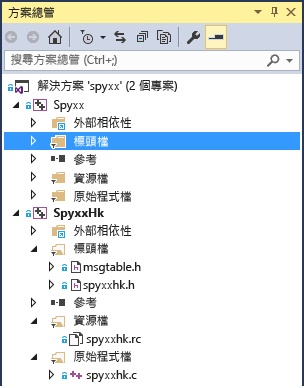

# <a name="porting-guide-spy"></a>移植指南：Spy++
本移植案例研究的設計，是為了讓您了解什麼是典型移植專案、您可能遇到的問題類型，並提供一些可用於解決移植問題的一般秘訣和訣竅。 這不是最終移植指南，因為移植專案的體驗主要取決於程式碼的細節。  
  
## <a name="spy"></a>Spy++  
 
Spy++ 是 Windows 桌面廣泛使用的 GUI 診斷工具，提供有關 Windows 桌面上之使用者介面項目的各種資訊。 它會顯示完整的 Windows 階層架構，並可存取有關每個視窗和控制項的中繼資料。 這個實用的應用程式多年來一直隨附於 Visual Studio。 我們找到一個之前在 Visual C++ 6.0 中編譯過的舊版，並將其移植到 Visual Studio 2015。 Visual Studio 2017 的體驗應該幾乎完全相同。
  
我們認為這個案例是移植使用 MFC 和 Win32 API 之 Windows 桌面應用程式的典型案例，特別適用於 Visual C++ 6.0 之後便沒有再以 Visual C++ 的各版更新過的舊專案。  
  
##  <a name="convert_project_file"></a> 步驟 1： 轉換專案檔。  

專案檔 (Visual C++ 6.0 中的兩個舊的 .dsw 檔案) 已輕鬆轉換，沒有發生任何需要進一步注意的問題。 其中一個專案是 Spy++ 應用程式。 另一個專案是以 C 撰寫並支援 DLL 的 SpyHk。 更複雜的專案可能不會那麼容易就升級 (如[這裡](../porting/visual-cpp-porting-and-upgrading-guide.md)所討論)。  
  
升級這兩個專案之後，我們的方案看起來像這樣：  
  
  
  
我們有兩個專案，一個包含大量 C++ 檔案，而另一個是以 C 撰寫的 DLL。  
  
##  <a name="header_file_problems"></a> 步驟 2： 標頭檔問題  

建置新轉換的專案時，您通常會先發現的問題之一，就是找不到專案所使用的標頭檔。  
  
在 Spy++ 中找不到的其中一個檔案是 verstamp.h。 透過網際網路搜尋，我們判斷這個檔案來自一項過時的資料技術 DAO SDK。 我們想要查明標頭檔中使用了哪些符號，以了解是否真的需要這個檔案，還是可以在其他地方定義這些符號，因此我們將標頭檔宣告標記為註解並重新編譯。 結果是只需要一個符號，那就是 VER_FILEFLAGSMASK。  
  
```  
1>C:\Program Files (x86)\Windows Kits\8.1\Include\shared\common.ver(212): error RC2104: undefined keyword or key name: VER_FILEFLAGSMASK  
```  
  
若要在可用的 include 檔案中尋找符號，最簡單方式是使用 [檔案中尋找] (**Ctrl**+**Shift**+**F**)，並指定 [Visual C++ Include 目錄]。 我們在 ntverp.h 中找到這個符號。 以 ntverp.h 取代 verstamp.h include，這個錯誤即會消失。  
  
##  <a name="linker_output_settings"></a> 步驟 3： 連結器 OutputFile 設定  

舊專案有時會有檔案位於非傳統位置，這在升級後可能會造成問題。 在這種情況下，我們必須在專案屬性中將 `$(SolutionDir)` 加入 **Include** 路徑，以確保 Visual Studio 可以在這些位置 (而不是其中一個專案資料夾) 找到一些標頭檔。  
  
MSBuild 指出其 **Link.OutputFile** 屬性不符合 **TargetPath** 和 **TargetName** 值，並發出 MSB8012。  
  
```Output  
warning MSB8012: TargetPath(...\spyxx\spyxxhk\.\..\Debug\SpyxxHk.dll) does not match the Linker's OutputFile property value (...\spyxx\Debug\SpyHk55.dll). This may cause your project to build incorrectly. To correct this, please make sure that $(OutDir), $(TargetName) and $(TargetExt) property values match the value specified in %(Link.OutputFile).warning MSB8012: TargetName(SpyxxHk) does not match the Linker's OutputFile property value (SpyHk55). This may cause your project to build incorrectly. To correct this, please make sure that $(OutDir), $(TargetName) and $(TargetExt) property values match the value specified in %(Link.OutputFile).  
```  
  
**Link.OutputFile** 是組建輸出 (例如 EXE、DLL)，通常是從 `$(TargetDir)$(TargetName)$(TargetExt)` 建構，並提供路徑、檔名和副檔名。 這是將專案從舊版 Visual C++ 建置工具 (vcbuild.exe) 移轉至新版建置工具 (MSBuild.exe) 時常見的錯誤。 由於在 Visual Studio 2010 中已變更建置工具，因此當您將 2010 版以前的專案移轉至 2010 (含) 以後版本時，可能會發生這個問題。 基本問題在於專案移轉精靈不會更新 **Link.OutputFile** 值，因為它不一定能夠根據其他專案設定來判斷該值。 因此，您通常必須手動設定。 如需詳細資料，請參閱 Visual C++ 部落格上的這篇[文章](http://blogs.msdn.com/b/vcblog/archive/2010/03/02/visual-studio-2010-c-project-upgrade-guide.aspx)。  
  
在此情況下，針對 Spy++ 專案，將所轉換專案中的 **Link.OutputFile** 屬性設為 .\Debug\Spyxx.exe 和 .\Release\Spyxx.exe (視組態而定)。 最好是在 [所有組態] 中，以 `$(TargetDir)$(TargetName)$(TargetExt)` 取代這些硬式編碼值。 如果這個方法沒有作用，您可以在此進行自訂，或在設定這些值的 [一般] 區段中變更屬性 (這些屬性包括 [輸出目錄]、[目標名稱] 和 [目標副檔名])。 請記住，如果您要檢視的屬性使用巨集，則可以在下拉式清單中選擇 [編輯] 來開啟對話方塊，以顯示替代巨集後的最終字串。 您可以選擇 [巨集] 按鈕，來檢視所有可用的巨集與其目前的值。  
  
##  <a name="updating_winver"></a> 步驟 4： 更新目標 Windows 版本  

下一個錯誤指出 MFC 不再支援 WINVER 版本。 Windows XP 的 WINVER 是 0x0501。  
  
```Output  
C:\Program Files (x86)\Microsoft Visual Studio 14.0\VC\atlmfc\include\afxv_w32.h(40): fatal error C1189: #error:  MFC does not support WINVER less than 0x0501.  Please change the definition of WINVER in your project properties or precompiled header.  
```  
  
Microsoft 不再支援 Windows XP，因此即使可在 Visual Studio 2015 中將其設為目標，您也應該逐步淘汰應用程式對該版的支援，並建議使用者採用新版 Windows。  
  
 若要解決這個錯誤，請定義 WINVER，並將 [專案屬性] 設定更新為目前要設為目標的 Windows 最低版本。 在[這裡](/windows/desktop/WinProg/using-the-windows-headers)尋找各種 Windows 版本之值的表格。  
  
stdafx.h 檔案包含其中一些巨集定義。  
  
```cpp  
#define WINVER       0x0500  // these defines are set so that we get the  
#define _WIN32_WINNT 0x0500  // maximum set of message/flag definitions,  
#define _WIN32_IE    0x0400  // from both winuser.h and commctrl.h.    
```  
  
我們將 WINVER 設定為 Windows 7。 如果使用 Windows 7 (_WIN32_WINNT_WIN7) 的巨集，而不是值本身 (0x0601)，稍後會比較容易閱讀程式碼。  
  
```cpp  
#define WINVER _WINNT_WIN32_WIN7 // Minimum targeted Windows version is Windows 7  
```  
  
##  <a name="linker_errors"></a> 步驟 5： 連結器錯誤  

由於這些變更，SpyHk (DLL) 專案雖然會建置，但是會產生連結器錯誤。  
  
```  
LINK : warning LNK4216: Exported entry point _DLLEntryPoint@12  
```  
  
不應該匯出 DLL 的進入點。 進入點僅供載入器第一次將 DLL 載入記憶體時呼叫，因此其他呼叫端的匯出資料表中不應該有這個進入點。 我們只需要確定它並未附加 **__declspec(dllexport)** 指示詞。 在 spyxxhk.c 中，我們必須將其從 `DLLEntryPoint` 的宣告和定義這兩個位置中移除。 使用這個指示詞沒有任何意義，但是舊版連結器和編譯器都未將它標示為問題。 新版連結器會發出警告。  
  
```cpp  
// deleted __declspec(dllexport)  
BOOL WINAPI DLLEntryPoint(HINSTANCE hinstDLL,DWORD fdwReason, LPVOID lpvReserved);    
```  
  
C DLL 專案 SpyHK.dll 現在會無誤建置和連結。  
  
##  <a name="outdated_header_files"></a> 步驟 6： 更多過時的標頭檔  
 
我們接著要開始處理主要可執行檔專案 Spyxx。  
  
找不到另外兩個 Include 檔案：ctl3d.h 和 penwin.h。 雖然搜尋網際網路嘗試找出包含標頭的檔案可能會有幫助，但有時這項資訊並不是那麼有用。 我們發現 ctl3d.h 是 Exchange 開發套件的一部分，並支援 Windows 95 上特定樣式的控制項；而 penwin.h 則與過時的 API Window Pen Computing 相關。 在這種情況下，我們可以直接將 `#include` 行標記為註解，並以 verstamp.h 的方式來處理未定義的符號。 所有與 3D 控制項或 Pen Computing 的內容都已從專案中移除。  
  
由於專案有許多編譯錯誤需要您逐步移除，因此當移除 `#include` 指示詞時，可能不會立即找到所有使用過時 API 的符號。 我們並未立即偵測到，而是稍後才發現 WM_DLGBORDER 未定義的錯誤。 這實際上只是來自 ctl3d.h 之許多未定義符號的其中一個。 一旦我們判定符號與過期的 API 相關，便會在程式碼中移除該符號的所有參考。  
  
##  <a name="updating_iostreams_code"></a> 步驟 7： 更新舊版 iostreams 程式碼  
 
下一個錯誤是使用 iostreams 的舊版 C++ 程式碼常見的錯誤。  
  
mstream.h(40): 嚴重錯誤 C1083: 無法開啟 Include 檔案: 'iostream.h': 沒有這種檔案或目錄  
  
這個問題在於舊版 iostreams 程式庫已被移除和取代。 我們必須以新標準取代舊版 iostreams。  
  
```cpp  
#include <iostream.h>  
#include <strstrea.h>  
#include <iomanip.h>    
```  
  
以下是更新後的 Include：  
  
```cpp  
#include <iostream>  
#include <sstream>  
#include <iomanip>    
```  
  
由於這項變更，使用已不再使用的 `ostrstream` 時會發生問題。 請適當地取代成 ostringstream。 我們嘗試新增 `ostrstream` 的 **typedef**，以避免過度修改程式碼，這至少是個起點。  
  
```cpp  
typedef std::basic_ostringstream<TCHAR> ostrstream;    
```  
  
目前使用 MBCS (多位元組字元集) 來建置專案，因此 **char** 是適當的字元資料類型。 不過，為了更輕鬆地將程式碼更新為 UTF-16 Unicode，我們將此更新為 `TCHAR`，以根據專案設定中的 [字元集] 屬性設定為 MBCS 或 Unicode，解析成 **char** 或 **wchar_t**。  
  
還需要更新其他一些程式碼片段。  我們以 `ios_base` 取代基底類別 `ios`，並以 basic_ostream\<T> 取代 ostream。 我們加入兩個額外的 typedef，並編譯這個區段。  
  
```cpp  
typedef std::basic_ostream<TCHAR> ostream;  
typedef ios_base ios;    
```  
  
使用這些 typedef 只是暫時的解決方法。 如需更永久的解決方法，可更新已重新命名或過期的 API 的每個參考。  
  
以下是下一個錯誤。  
  
```Output  
error C2039: 'freeze': is not a member of 'std::basic_stringbuf<char,std::char_traits<char>,std::allocator<char>>'  
```  
  
下一個問題是 `basic_stringbuf` 沒有 `freeze` 方法。 舊版 `ostream` 使用 `freeze` 方法來避免記憶體流失。 我們現在使用新版 `ostringstream`，因此不需要它。 我們可以刪除 `freeze` 的呼叫。  
  
```cpp  
//rdbuf()->freeze(0);  
```  
  
接下來兩個錯誤發生在相鄰兩行。 第一個錯誤與使用 `ends` 相關，也就是舊版 `iostream` 程式庫的 IO 操作工具會將 null 結束字元新增至字串。 第二個錯誤是無法將 `str` 方法的輸出指派給非 const 指標。  
  
```cpp  
// Null terminate the string in the buffer and  
// get a pointer to it.  
//  
*this << ends;  
LPSTR psz = str();    
```  
  
```Output  
2>mstream.cpp(167): error C2065: 'ends': undeclared identifier2>mstream.cpp(168): error C2440: 'initializing': cannot convert from 'std::basic_string<char,std::char_traits<char>,std::allocator<char>>' to 'LPSTR'  
```  
  
使用新版資料流程式庫就不需要 `ends`，因為字串一律以 null 結束，因此可以移除該行。 至於第二個問題，問題在於 `str()` 現在不會傳回字串的字元陣列指標，而會傳回 `std::string` 類型。 第二個問題的解決方法是將類型變更為 `LPCSTR`，並使用 `c_str()` 方法來要求指標。  
  
```cpp  
//*this << ends;  
LPCTSTR psz = str().c_str();    
```  
  
這段程式碼所發生的錯誤令我們困惑了好一陣子。  
  
```cpp  
MOUT << _T(" chUser:'") << chUser  
<< _T("' (") << (INT)(UCHAR)chUser << _T(')');    
```  
  
巨集 MOUT 會解析成 \*g_pmout，這是類型 `mstream` 的物件。 `mstream` 類別衍生自標準輸出字串類別 `std::basic_ostream<TCHAR>.`。不過，由於字串常值周圍的 _T (我們為了準備轉換成 Unicode 所放入)，運算子 **<<** 的多載解析會失敗並發生下列錯誤訊息：  
  
```Output  
1>winmsgs.cpp(4612): error C2666: 'mstream::operator <<': 2 overloads have similar conversions
1>  c:\source\spyxx\spyxx\mstream.h(120): note: could be 'mstream &mstream::operator <<(ios &(__cdecl *)(ios &))'
1>  c:\source\spyxx\spyxx\mstream.h(118): note: or       'mstream &mstream::operator <<(ostream &(__cdecl *)(ostream &))'
1>  c:\source\spyxx\spyxx\mstream.h(116): note: or       'mstream &mstream::operator <<(ostrstream &(__cdecl *)(ostrstream &))'
1>  c:\source\spyxx\spyxx\mstream.h(114): note: or       'mstream &mstream::operator <<(mstream &(__cdecl *)(mstream &))'
1>  c:\source\spyxx\spyxx\mstream.h(109): note: or       'mstream &mstream::operator <<(LPTSTR)'
1>  c:\source\spyxx\spyxx\mstream.h(104): note: or       'mstream &mstream::operator <<(TCHAR)'
1>  c:\source\spyxx\spyxx\mstream.h(102): note: or       'mstream &mstream::operator <<(DWORD)'
1>  c:\source\spyxx\spyxx\mstream.h(101): note: or       'mstream &mstream::operator <<(WORD)'
1>  c:\source\spyxx\spyxx\mstream.h(100): note: or       'mstream &mstream::operator <<(BYTE)'
1>  c:\source\spyxx\spyxx\mstream.h(95): note: or       'mstream &mstream::operator <<(long)'
1>  c:\source\spyxx\spyxx\mstream.h(90): note: or       'mstream &mstream::operator <<(unsigned int)'
1>  c:\source\spyxx\spyxx\mstream.h(85): note: or       'mstream &mstream::operator <<(int)'
1>  c:\source\spyxx\spyxx\mstream.h(83): note: or       'mstream &mstream::operator <<(HWND)'
1>  C:\Program Files (x86)\Microsoft Visual Studio 14.0\VC\atlmfc\include\afxdisp.h(1132): note: or       'CDumpContext &operator <<(CDumpContext &,COleSafeArray &)'
1>  C:\Program Files (x86)\Microsoft Visual Studio 14.0\VC\atlmfc\include\afxdisp.h(1044): note: or       'CArchive &operator <<(CArchive &,ATL::COleDateTimeSpan)'
1>  C:\Program Files (x86)\Microsoft Visual Studio 14.0\VC\atlmfc\include\afxdisp.h(1042): note: or       'CDumpContext &operator <<(CDumpContext &,ATL::COleDateTimeSpan)'
1>  C:\Program Files (x86)\Microsoft Visual Studio 14.0\VC\atlmfc\include\afxdisp.h(1037): note: or       'CArchive &operator <<(CArchive &,ATL::COleDateTime)'
1>  C:\Program Files (x86)\Microsoft Visual Studio 14.0\VC\atlmfc\include\afxdisp.h(1035): note: or       'CDumpContext &operator <<(CDumpContext &,ATL::COleDateTime)'
1>  C:\Program Files (x86)\Microsoft Visual Studio 14.0\VC\atlmfc\include\afxdisp.h(1030): note: or       'CArchive &operator <<(CArchive &,COleCurrency)'
1>  C:\Program Files (x86)\Microsoft Visual Studio 14.0\VC\atlmfc\include\afxdisp.h(1028): note: or       'CDumpContext &operator <<(CDumpContext &,COleCurrency)'
1>  C:\Program Files (x86)\Microsoft Visual Studio 14.0\VC\atlmfc\include\afxdisp.h(955): note: or       'CArchive &operator <<(CArchive &,ATL::CComBSTR)'
1>  C:\Program Files (x86)\Microsoft Visual Studio 14.0\VC\atlmfc\include\afxdisp.h(951): note: or       'CArchive &operator <<(CArchive &,COleVariant)'
1>  C:\Program Files (x86)\Microsoft Visual Studio 14.0\VC\atlmfc\include\afxdisp.h(949): note: or       'CDumpContext &operator <<(CDumpContext &,COleVariant)'
1>  C:\Program Files (x86)\Microsoft Visual Studio 14.0\VC\atlmfc\include\afxwin.h(248): note: or       'CArchive &operator <<(CArchive &,const RECT &)'
1>  C:\Program Files (x86)\Microsoft Visual Studio 14.0\VC\atlmfc\include\afxwin.h(247): note: or       'CArchive &operator <<(CArchive &,POINT)'
1>  C:\Program Files (x86)\Microsoft Visual Studio 14.0\VC\atlmfc\include\afxwin.h(246): note: or       'CArchive &operator <<(CArchive &,SIZE)'
1>  C:\Program Files (x86)\Microsoft Visual Studio 14.0\VC\atlmfc\include\afxwin.h(242): note: or       'CDumpContext &operator <<(CDumpContext &,const RECT &)'
1>  C:\Program Files (x86)\Microsoft Visual Studio 14.0\VC\atlmfc\include\afxwin.h(241): note: or       'CDumpContext &operator <<(CDumpContext &,POINT)'
1>  C:\Program Files (x86)\Microsoft Visual Studio 14.0\VC\atlmfc\include\afxwin.h(240): note: or       'CDumpContext &operator <<(CDumpContext &,SIZE)'
1>  C:\Program Files (x86)\Microsoft Visual Studio 14.0\VC\atlmfc\include\afx.h(1639): note: or       'CArchive &operator <<(CArchive &,const CObject *)'
1>  C:\Program Files (x86)\Microsoft Visual Studio 14.0\VC\atlmfc\include\afx.h(1425): note: or       'CArchive &operator <<(CArchive &,ATL::CTime)'
1>  C:\Program Files (x86)\Microsoft Visual Studio 14.0\VC\atlmfc\include\afx.h(1423): note: or       'CDumpContext &operator <<(CDumpContext &,ATL::CTime)'
1>  C:\Program Files (x86)\Microsoft Visual Studio 14.0\VC\atlmfc\include\afx.h(1418): note: or       'CArchive &operator <<(CArchive &,ATL::CTimeSpan)'
1>  C:\Program Files (x86)\Microsoft Visual Studio 14.0\VC\atlmfc\include\afx.h(1416): note: or       'CDumpContext &operator <<(CDumpContext &,ATL::CTimeSpan)'
1>  C:\Program Files (x86)\Microsoft Visual Studio 14.0\VC\include\ostream(694): note: or       'std::basic_ostream<wchar_t,std::char_traits<wchar_t>> &std::operator <<<wchar_t,std::char_traits<wchar_t>>(std::basic_ostream<wchar_t,std::char_traits<wchar_t>> &,const char *)'
1>  C:\Program Files (x86)\Microsoft Visual Studio 14.0\VC\include\ostream(741): note: or       'std::basic_ostream<wchar_t,std::char_traits<wchar_t>> &std::operator <<<wchar_t,std::char_traits<wchar_t>>(std::basic_ostream<wchar_t,std::char_traits<wchar_t>> &,char)'
1>  C:\Program Files (x86)\Microsoft Visual Studio 14.0\VC\include\ostream(866): note: or       'std::basic_ostream<wchar_t,std::char_traits<wchar_t>> &std::operator <<<wchar_t,std::char_traits<wchar_t>>(std::basic_ostream<wchar_t,std::char_traits<wchar_t>> &,const _Elem *)'
1>          with
1>          [
1>              _Elem=wchar_t
1>          ]
1>  C:\Program Files (x86)\Microsoft Visual Studio 14.0\VC\include\ostream(983): note: or       'std::basic_ostream<wchar_t,std::char_traits<wchar_t>> &std::operator <<<wchar_t,std::char_traits<wchar_t>,wchar_t[10]>(std::basic_ostream<wchar_t,std::char_traits<wchar_t>> &&,const _Ty (&))'
1>          with
1>          [
1>              _Ty=wchar_t [10]
1>          ]
1>  C:\Program Files (x86)\Microsoft Visual Studio 14.0\VC\include\ostream(1021): note: or       'std::basic_ostream<wchar_t,std::char_traits<wchar_t>> &std::operator <<<wchar_t,std::char_traits<wchar_t>>(std::basic_ostream<wchar_t,std::char_traits<wchar_t>> &,const std::error_code &)'
1>  winmsgs.cpp(4612): note: while trying to match the argument list '(CMsgStream, const wchar_t [10])'  
```  
  
由於有這麼多運算子 **<<** 定義，這種錯誤可能會讓人心生畏懼。 在更仔細地查看可用的多載之後，我們發現大多數多載無關；接著更仔細地查看 `mstream` 類別定義，我們找出認為在這種情況下應該會呼叫的下列函式。  
  
```cpp  
mstream& operator<<(LPTSTR psz)  
{  
  return (mstream&)ostrstream::operator<<(psz);  
}    
```  
  
您可以從以上長篇錯誤訊息的最後一行得知，未呼叫的原因是因為字串常值的類型為 `const wchar_t[10]`，因此不會自動轉換為非 const 指標。 不過，該運算子不應該修改輸入參數，因此更適當的參數類型為 `LPCTSTR` (編譯成 MBCS 時為 `const char*`，編譯成 Unicode 時為 `const wchar_t*`)，而不是 `LPTSTR` (編譯成 MBCS 時為 `char*`，編譯成 Unicode 時為 `wchar_t*`)。 進行該項變更可修正這個錯誤。  
  
舊版、較不嚴格的編譯器允許這種轉換類型，但最新的一致性變更需要更正確的程式碼。  
  
##  <a name="stricter_conversions"></a> 步驟 8： 編譯器的更嚴格轉換  
 
我們也得到許多類似如下的錯誤：  
  
```  
error C2440: 'static_cast': cannot convert from 'UINT (__thiscall CHotLinkCtrl::* )(CPoint)' to 'LRESULT (__thiscall CWnd::* )(CPoint)'  
```  
  
出現在訊息對應中的錯誤只是巨集：  
  
```cpp  
BEGIN_MESSAGE_MAP(CFindToolIcon, CWnd)  
// other messages omitted...  
ON_WM_NCHITTEST() // Error occurs on this line.  
END_MESSAGE_MAP()  
```  
  
移至這個巨集的定義，我們發現它參考函式 `OnNcHitTest`。  
  
```cpp  
#define ON_WM_NCHITTEST() \  
{ WM_NCHITTEST, 0, 0, 0, AfxSig_l_p, \  
(AFX_PMSG)(AFX_PMSGW) \  
(static_cast< LRESULT (AFX_MSG_CALL CWnd::*)(CPoint) > (&ThisClass :: OnNcHitTest)) },  
```  
  
問題一定與成員函式類型的指標不符相關。 問題不在於從類別類型 `CHotLinkCtrl` 轉換成類別類型 `CWnd`，因為這是有效的衍生基底轉換。 問題在於傳回類型：UINT 與LRESULT。 LRESULT 會根據目標二進位檔類型，解析成 64 位元指標或 32 位元指標的 LONG_PTR，因此 UINT 不會轉換成這種類型。 這個問題在升級 2005 版以前所撰寫的程式碼時很常見，因為許多訊息對應方法的傳回類型從 UINT 變更為 LRESULT，是到了 Visual Studio 2005 才有的一項 64 位元相容性變更。 我們在下列程式碼中，將傳回類型從 UINT 變更為 LRESULT：  
  
```cpp  
afx_msg UINT OnNcHitTest(CPoint point);  
```  
  
變更後的程式碼如下：  
  
```cpp  
afx_msg LRESULT OnNcHitTest(CPoint point);  
```  
  
這個函式在衍生自 CWnd 的不同類別中出現約 10 次，因此建議您在編輯器中將游標移到函式上方，然後使用 [移至定義] (快速鍵：**F12**) 和 [移至宣告] (快速鍵：**Ctrl**+**F12**)，透過 [尋找符號] 工具視窗尋找並巡覽至這些符號。 [移至定義] 通常是兩者中較有用的一個。 [移至宣告] 會尋找定義類別宣告以外的宣告，例如 friend 類別宣告或向前參考。  
  
##  <a name="mfc_changes"></a> 步驟 9： MFC 變更  
 
下一個錯誤產生也與已變更的宣告類型相關，並且也是出現在巨集中。  
  
```Output  
error C2440: 'static_cast': cannot convert from 'void (__thiscall CFindWindowDlg::* )(BOOL,HTASK)' to 'void (__thiscall CWnd::* )(BOOL,DWORD)'  
```  
  
問題在於 `CWnd::OnActivateApp` 的第二個參數已從 HTASK 變更為 DWORD。 這項變更發生在 Visual Studio 2002 版 Visual Studio .NET 中。  
  
```cpp  
afx_msg void OnActivateApp(BOOL bActive, HTASK hTask);  
```  
  
我們必須按照下列方式更新衍生類別中的 OnActivateApp 宣告：  
  
```cpp  
afx_msg void OnActivateApp(BOOL bActive, DWORD dwThreadId);  
```  
  
我們現在可以編譯專案。 不過還有幾個警告需要解決，並且有幾個升級選項可用，例如從 MBCS 轉換成 Unicode，或使用安全的 CRT 函式來增強安全性。  
  
##  <a name="compiler_warnings"></a> 步驟 10： 解決編譯器警告  

若要取得警告的完整清單，由於您只能從目前編譯取得警告報表，因此您應該對方案執行 [全部重建]，而不是一般建置，以確保重新編譯之前編譯的所有內容。 另一個問題在於要接受目前的警告層級，還是要使用較高的警告層級。  移植大量程式碼時 (特別是舊版程式碼)，可能適合使用較高的警告層級。  您也可能想要從預設警告層級開始，然後再增加警告層級以取得所有警告。 如果您使用 `/Wall`，您會取得系統標頭檔的一些警告，因此許多人使用 `/W4` 來取得程式碼的大部分警告，以避免取得系統標頭的警告。 如果您想要將警告顯示為錯誤，請新增 `/WX` 選項。 這些設定位於 [專案屬性] 對話方塊的 [C/C++] 區段中。  
  
`CSpyApp` 類別之其中一個方法會產生已不再支援的函式警告。  
  
```cpp  
void SetDialogBkColor() {CWinApp::SetDialogBkColor(::GetSysColor(COLOR_BTNFACE));}  
```  
  
警告如下所示。  
  
```Output  
warning C4996: 'CWinApp::SetDialogBkColor': CWinApp::SetDialogBkColor is no longer supported. Instead, handle WM_CTLCOLORDLG in your dialog  
```  
  
Spy++ 程式碼中的訊息 WM_CTLCOLORDLG 已經過處理，因此唯一需要之變更是刪除 `SetDialogBkColor` 的任何參考，因為我們已不再需要它。  
  
下一個警告可透過將變數名稱標記為註解來直接修正。 我們收到下列警告：  
  
```Output  
warning C4456: declaration of 'lpszBuffer' hides previous local declaration  
```  
  
產生這個警告的程式碼與巨集相關。  
  
```cpp  
DECODEPARM(CB_GETLBTEXT)  
{  
  P2WPOUT();  
  
  P2LPOUTPTRSTR;  
  P2IFDATA()  
  {  
    PARM(lpszBuffer, PPACK_STRINGORD, ED2);  
      
    INDENT();  
      
    P2IFISORD(lpszBuffer)  
    {  
      P2OUTORD(lpszBuffer);  
    }  
    else  
    {  
      PARM(lpszBuffer, LPTSTR, ED2);  
      P2OUTS(lpszBuffer);  
    }  
  }  
}    
```  
  
如同這個程式碼大量使用巨集，會使程式碼難以維護。 在本例中，巨集包含變數的宣告。 巨集 PARM 的定義如下：  
  
```cpp  
#define PARM(var, type, src)type var = (type)src  
```  
  
因此，`lpszBuffer` 變數會在同一個函式中宣告兩次。 修正這個警告並不如修正未使用巨集的程式碼一樣直接 (只要移除第二個類型宣告即可)。 因此，我們很不幸的必須決定要將巨集程式碼重寫為一般程式碼 (繁瑣且可能容易出錯的工作)，或停用警告。  
  
在本例中，我們選擇停用警告。 我們可以如下所示加入 pragma 來執行這個動作：  
  
```cpp  
#pragma warning(disable : 4456)  
```  
  
停用警告時，您可能需要將停用功能僅限於產生警告的程式碼，以避免隱藏可能提供有用資訊的警告。 我們在產生警告的該行之後新增程式碼以還原警告，由於這個警告發生在巨集中，因此較佳做法是使用適用於巨集的 **__pragma** 關鍵字 (`#pragma` 不適用於巨集)。  
  
```cpp  
#define PARM(var, type, src)__pragma(warning(disable : 4456))  \  
type var = (type)src \  
__pragma(warning(default : 4456))    
```  
  
下一個警告需要修訂一些程式碼。 Win32 API `GetVersion` (和 `GetVersionEx`) 已淘汱。  
  
```Output  
warning C4996: 'GetVersion': was declared deprecated  
```  
  
下列程式碼示範如何取得版本。  
  
```cpp  
// check Windows version and set m_bIsWindows9x/m_bIsWindows4x/m_bIsWindows5x flags accordingly.  
DWORD dwWindowsVersion = GetVersion();    
```  
  
後面接著大量程式碼，以檢查 dwWindowsVersion 值，判斷我們是否在 Windows 95 上執行，以及 Windows NT 的版本。 由於這些全都過時，因此我們會移除程式碼，並處理這些變數的任何參考。  
  
[Operating system version changes in Windows 8.1 and Windows Server 2012 R2](https://msdn.microsoft.com/library/windows/desktop/dn302074.aspx) (Windows 8.1 和 Windows Server 2012 R2 中的作業系統版本變更) 一文說明這種情況。  
  
`CSpyApp` 類別中有方法可以查詢作業系統版本：`IsWindows9x`、`IsWindows4x` 和 `IsWindows5x`。 您可以一開始先假設就這個舊版應用程式所使用的技術而言，所要支援的 Windows 版本 (Windows 7 (含) 以後版本) 全部接近 Windows NT 5。 這些方法可用來解決舊版作業系統的限制。 因此，我們變更這些方法，針對 `IsWindows5x` 傳回 TRUE，並針對其他方法傳回 FALSE。  
  
```cpp  
BOOL IsWindows9x() {/*return(m_bIsWindows9x);*/ return FALSE;  }  
BOOL IsWindows4x() {/*return(m_bIsWindows4x);*/ return FALSE;  }  
BOOL IsWindows5x() {/*return(m_bIsWindows5x);*/ return TRUE;  }    
```  
  
這會只剩下一些直接使用內部變數的地方。 由於我們移除了這些變數，我們得到一些必須明確解決的錯誤。  
  
```Output  
error C2065: 'm_bIsWindows9x': undeclared identifier  
```  
  
```cpp  
void CSpyApp::OnUpdateSpyProcesses(CCmdUI *pCmdUI)  
{  
  pCmdUI->Enable(m_bIsWindows9x || hToolhelp32 != NULL);  
}    
```  
  
我們可以將其取代成方法呼叫，或只是傳遞 TRUE 並移除 Windows 9x 的舊版特殊案例。  
  
```cpp  
void CSpyApp::OnUpdateSpyProcesses(CCmdUI *pCmdUI)  
{  
  pCmdUI->Enable(TRUE /*!m_bIsWindows9x || hToolhelp32 != NULL*/);  
}    
```  
  
預設層級 (3) 的最後一個警告與位元欄位相關。  
  
```Output  
treectl.cpp(1656): warning C4463: overflow; assigning 1 to bit-field that can only hold values from -1 to 0  
```  
  
觸發這個警告的程式碼如下所示。  
  
```cpp  
m_bStdMouse = TRUE;  
```  
  
`m_bStdMouse` 的宣告表示它是位元欄位。  
  
```cpp  
class CTreeListBox : public CListBox  
{  
  DECLARE_DYNCREATE(CTreeListBox)  
    
  CTreeListBox();  
    
  private:  
  int ItemFromPoint(const CPoint& point);  
    
  class CTreeCtl* m_pTree;  
  BOOL m_bGotMouseDown : 1;  
  BOOL m_bDeferedDeselection : 1;  
  BOOL m_bStdMouse : 1;    
```  
  
這段程式碼是在 Visual C++ 支援內建 bool 類型之前所撰寫。 在這類程式碼中，BOOL 是 **int** 的 **typedef**。**int** 類型是**帶正負號**的類型，而 **signed int** 的位元表示使用第一個位元作為正負號位元，因此 int 類型的位元欄位可能會解譯為代表 0 或 -1，但這可能不是預期目的。  
  
光看程式碼，您可能不知道為什麼這是位元欄位。 其用意是為了保持物件很小，還是有任何地方使用了物件的二進位檔配置？ 由於找不出使用位元欄位的任何理由，因此我們將這些欄位變更為一般 BOOL 成員。 使用位元欄位不保證可以保持物件很小。 這取決於編譯器如何配置類型。  
  
您可能會好奇全部改用標準類型 **bool** 是否會有幫助。 發明許多舊版程式碼模式 (例如 BOOL 類型) 是為了解決標準 C++ 日後已解決的問題，因此當您在新版中第一次執行程式碼之後，可以考慮的其中一項變更就是從 BOOL 變更為 **bool** 內建類型。  
  
解決出現在預設層級 (層級 3) 的所有警告之後，我們變更為層級 4 並攔截到幾個額外的警告。 第一個出現的警告如下所示：  
  
```Output  
warning C4100: 'nTab': unreferenced formal parameter  
```  
  
產生這個警告的程式碼如下所示。  
  
```cpp  
virtual void OnSelectTab(int nTab) {};  
```  
  
這看起來雖然無害，但由於我們想要設定好 `/W4` 和 `/WX` 的全新編譯，因此我們直接將變數名稱標記為註解，以方便閱讀。  
  
```cpp  
virtual void OnSelectTab(int /*nTab*/) {};  
```  
  
我們收到的其他警告適用於一般程式碼清除。 有一些從 **int** 或 **unsigned int** 到 WORD (即 **unsigned short** 的 typedef) 的隱含轉換。 這些轉換可能會遺失資料。 我們針對這些情況，在 WORD 中新增一個轉換。  
  
從這段程式碼得到的另一個層級 4 警告為：  
  
```Output  
warning C4211: nonstandard extension used: redefined extern to static  
```  
  
當變數先宣告為 **extern**，稍後再宣告為 **static** 時，就會發生這個問題。 這兩個儲存類別規範的意思互斥，但允許做為 Microsoft 擴充功能。 如果您想要讓程式碼可以移植到其他編譯器，或者想要使用 `/Za` (ANSI 相容性) 進行編譯，您需要變更宣告以擁有相符的儲存類別指定名稱。  
  
##  <a name="porting_to_unicode"></a> 步驟 11： 從 MBCS 移植到 Unicode

請注意，在 Windows 世界中，當提到 Unicode，通常是指 UTF-16。 其他作業系統 (例如 Linux) 會使用 UTF-8，但 Windows 通常不會使用。 已在 Visual Studio 2013 和 2015 中取代 MBCS 版的 MFC，但在 Visual Studio 2017 中不再予以取代。 如果使用 Visual Studio 2013 或 2015，則在執行步驟實際將 MBCS 程式碼移植到 UTF-16 Unicode之前，我們可能需要暫時移除 MBCS 已被取代的警告，以便執行其他工作，或將移植延後到方便的時間。 目前程式碼使用 MBCS，而為了繼續使用，我們需要安裝 MFC 的 ANSI/MBCS 版本。 相當大的 MFC 程式庫不是預設 Visual Studio **使用 C++ 的桌面開發**安裝的一部分，因此您必須從安裝程式的選擇性元件中選取它。 請參閱 [MFC MBCS DLL 附加元件](../mfc/mfc-mbcs-dll-add-on.md)。 下載這個程式庫並重新啟動 Visual Studio 之後，即可使用 MFC 的 MBCS 版本進行編譯並與其連結，但若要在使用 Visual Studio 2013 或 2015 時移除 MBCS 的相關警告，您也應該在專案屬性的 [前置處理器] 區段中，將 NO_WARN_MBCS_MFC_DEPRECATION 新增至預先定義的巨集清單，或新增於 stdafx.h 標頭檔或其他常見標頭檔的開頭。  
  
現在出現一些連結器錯誤。  
  
```Output  
fatal error LNK1181: cannot open input file 'mfc42d.lib'  
```  
  
由於連結器輸入中包含 MFC 的過時靜態程式庫版本，因此會發生 LNK1181。 我們不再需要這個版本；因為可以動態方式連結 MFC，所以只需要從專案屬性 [連結器] 區段的 [輸入] 屬性，移除所有 MFC 靜態程式庫。 這個專案也使用 `/NODEFAULTLIB` 選項，但卻列出所有程式庫相依性。  
  
```  
msvcrtd.lib;msvcirtd.lib;kernel32.lib;user32.lib;gdi32.lib;advapi32.lib;Debug\SpyHk55.lib;%(AdditionalDependencies)  
```  
  
現在讓我們實際將舊版多位元組字元集 (MBCS) 程式碼更新為 Unicode。 由於這是與 Windows 桌面平台緊密繫結的 Windows 應用程式，因此我們會將其移植到 Windows 所使用的 UTF-16 Unicode。 如果您想要撰寫跨平台程式碼，或將 Windows 應用程式移植到其他平台，您可能需要考慮移植到其他作業系統廣泛使用的 UTF-8。  
  
移植到 UTF-16 Unicode 時，我們必須決定是否仍然需要編譯為 MBCS 的選項。  如果想要具有支援 MBCS 的選項，我們應該使用 TCHAR 巨集作為字元類型，其會根據編譯期間定義的 _MBCS 或 _UNICODE 解析為 **char** 或 **wchar_t**。 若是切換為 TCHAR 和 TCHAR 版的各式 API，而不是 **wchar_t** 及其關聯的 API，表示您只要定義 _MBCS 巨集 (而不是 _UNICODE)，就能返回程式碼的 MBCS 版本。 除了 TCHAR 之外，還存在廣泛使用之 typedef、巨集和函式的各種 TCHAR 版本。 例如，以 LPCTSTR 取代 LPCSTR 等。 在專案屬性對話方塊中，於 [組態屬性] 的 [一般] 區段中，將 [字元集] 屬性從 [使用 MBCS 字元集] 變更為 [使用 Unicode 字元集]。 這個設定會影響在編譯期間預先定義的巨集。 同時會影響 UNICODE 巨集和 _UNICODE 巨集。 這個專案屬性對兩者的影響會一致。 Windows 標頭使用 UNICODE，而 Visual C++ 標頭 (例如 MFC) 使用 _UNICODE，但是當定義其中一個時，另一個一律會取得定義。  
  
目前有使用 TCHAR 從 MBCS 移植到 UTF-16 Unicode 的良好[指南](https://msdn.microsoft.com/library/cc194801.aspx)。 我們將選擇這個方法。 首先，我們將 [字元集] 屬性變更為 [使用 Unicode 字元集] 並重建專案。  
  
程式碼中有些位置已在使用 TCHAR，顯然是預期最終需要支援 Unicode。 有些位置則未使用。 我們搜尋 CHAR 的執行個體 (即 **char** 的 **typedef**)，並將大多數執行個體取代成 TCHAR。 我們也會尋找 `sizeof(CHAR)`。 每當從 CHAR 變更為 TCHAR 時，通常必須變更為 `sizeof(TCHAR)`，因為這個選項經常會用來判斷字串中的字元數。 在此使用錯誤的類型不會產生編譯器錯誤，因此請特別注意這種情況。  
  
剛切換為 Unicode 之後經常會看到這種錯誤類型。  
  
```Output  
error C2664: 'int wsprintfW(LPWSTR,LPCWSTR,...)': cannot convert argument 1 from 'CHAR [16]' to 'LPWSTR'  
```  
  
以下是產生這個錯誤的程式碼範例：  
  
```cpp  
wsprintf(szTmp, "%d.%2.2d.%4.4d", rmj, rmm, rup);  
```  
  
我們將 _T 放在字串常值周圍以移除錯誤。  
  
```cpp  
wsprintf(szTmp, _T("%d.%2.2d.%4.4d"), rmj, rmm, rup);  
```  
  
_T 巨集的效果是根據 MBCS 或 UNICODE 的設定，將字串常值編譯為 **char** 字串或 **wchar_t** 字串。 若要在 Visual Studio 中以 _T 取代所有字串，請先開啟 [快速取代] (快速鍵：**Ctrl**+**F**) 方塊或 [檔案中取代] (快速鍵：**Ctrl**+**Shift**+**H**)，然後選擇 [使用規則運算式] 核取方塊。 輸入 `((\".*?\")|('.+?'))` 做為搜尋文字，以及 `_T($1)` 做為取代文字。 如果某些字串周圍已經有 _T 巨集，這個程序會再加入巨集一次；您也可能發現不需要 _T 的情況 (例如使用 `#include` 時)，因此最好使用 [取代下一個]，而不是 [全部取代]。  
  
 這個特定函式 [wsprintf](/windows/desktop/api/winuser/nf-winuser-wsprintfa) 實際上是定義於 Windows 標頭中，其文件建議不要使用它，因為可能會發生緩衝區滿溢的情況。 `szTmp` 緩衝區未指定大小，因此該函式無法檢查緩衝區是否可以保留寫入的所有資料。 請參閱下一節有關移植到安全 CRT 的資訊，我們在該節中會修正其他類似問題。 我們最後會以 [_stprintf_s](../c-runtime-library/reference/sprintf-s-sprintf-s-l-swprintf-s-swprintf-s-l.md) 來取代它。  
  
轉換成 Unicode 的另一個常見錯誤如下。  
  
```Output  
error C2440: '=': cannot convert from 'char *' to 'TCHAR *'  
```  
  
產生這個錯誤的程式碼如下所示：  
  
```cpp  
pParentNode->m_szText = new char[strTitle.GetLength() + 1];  
_tcscpy(pParentNode->m_szText, strTitle);  
```  
  
即使使用了 `_tcscpy` 函式 (用於複製字串的 TCHAR strcpy 函式)，配置的緩衝區還是 **char** 緩衝區。 您可以輕鬆變更為 TCHAR。  
  
```cpp  
pParentNode->m_szText = new TCHAR[strTitle.GetLength() + 1];  
_tcscpy(pParentNode->m_szText, strTitle);    
```  
  
同樣地，如果保證是編譯器錯誤，則會將 LPSTR (STRing 的長指標) 和 LPCSTR (常數 STRing 的長指標) 分別變更為 LPTSTR (TCHAR STRing 的長指標) 和 LPCTSTR (常數 TCHAR STRing 的長指標)。 由於必須個別檢查每種情況，因此我們選擇不使用全域搜尋和取代來進行這類取代。 在某些情況下，需要 **char** 版本，例如處理特定 Windows 訊息 (使用具有 **A** 尾碼的 Windows 結構) 時。 在 Windows API 中，尾碼 **A** 表示 ASCII 或 ANSI (也適用於 MBCS)，而尾碼 **W** 表示寬字元或 UTF-16 Unicode。 Windows 標頭使用這個命名模式，但是當我們必須加入只在 MBCS 版本中定義的 Unicode 版函式時，也會在 Spy++ 程式碼中遵循這個模式。  
  
在某些情況下，我們必須取代類型，才能使用正確解析的版本 (例如以 WNDCLASS 取代 WNDCLASSA)。  
  
在許多情況下，我們必須使用 Win32 API 的泛型版本 (巨集)，例如 `GetClassName` (而不是 `GetClassNameA`)。 在訊息處理常式的 switch 陳述式中，某些訊息是 MBCS 或 Unicode 特定訊息；在這些情況下，由於我們將具有泛型名稱的函式取代成 **A** 和 **W** 特定函式，並根據是否定義 UNICODE，新增解析成正確 **A** 或 **W** 名稱的泛型名稱巨集，因此必須變更程式碼，才能明確呼叫 MBCS 版本。  在程式碼的許多部分，當我們切換以定義 _UNICODE 時，現在會選擇 W 版本，即使我們想要的是 **A** 版本亦然。  
  
必須針對幾個地方採取特別行動。 只要使用 `WideCharToMultiByte` 或 `MultiByteToWideChar` 都可能需要進一步檢視。 以下是已使用 `WideCharToMultiByte` 的一個範例。  
  
```cpp  
BOOL C3dDialogTemplate::GetFont(CString& strFace, WORD& nFontSize)  
{  
  ASSERT(m_hTemplate != NULL);  
    
  DLGTEMPLATE* pTemplate = (DLGTEMPLATE*)GlobalLock(m_hTemplate);  
  if ((pTemplate->style & DS_SETFONT) == 0)  
  {  
    GlobalUnlock(m_hTemplate);  
    return FALSE;  
  }  
    
  BYTE* pb = GetFontSizeField(pTemplate);  
  nFontSize = *(WORD*)pb;  
  pb += sizeof (WORD);  
  WideCharToMultiByte(CP_ACP, 0, (LPCWSTR)pb, -1,  
  strFace.GetBufferSetLength(LF_FACESIZE), LF_FACESIZE, NULL, NULL);  
  strFace.ReleaseBuffer();  
  GlobalUnlock(m_hTemplate);  
  return TRUE;  
}    
```  
  
若要解決這個問題，我們必須了解這麼做的原因，是為了將代表字型名稱的寬字元字串複製到 `CString` 內部緩衝區 `strFace` 中。 多位元組 `CString` 字串需要的程式碼與寬字元 `CString` 字串稍微不同，因此我們在這個案例中新增 `#ifdef`。  
  
```cpp  
#ifdef _MBCS  
WideCharToMultiByte(CP_ACP, 0, (LPCWSTR)pb, -1,  
strFace.GetBufferSetLength(LF_FACESIZE), LF_FACESIZE, NULL, NULL);  
strFace.ReleaseBuffer();  
#else  
wcscpy(strFace.GetBufferSetLength(LF_FACESIZE), (LPCWSTR)pb);  
strFace.ReleaseBuffer();  
#endif    
```  
  
當然，我們應該使用更安全的版本 `wcscpy_s`，而不是 `wcscpy`。 下一節將解決這個問題。  
  
檢查工作時，我們應該將 [字元集] 重設為 [使用多位元組字元集]，並確保程式碼仍會使用 MBCS 和 Unicode 編譯。 不用說，在進行這些變更之後，重新編譯後的應用程式上所執行的完整測試應該成功。  
  
在使用這個 Spy++ 方案的工作中，每位 C++ 開發人員將程式碼轉換成 Unicode 平均需要約兩個工作天， 這不包括重新測試的時間。  
  
##  <a name="porting_to_secure_crt"></a> 步驟 12： 移植以使用安全的 CRT  
 
下一個步驟是移植程式碼，以使用 CRT 函式的安全版本 (版本尾碼為 **_s**)。 在這種情況下，一般策略是以 **_s** 版本來取代函式，然後通常會新增所需的其他緩衝區大小參數。 在許多情況下，由於已知大小，因此會直接這樣做。 在其他無法立即得知大小的情況下，則需要將額外的參數加入使用 CRT 函式的函式；您也可以查看目的緩衝區的使用方式，以了解適當的大小限制。  
  
Visual C++ 提供一個訣竅，讓您不需要加入許多大小參數就能保護程式碼的安全，那就是使用樣板多載。 因為這些多載是範本，所以只有在編譯為 C++ (而不是 C) 時才可以使用。Spyxxhk 是 C 專案，因此無法使用這個訣竅。  但 Spyxx 不是，因此可以使用這個訣竅。 這個訣竅是將類似這行的程式碼，加入專案的每個檔案中會編譯到的位置，例如 stdafx.h 中：  
  
```cpp  
#define _CRT_SECURE_TEMPLATE_OVERLOADS 1  
```  
  
當您如此定義時，只要緩衝區是陣列 (而不是原始指標)，就可以從陣列類型推斷其大小，並將此大小當做大小參數使用，而不必您加以提供。 這將有助於減少重寫程式碼的複雜度。 您仍然必須以 **_s** 版本取代函式名稱，但通常可以透過搜尋和取代作業來完成。  
  
某些函式的傳回值已變更。 例如，`_itoa_s` (以及 `_itow_s` 和巨集 `_itot_s`) 會傳回錯誤碼 (`errno_t`)，而不是字串。 因此在這些情況下，您必須將 `_itoa_s` 的呼叫移到其他行，並取代成緩衝區的識別項。  
  
以下是一些常見的案例：針對 `memcpy`，當切換為 `memcpy_s` 時，我們通常會新增要複製的目標結構大小。 同樣地，針對大多數字串和緩衝區，藉由宣告緩衝區或尋找緩衝區的原始配置位置，即可輕鬆判斷陣列或緩衝區的大小。 在某些情況下，您必須判斷緩衝區實際可用的大小，如果您要修改的函式範圍中沒有該項資訊，則應該將其加入做為額外的參數，並且應該修改呼叫程式碼以提供該項資訊。  
  
透過上述技術來轉換程式碼以使用安全的 CRT 函式，需要約半天的時間。 如果您選擇不使用樣板多載，而要手動加入大小參數，可能得花兩倍次或三倍以上的時間。  
  
##  <a name="deprecated_forscope"></a> 步驟 13： /Zc:forScope- 已被取代  
 
自 Visual C++ 6.0 開始，編譯器遵守目前標準，也就是將迴圈中宣告的變數範圍限制在迴圈範圍。 編譯器選項 [/Zc:forScope](../build/reference/zc-forscope-force-conformance-in-for-loop-scope.md) (專案屬性中的 [強制在 For 迴圈範圍中一致]) 控制是否要回報這個錯誤。 我們應該更新程式碼使其符合標準，並只在迴圈外加入宣告。 若要避免變更程式碼，您可以將 C++ 專案屬性 [語言] 區段中的設定變更為 `No (/Zc:forScope-)`。 不過，請記住，未來的 Visual C++ 版本可能會移除 `/Zc:forScope-`，因此最後還是需要變更您的程式碼以符合標準。  
  
這些問題相對容易修正，但根據您的程式碼，它可能會影響大量程式碼。 以下是典型問題。  
  
```cpp  
int CPerfTextDataBase::NumStrings(LPCTSTR mszStrings) const  
{  
  for (int n = 0; mszStrings[0] != 0; n++)  
  mszStrings = _tcschr(mszStrings, 0) + 1;  
  return(n);  
}    
```  
  
上述程式碼會產生錯誤：  
  
```Output  
'n': undeclared identifier  
```  
  
由於編譯器已停用允許不再使用 C++ 標準編譯之程式碼的編譯器選項，因此會發生這個錯誤。 根據標準，在迴圈內宣告變數會將其範圍限制在僅限迴圈，因此在迴圈外使用迴圈計數器的常見做法需要將計數器的宣告也移到迴圈外，如下列修訂過的程式碼所示：  
  
```cpp  
int CPerfTextDataBase::NumStrings(LPCTSTR mszStrings) const  
{  
  int n;  
  for (n = 0; mszStrings[0] != 0; n++)  
  mszStrings = _tcschr(mszStrings, 0) + 1;  
  return(n);  
}    
```  
  
## <a name="summary"></a>總結  
 
將 Spy++ 從原始 Visual C++ 6.0 程式碼移植到最新編譯器需要約 20 小時的程式碼撰寫時間，整個過程需要約一週。 我們已透過八個版本的產品直接從 Visual Studio 6.0 升級至 Visual Studio 2015。 這現在是在大型和小型專案上進行所有升級的建議方法。  
  
## <a name="see-also"></a>請參閱  

[移植和升級：範例和案例研究](../porting/porting-and-upgrading-examples-and-case-studies.md)   
[上一個案例研究：COM Spy](../porting/porting-guide-com-spy.md)